# IBM Blockchain Platform on Cloud
在 IBM Cloud 上免费部署 Fabric 区块链网络

**标签:** 云计算

[原文链接](https://developer.ibm.com/zh/articles/cl-lo-ibm-blockchain-platform-on-cloud/)

徐 春雷

发布: 2019-10-09

* * *

## 前言

Hyperledger Fabric —— 作为一个企业级的分布式账本技术平台，在应用中，部署与管理是首要且非常关键的，因为这直接关系到区块链技术中的重要基础，如：共识、数字签名、数据一致性等，而这些方面又与区块链网络的可靠、安全、效率等直接相关。

鉴于此，笔者曾在关于 Fabric 学习与实践的系列文章中，专门写了一篇 [《Fabric 区块链的多节点部署》](https://www.ibm.com/developerworks/cn/cloud/library/cl-lo-hyperledger-fabric-practice-analysis3/index.html?ca=drs-) ，介绍如何在多组织、多节点环境中手工部署 Fabric。但是，在云环境中又如何快速、高效地部署、管理 Fabric 呢？这成为一个迫切的问题。

IBM 提供了一个完整的、集成的基于云平台的区块链云服务产品—— IBM Blockchain Platform，为区块链在云上的开发、部署、管理提供了很好的工具、方案与用户体验。

- IBM Blockchain Platform 当前版本基于 Hyperledger Fabric 1.4.1。
- 通过部署工具、管理界面，它可以很方便地部署到 IBM Cloud、IBM Multicloud 或其它第三方云平台（如 AWS）。
- 目前，测试用户可以在 IBM Cloud 建立免费的 Kubernetes Cluster（30 天内免费试用），Blockchain Platform 将部署在其之上。

这篇文章将从注册 IBM Cloud 账户开始，向大家介绍如何使用 IBM Blockchain Platform on IBM Cloud；以及如何通过 IBM Blockchain Platform VS Code Extension 进行区块链项目开发，并与部署在云环境中的区块链网络进行交互。

这是一个可靠的企业级区块链平台，其操作简洁、高效，其图形、可视化的界面也可以帮助大家更好地理解 Fabric 网络。

因为这个过程需要升级 IBM Cloud 账号，并登记信用卡，所以，本文将尽可能详细地提供更多的截图，以便让大家迅速了解这个优秀的 Blockchain 云服务平台。

_（绑卡时若遇到错误信息，可根据提示发送邮件给 verify@us.ibm.com 进行确认。）_

**免费试用 IBM Cloud**

利用 [IBM Cloud Lite](https://cocl.us/IBM_CLOUD_GCG) 快速轻松地构建您的下一个应用程序。您的免费帐户从不过期，而且您会获得 256 MB 的 Cloud Foundry 运行时内存和包含 Kubernetes 集群的 2 GB 存储空间。 [了解所有细节](https://www.ibm.com/cloud/blog/announcements/introducing-ibm-cloud-lite-account-2) 并确定如何开始。

## 注册并升级 IBM Cloud 账号

1. 在 [https://cloud.ibm.com/login](https://cocl.us/IBM_CLOUD_GCG) 页面注册一个账户；并登录。
2. 点击右上角 Manage / Account，进入 Account 页面。
3. 点击左侧 Account settings，并在 Account upgrade / Pay-As-You-Go 栏目中，点击 “Add credit card”；加入并验证信用卡信息。

当新建 IBM Blockchain Platform Service 时需要一个支持付费的账户，才能进行下一步操作。所以，为了继续操作，需要先将账户升级。

## 新建 IBM Blockchain Platform Service

1. 账户升级成功并登录后，点击右上角 Catalog，并搜索 Blockchain，点击搜索结果中的 Blockchain Platform。

    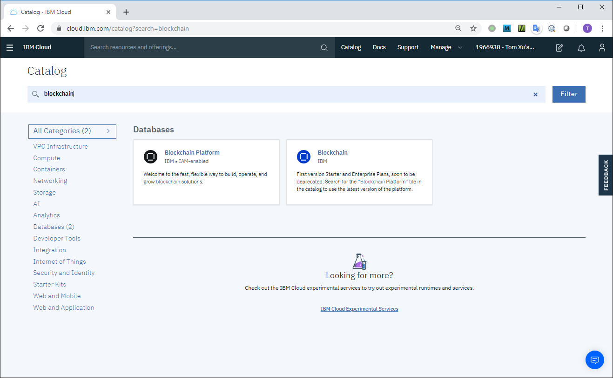

2. 输入您所期望的 Service name，region/location 选择 Dallas。对于不同的 Location，Blockchain Platform 目前有些版本与功能上的差异，所以，我们在这里统一以 Dallas 为示例。请注意在之后建立 Kubernetes Cluster 时，也选择 Dallas。

    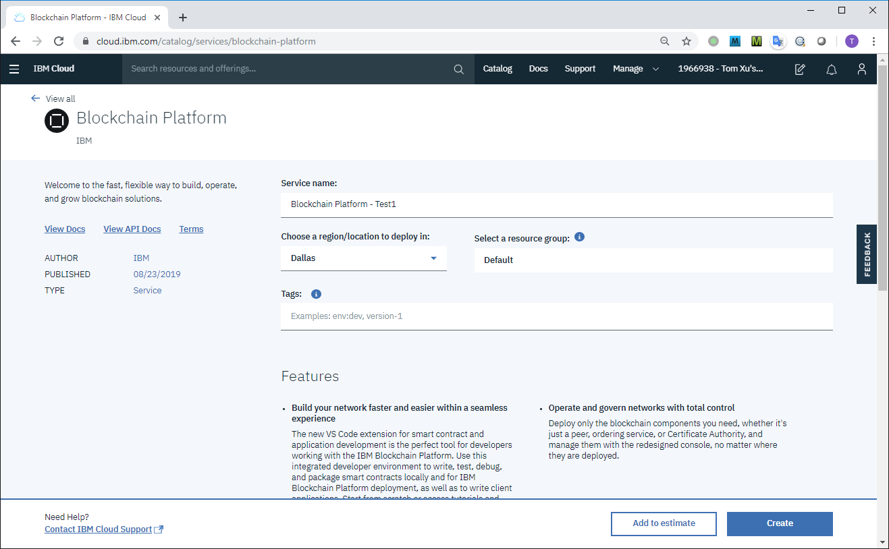

3. 将当前页面下拉到末尾，在 Pricing Plan 中只有一个 Standard Plan，并提示了计费标准。后续我们将把它部署在一个免费的 Kubernetes Cluster 上（30 天内免费试用），因此在实际试用过程中，它并不会收费。

    

    关于费用问题的详细说明，请查阅当前 Blockchain Platform 帮助文档： [https://cloud.ibm.com/docs/services/blockchain?topic=blockchain-ibp-v2-deploy-iks#ibp-v2-deploy-iks-resources-required](https://cloud.ibm.com/docs/services/blockchain?topic=blockchain-ibp-v2-deploy-iks#ibp-v2-deploy-iks-resources-required)

    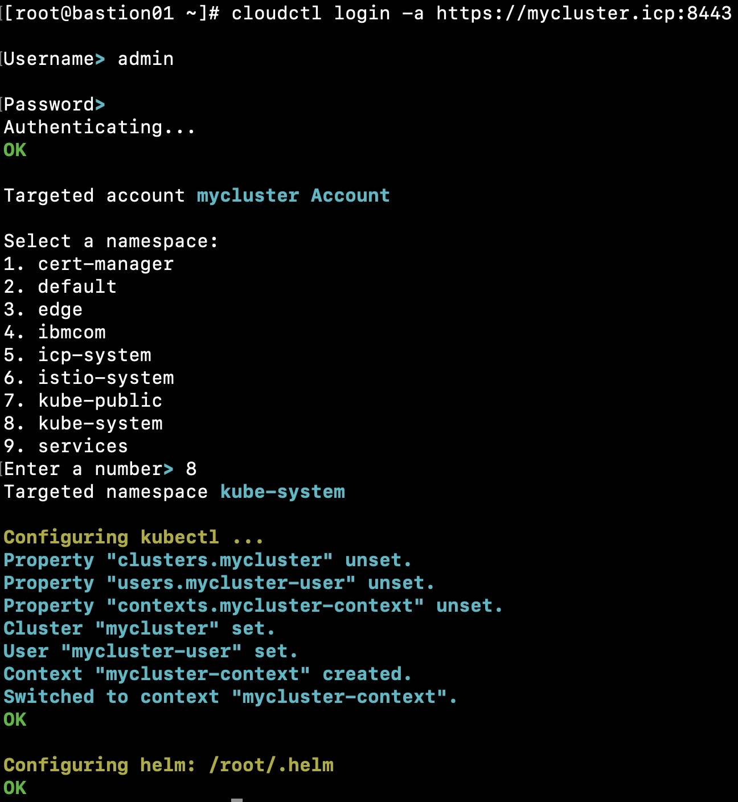

4. 点击右下角 Create 按钮，进入部署页面。
5. 如果您已经有建立好的 Kubernetes Cluster，可以点击下方右侧的 I have a cluster；如果没有，可以点击下方左侧的 Continue 按钮。

    本文以后者为例，点击下方左侧的 Continue 按钮。

    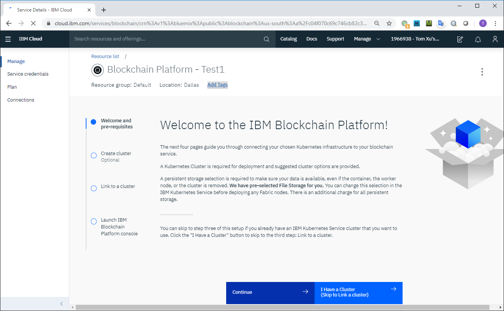

6. 在新页面中点击 Create a new cluster。

    

7. 在 Cluster 部署页面中， **Select a pla n 项目选择 Free** (试用请选择此选项)，Geography 项目选择 North America，Metro 项目选择 Dallas；然后点击 Create cluster 按钮。

    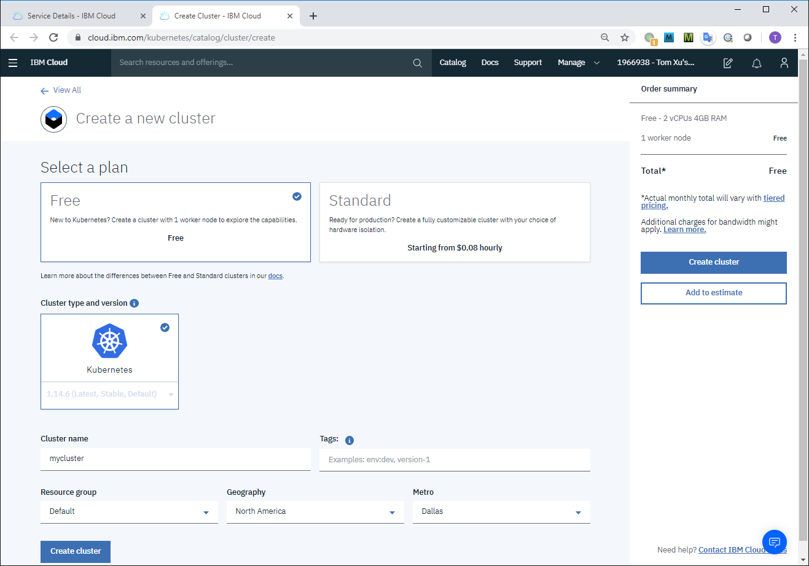

8. 新建 IBM Kubernetes Cluster（Free Plan）大概需要 20 分钟左右，请耐心等待。

    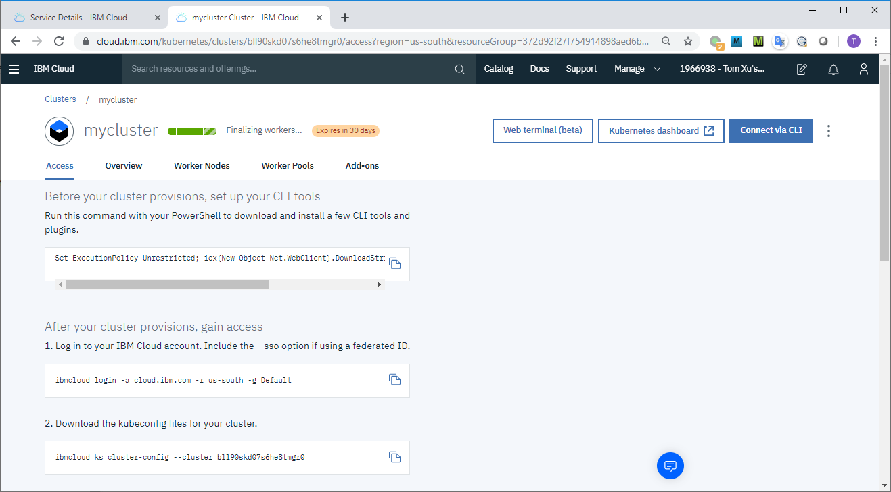

9. Kubernetes Cluster 建立成功后，回到刚才 Blockchain Platform 页面；在 link to a cluster 项目中，选择刚建立好的 Cluster – mycluster，并点击 Deploy to cluster 按钮。

    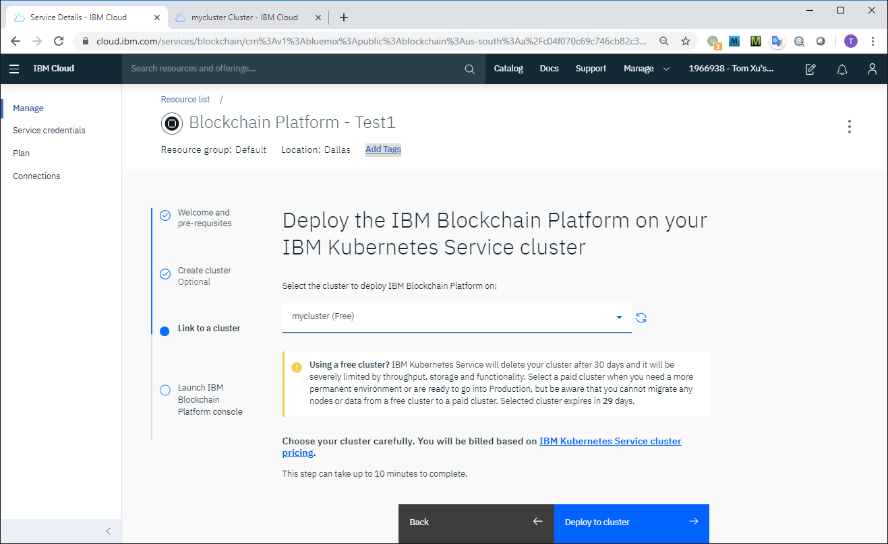

10. 部署成功后，会自动显示 Launch the IBM Blockchain Platform 按钮，点击按钮，进入部署、管理界面。

    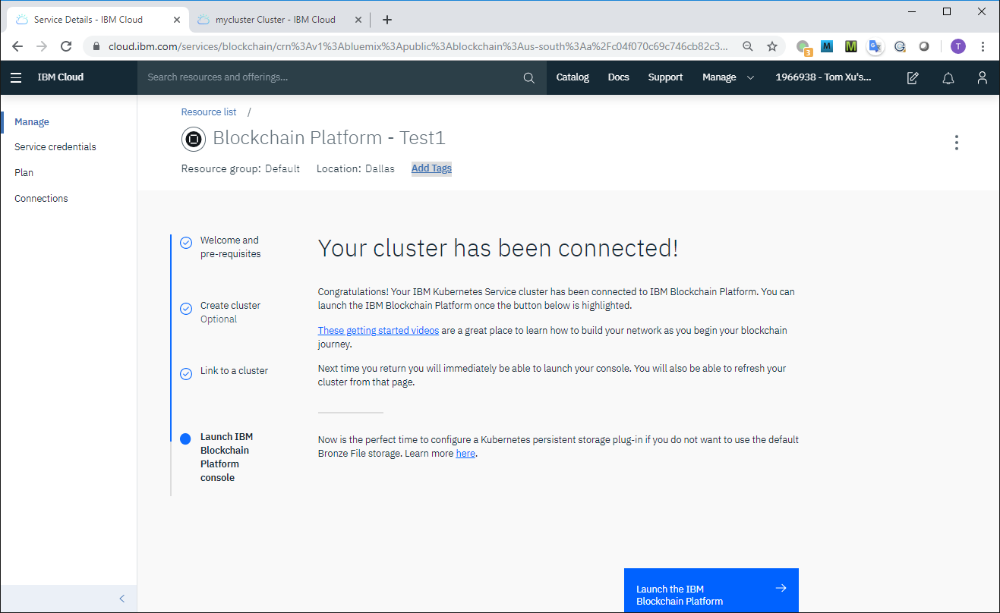

11. 在以后，也可以通过 IBM Cloud 左侧的 Resource list 功能进入 Service 列表页面，并选择进入 Blockchain Platform 部署、管理界面。

    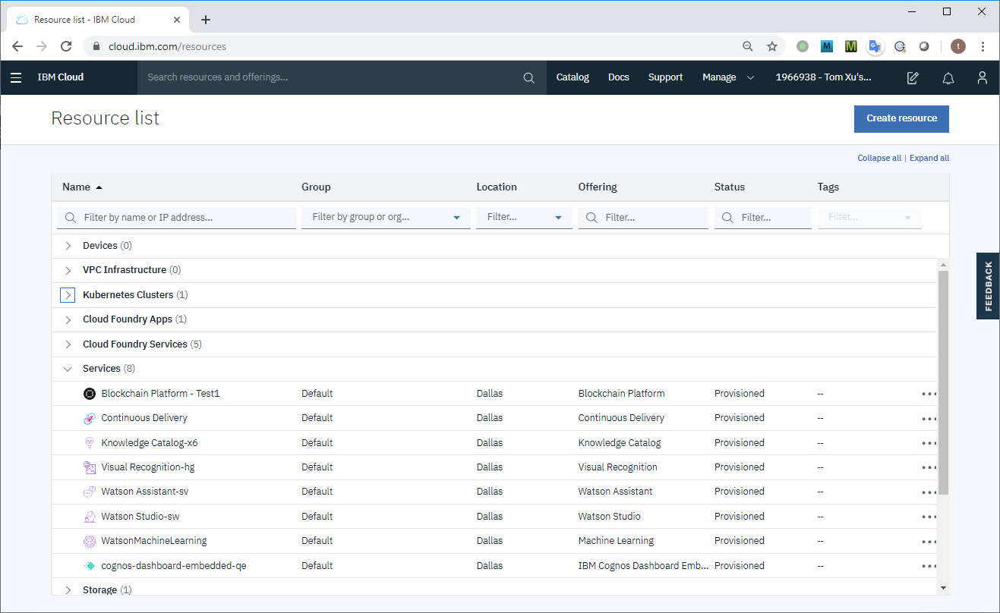

12. 初始的管理界面是这样的。

    

    其左侧菜单主要是以下功能：

    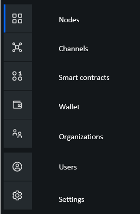


现在，IBM Blockchain Platform Service 就已经建立成功了。接下来，我们将以此为基础，继续部署、管理一个区块链网络。

## 部署区块链网络

这个示例区块链网络将有三个 Organization，并有各自对应的 CA；提供一个 Ordering Node，两个 Endorsing peer node，并组成一个 Channel；会有一个简单的 Smart Contract，主要功能就是将一个 Message 文本加入分布式账本。

按道理，我们应该有多个 IBM Cloud 账号协同建立这个区块链网络，但因为条件限制，我们使用一个账号进行所有的操作，这样，也就省略了一些资源（如证书、Smart Contract Package）在区块链网络之外的传递过程，并会在一个界面上通过 Identity 切换来完成多用户操作，但这些在逻辑上都是清楚可分的，请读者在下文中注意。

这个示例网络结构示意如下：


### 新建 CA Server

在区块链网络中，每个参与者（Administrator、User、Node、Client 等）都通过证书标识自己的身份。证书由 CA 颁发，获取证书的过程可能是完全独立于区块链平台的，比如：由某第三方 CA 颁发，或通过 openssl 等工具自行生成，如果那样，我们需要向 Blockchain Platform 提供已经存在的证书、私钥等 MSP 元素。

Hyperledger Fabric 提供了 Fabric CA Server，可以帮助我们生成一系列证书，这个部分也被集成在了 Blockchain Platform 中，可以很方便地使用。在这个示例网络中，我们就使用 Fabric CA Server 来完成证书颁发任务。

1. 点击左侧 Nodes 按钮，在 Nodes 列表页面中点击 Add Certificate Authority。

    

2. 选择 Create an IBM Cloud Certificate Authority，点击 Next；输入将为 Ordering 节点颁发证书的 CA 名称、及管理员相关内容：

    CA display name: Order CA

    CA administrator enroll ID: admin\_ca\_order

    CA administrator enroll secret: adminpw

    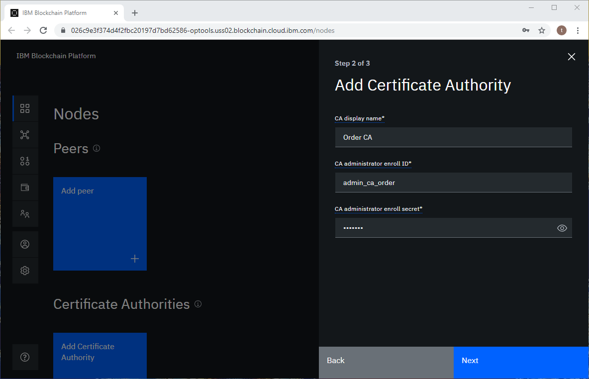

    点击 Next，再点击 Add Certificate Authority；操作成功后，在 Nodes 页面中，可以看到刚添加成功的 Order CA。

    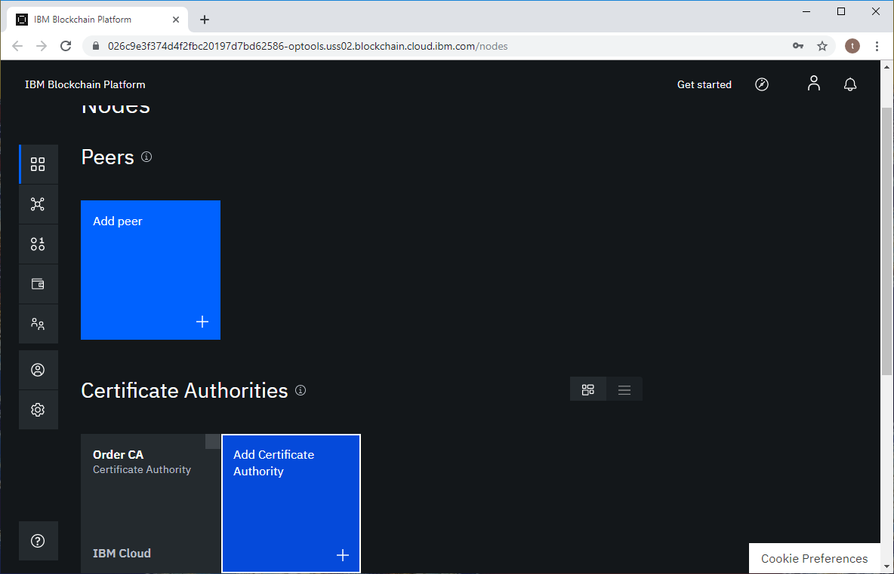

3. 点击刚建立成功的 Order CA，进入 CA 管理界面；再点击 Associate identity。
4. 在 Associate identity 界面输入以下内容：

    Enroll ID: admin\_ca\_order

    Enroll secret: adminpw

    Identity display name: Admin CA Order

    

5. 点击 Associate identity 按钮，此操作会生成 Order CA 管理员 admin\_ca\_order 的私钥、证书，并自动导入到 Wallet。

    操作完成后，在 order ca Node 界面及 Wallet 界面都可以看到 admin\_ca\_order 的相关内容。

    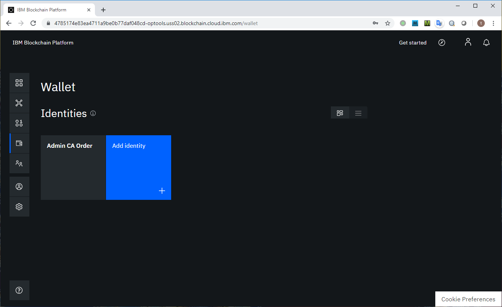

6. 刚刚建立的 CA 是为建立 Ordering 节点准备的，在这个示例网络中，提供 Ordering 节点的是一个独立的 Organization。当然，在您的测试过程中，也可以让三个组织使用同一个 CA 进行证书管理。

    现在，我们需要按计划建立另外两个 CA Server，将分别管理 Org1、Org2 的证书，并使用 Associate identity 分别建立两个 CA Server 的管理员。

    其主要内容如下（过程略）：

    CA display name: Org1 CA

    CA administrator enroll ID: admin\_ca\_org1

    CA administrator enroll secret: adminpw

    Enroll ID: admin\_ca\_org1

    Enroll secret: adminpwIdentity display name: Admin CA Org1

    CA display name: Org2 CA

    CA administrator enroll ID: admin\_ca\_org2

    CA administrator enroll secret: adminpw

    Enroll ID: admin\_ca\_org2

    Enroll secret: adminpwIdentity display name: Admin CA Org2


### 注册 Identities

在 Fabric 网络中，Peer node 需要标识为 peer 的证书，管理员或其他用户需要标识为 client 的证书；都将由其 Organization 所属的 CA Server 颁发。

我们现在开始为 Peer 新建其在 CA Server 中的用户，以供将来 Enroll Identity 时生成私钥与证书。

1. 点击左侧 Nodes 按钮，进入 Org1 CA 管理界面；点击 Register user；输入相关内容如下，再点击 Next 按钮。

    Enroll ID: peer1p\_org1\_id

    Enroll secret: adminpw

    **Type: peer （注意：这里是 peer）**

    Use root affiliation

    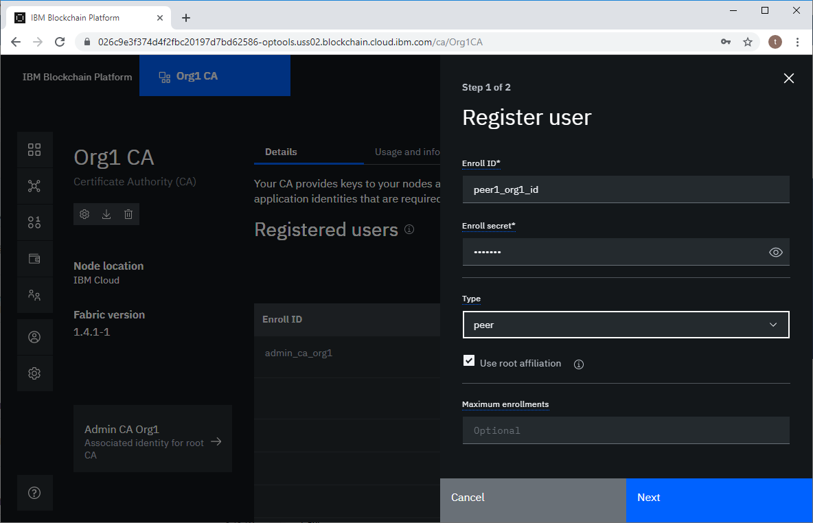

2. 重复 Register user 功能，新建 Org1 管理员用户。

    Enroll ID: admin\_org1

    Enroll secret: adminpw

    **Type: client （注意：这里是 client）**

    Use root affiliation

3. 再次重复 Register user；注册 Ordering service 所需要的 Peer、管理员用户以及 Org2 所需要的 Node、管理员用户；

    进入 Order CA，新建 Ordering node 用户：

    Enroll ID: node\_order\_id

    Enroll secret: adminpw

    **Type: peer** Use root affiliation

    进入 Order CA，新建 Ordering Service 管理员用户：

    Enroll ID: admin\_order

    Enroll secret: adminpw

    **Type: client**

    Use root affiliation

    进入 Org2 CA，新建 Peer node 用户：

    Enroll ID: peer1\_org2\_id

    Enroll secret: adminpw

    **Type: peer**

    Use root affiliation

    进入 Org2 CA，新建 Org2 管理员用户：

    Enroll ID: admin\_org2

    Enroll secret: adminpw

    **Type: client**

    Use root affiliation

    注意：为简化本文所讲述的步骤，我们通过一个 IBM Cloud 账户完成了所有操作，在实际生产环境中，这些操作应由不同的人员分别完成。


### 新建 Organization

按计划，我们将建立三个 Organization，即建立三个 MSP。

1. 通过左侧 Organization 菜单进入管理界面；点击 Create MSP definition；输入内容如下：

    MSP display name: MSP Order

    MSP ID: msporder

    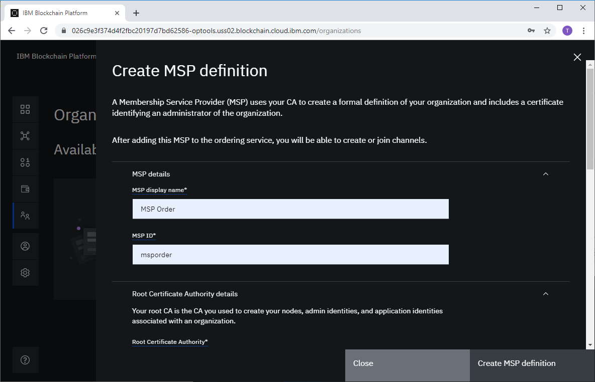

    继续输入以下内容：

    Root certificate Authority: Order CA

    Enroll ID：admin\_order

    Enroll secret: adminpw

    Identity name: Admin Order

    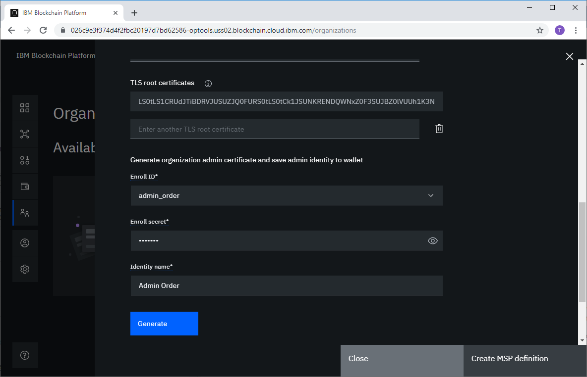

2. 点击 Generate，生成管理员证书，同时会自动导出到 Wallet；再点击右下角 Create MSP definition；最终完成 Order MSP 的创建过程。
3. 重复以上步骤，建立 MSP Org1。


    ```
    MSP display name: MSP Org1
    MSP ID: msporg1
    Root certificate Authority: Org1 CA
    Enroll ID：admin_org1
    Enroll secret: adminpw
    Identity name: Admin Org1

    ```


    Show moreShow more icon

4. 重复以上步骤，建立 MSP Org2。


    ```
    MSP display name: MSP Org2
    MSP ID: msporg2
    Root certificate Authority: Org2 CA
    Enroll ID：admin_org2
    Enroll secret: adminpw
    Identity name: Admin Org2

    ```


    Show moreShow more icon


### 部署 Ordering Service

1. 通过左侧菜单 Nodes，进入 Ordering services 栏目，点击 Add ordering service；输入以下内容，并点击 Next 按钮：

    Ordering service display name：One Node Order

2. 继续输入以下内容，并点击 Next 按钮：


    ```
    Certificate authority: Order CA
    Ordering service enroll ID: node_order_id
    Ordering service enroll secret: adminpw
    Organization MSP: MSP Order

    ```


    Show moreShow more icon

    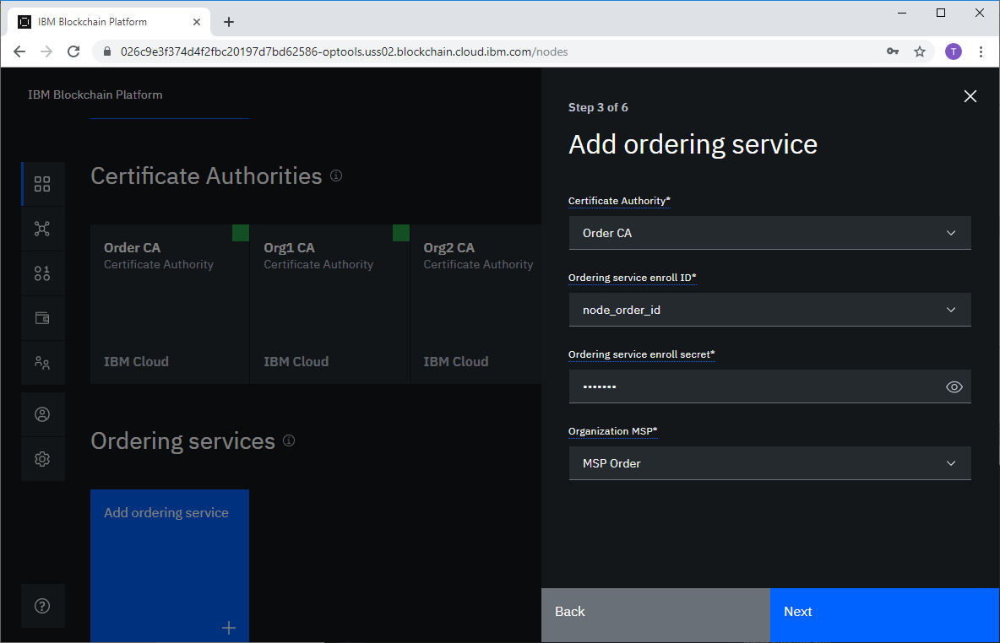

3. 继续输入以下内容，并点击 Next 按钮：

    TLS CA enroll ID: node\_order\_id

    TLS CA enroll secret: adminpw

    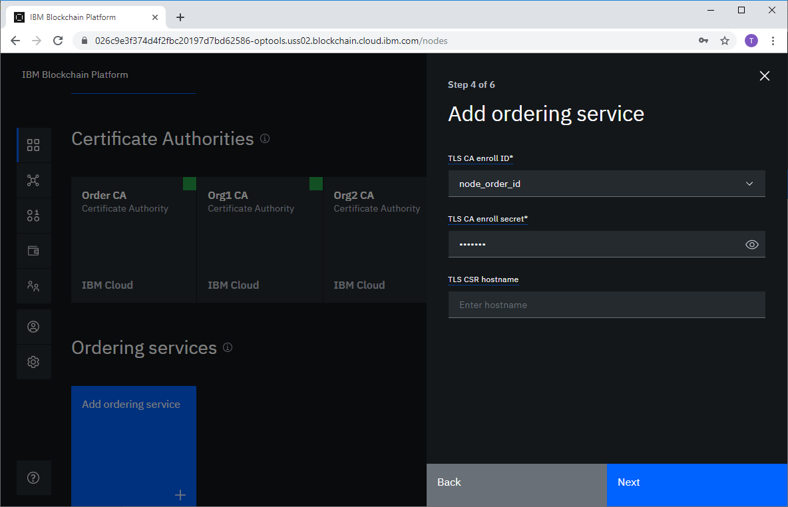

4. 在下一个 Associate identity 界面中，选择 Existing Identity，并选择 Admin Order；点击 Next 按钮。

    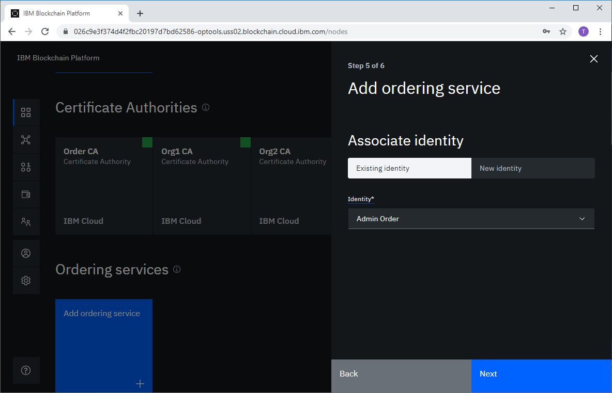

5. 最后点击 Add ordering service 按钮，部署并启动 Ordering service，需要一些时间，请耐心等待。

    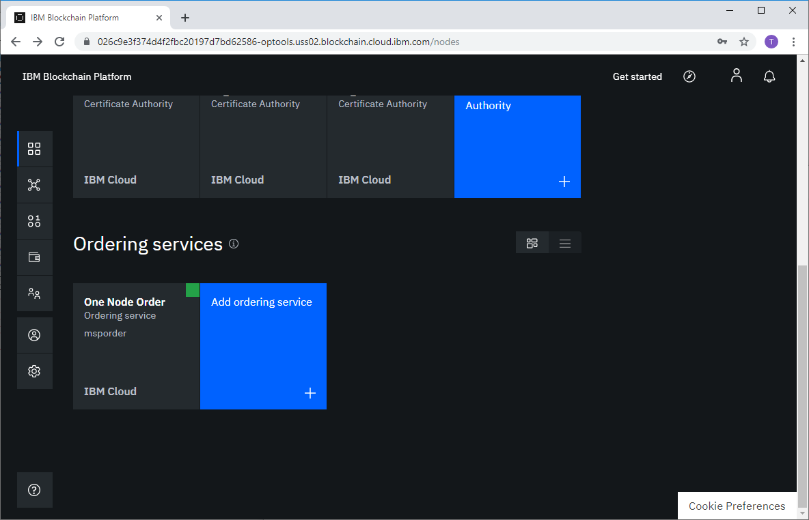

6. 来到刚刚建立好的 One Node Order 界面中，在 Consortium members 栏目下点击 Add organization 按钮，将 MSP Org1、MSP Org2 都加入进来。

    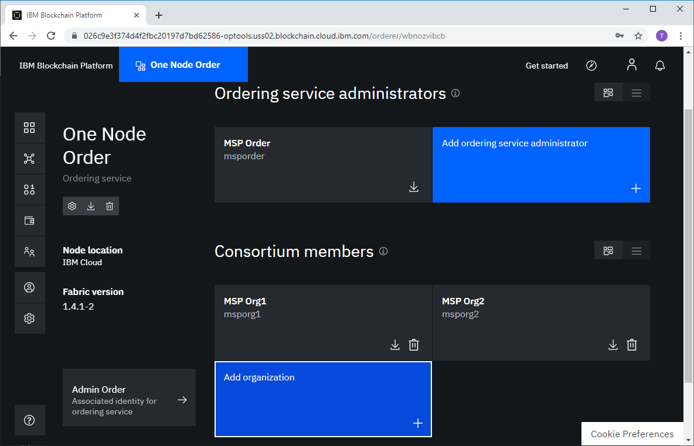


### 新建 Channel

1. 从左侧菜单点击 Channels，再点击 Create channel，输入内容如下：

    Channel name: mychannel

    Ordering service: One Node Order

    在 Channel members 部分，依次选择 msgorg1 和 msgorg2，点击 Add 按钮，并都选择为 Operator。

    Channel update policy: 1 out 2

    Channel creator MSP: MSP Org1 (msporg1)

    Identity: Admin Org1

    

    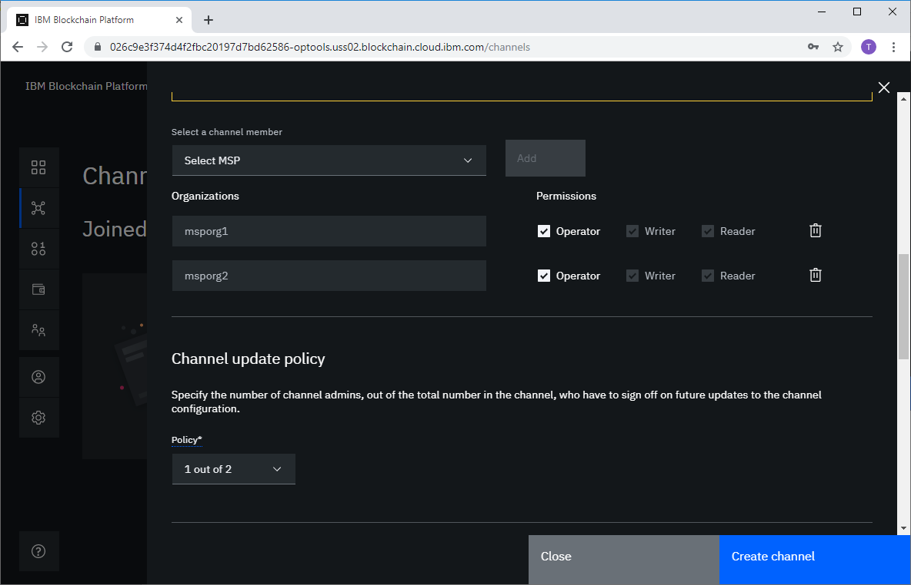

    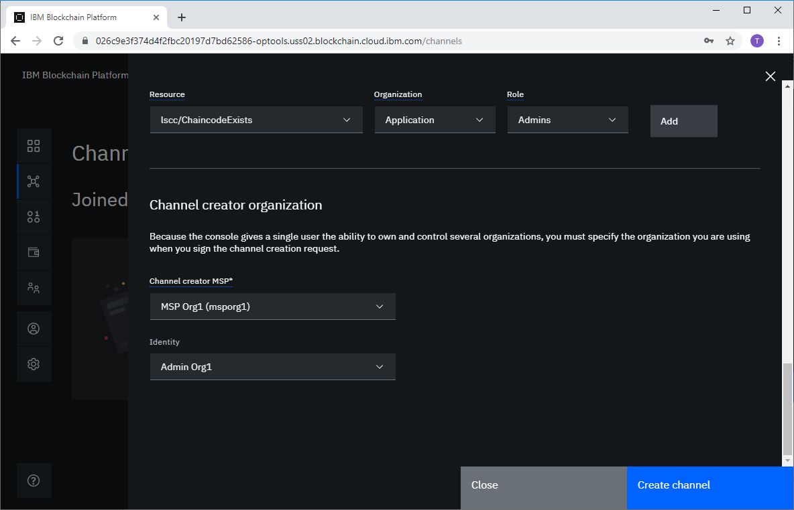

    点击 Create channel 按钮。

2. Channel 新建成功后，会显示在列表中。

    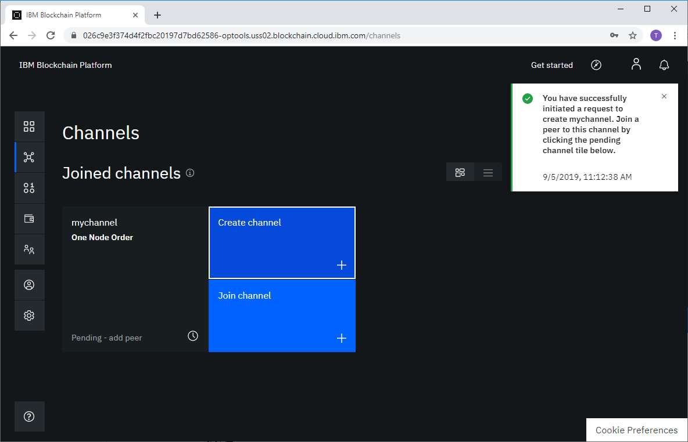


### 新建 Peer

1. 从左侧菜单点击 Nodes，并在 Peers 栏目下，点击按钮 Add peer；选择 Create an IBM cloud peer，输入以下内容：


    ```
    Peer display name: Peer1 Org1
    State database: CouchDB

    Certificate Authorith: Org1 CA
    Peer enroll ID: peer1_org1_id
    Peer enroll secret: adminpw
    Organization MSP: MSP Org1

    TLS CA enroll ID: peer1_org1_id
    TLS CA enroll secret: adminpw

    Associate identity: Admin Org1

    ```


    Show moreShow more icon

    最后点击 Create peer 按钮新建 Peer。

    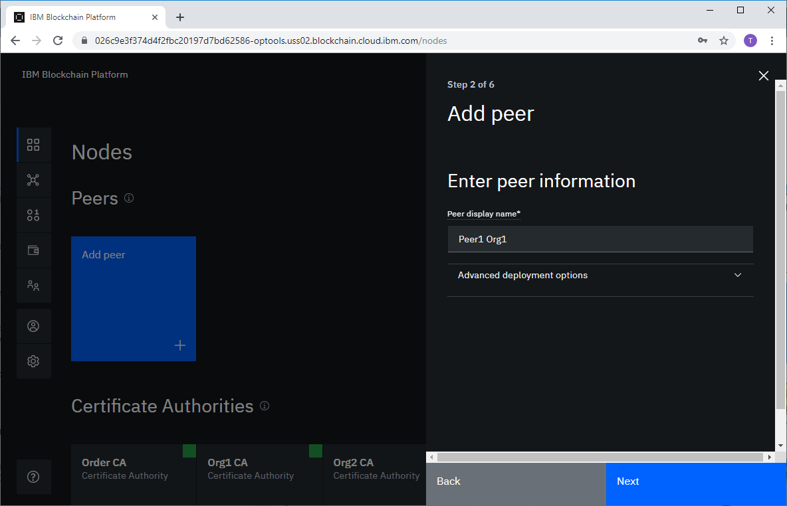

    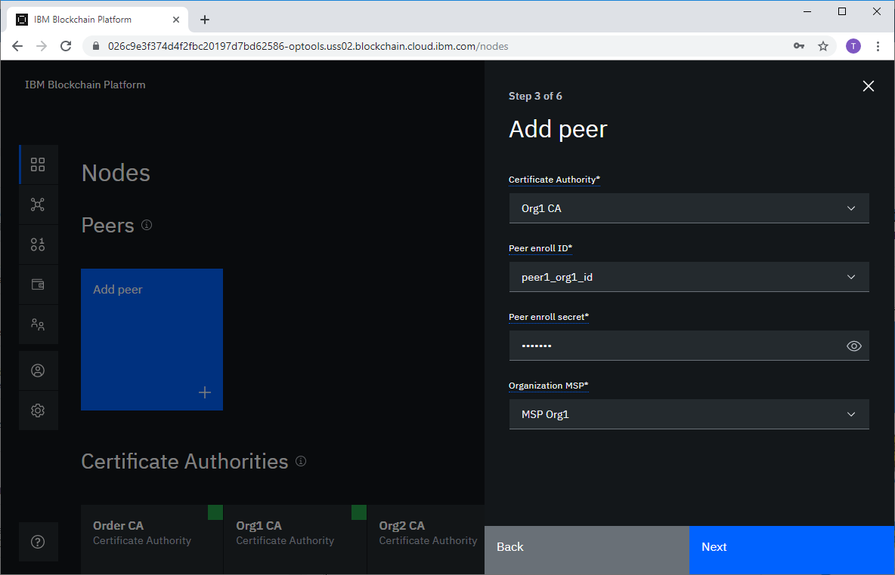

2. 重复以上步骤新建另一个 Peer：Peer1 Org2。


    ```
    Peer display name: Peer1 Org2
    State database: CouchDB

    Certificate Authority: Org2 CA
    Peer enroll ID: peer1_org2_id
    Peer enroll secret: adminpw
    Organization MSP: MSP Org2

    TLS CA enroll ID: peer1_org2_id
    TLS CA enroll secret: adminpw

    Associated identity: Admin Org2

    ```


    Show moreShow more icon

    此部分内容完成后，在 Wallet 中，可以看到一些 Identity，请及时下载、保存这些证书、私钥，并保证其安全，尤其对于私钥，不可遗失或泄漏。

    我们可以从 Wallet 中再次导出下载证书和私钥，但 Wallet 只是利用了浏览器端的 Local Storage 功能，也就意味着它可能由浏览器的更新、更换而丢失，所以，我们不能完全依赖基于浏览器的 Wallet 功能。


### 将 Peer 加入到 Channel

1. 在 Nodes 界面点击刚加入成功的 Peer1 Org1，再点击 Join channel。
2. 选择、输入以下内容：

    Ordering service: One Node Order

    Channel name: mychannel

    点击 Join Channel 按钮。

    

3. 重复以上步骤，将 Peer1 Org2 加入到 mychannel。
4. 回到 Channels 界面并点击进入 mychannel，在 Channel details / Anchor peers 栏目中点击 Add anchor peer，将 Peer1 Org1 和 Peer1 Org2 都选中设为 Anchor peer。

    


## 用 Visual Studio Code 开发 Smart Contract

IBM Blockchain Platform 还提供了 VS Code extension，可以在 VS Code 里方便的开发 Smart Contract，并可以与区块链网络交互，完成一些测试、部署、管理工作。

本文这部分内容将直接用 Extension 提供的示例代码，建立一个 Smart Contract 打包文件，并部署到 mychannel 上。

读者也可以略过这个部分，直接跳转转到下一部分（安装 Smart Contract）。并使用一个打包好的文件进行部署。

1. 安装 VS Code，请参考 [https://code.visualstudio.com/](https://code.visualstudio.com/) 。
2. 进入 VS Code 界面，在 Extensions 界面中搜索并安装 IBM Blockchain Platform。

    安装成功后，在左侧菜单中会发现多了 IBM Blockchain Platform 按钮；点击进入 Blockchain Platform Extension 界面。

    

3. 展开第一个项目 Smart Contract；并将鼠标停放，点击 “…” 在弹出菜单中选择 Create New Project；选择 JavaScript；输入 Project name：ibpsimplemsg；选择 Project 目录，接下来 VS Code 会自动建立一个示例项目的所有文件。（这需要一些时间，请耐心等待。）

    

4. 将鼠标停放在 Smart Contract 上，点击菜单 Package Open Project，这会将当前 Smart Contract 项目自动打包，并保存于当前用户.fabric-vscode/packages 目录下，文件名类似于 ibpsimplemsg@0.0.1.cds。这个文件是可以用解压缩文件打开的。

    关于 VS Code Extension 的使用我们以后再讲，现在，我们再回到 Blockchain Platform 控制台，继续之前的部署过程。


## 安装 Smart Contract

1. 准备好上一步骤中打包好的文件 ibpsimplemsg@0.0.1.cds。

    如果没有进行上一步操作，可以直接使用这个文件： [https://github.com/tomxucnxa/ibp\_project\_1/blob/master/cds/ibpsimplemsg%400.0.1.cds](https://github.com/tomxucnxa/ibp_project_1/blob/master/cds/ibpsimplemsg%400.0.1.cds)

2. 点击左侧菜单中的 Smart Contract；再点击 Install smart contract，选择准备好的 cds 文件，并在下一步中选中 Peer1 Org1 和 Peer1 Org2；再点击 Install smart contract 按钮。

    

    这一步骤，也可以由 Nodes 界面进入每个 Peer，分别安装 Smart Contract。

3. 安装成功后，在 Installed smart contracts 列表中，可以发现刚安装成功的 Smart contract；在其右侧弹出菜单中，点击 Instantiate。
4. 在 Instantiate 界面中，输入或选择以下内容：

    Channel：mychannel

    Members: msporg1, msporg2

    Policy: 1 out of 2

    Approve peer: Peer1 Org1 （也可以是 Peer1 Org2）

    其余内容默认即可。最终点击 Instantiate smart contract 按钮完成 Instantiate 过程，这个过程需要一些时间，请耐心等待。

    

    至此，在 Cloud 上的部署过程就全部完成了。


## 开发 Application

接下来，我们将开发一个简单的应用程序，与部署好的区块链网络及 Smart Contract 进行交互。

1. 在 Smart contract 界面的 Instantiated smart contracts 列表，选择 ibpsimplemsg，点击右侧弹出菜单中的 Connect with SDK。在之后的界面需要输入以下内容：

    MSP for connection: msporg1Certificate Authority: Org1 CA点击 Download connection profile 按钮，下载并保存文件 mychannel\_ibpsimplemsg\_profile.json。

2. 在 Wallet 界面中，点击 Admin Org1，下载并保存 certificate.pem 与 private\_key.pem 文件。
3. 下载示例 Application 程序：


    ```
    $ git clone https://github.com/tomxucnxa/ibp_project_1.git

    ```


    Show moreShow more icon

4. 将之前下载的三个文件保存到以下目录：


    ```
    $ ibp_project_1/application/connections/mychannel_ibpsimplemsg_profile.json
    $ ibp_project_1/application/identities/certificate.pem
    $ ibp_project_1/application/identities/private_key.pem

    ```


    Show moreShow more icon

5. 执行基于 Fabric SDK Node.js 的 Client 程序；添加并查询一个 message。


    ```
    $ cd ibp_project_1/application
    $ npm install
    $ node ibpmsgtest.js

    ```


    Show moreShow more icon

    运行成功，可得到类似以下结果（有时因网络原因可能 Timeout，请重试）：


    ```
    info: ==== Begin transaction
    info: Identity Admin Org1 exists.
    info: Gateway connects get succeed.
    info: Create 06761256 MSG_06761256
    info: Transaction Result
    info: ==== Begin query 06761256
    info: Identity Admin Org1 exists.
    info: Gateway connects get succeed in query testing.
    info: Query Result {"value":"MSG_06761256"}

    ```


    Show moreShow more icon


## 结束语

至此，我们就已经成功部署并使用了 IBM Blockchain Platform on Cloud。这只是一些简化步骤的介绍，有几点需要说明：

1. 大部分的步骤其实在 [Blockchain Platform 文档](https://cloud.ibm.com/docs/services/blockchain?topic=blockchain-get-started-ibp&locale=en) 中都有详细介绍，大家可以参考官方文档获取更详细技术资料；也感谢他们提供了这个优秀的产品与文档。
2. 除了控制台界面，我们还可以通过一些 Blockchain Platform 提供的 [RESTful APIs](https://cloud.ibm.com/apidocs/blockchain?locale=en) 在自己的系统里部署、管理区块链网络。
3. 如果部署到免费的 Kubernetes Cluster，这个 Cluster 会在 30 天到期后被删除，请做好备份，包括 IBP 相关内容，都需要自行备份。
4. 试用的 Kubernetes Cluster 被删除后，在 Cloud resource list 里，IBP Service 仍存在，如不需要可手动删除。
5. Blockchain Platform 也可以部署在 IBM Multicloud 上或其他云平台（如 AWS）。
6. VS Code Blockchain Platform Extension 还提供了其他一些非常好的功能，如：管理 Wallet，通过 Connection Profile 连接 Fabric Gateway，并测试 Smart contract；还可以利用本地 Local Fabric 进行 Smart Contract 的开发、调试。

    _（在本文中我们绑定了信用卡，但所选方案不会产生费用；如您使用了其他服务，请留意收费情况。）_


## 参考资源

- 参考 [IBM Blockchain Dev Center](https://developer.ibm.com/cn/blockchain/) ，查看 IBM 在区块链领域的最新信息。
- 参考 [Hyperledger Fabric Documentation](http://hyperledger-fabric.readthedocs.io/en/latest/index.html) ，了解开源项目 Fabric 的主要内容。
- 参考 [Blockchain Platform 文档](https://cloud.ibm.com/docs/services/blockchain?topic=blockchain-get-started-ibp&locale=en) ，了解更详细技术内容。
- 参考 [Fabric SDK for Node.js](https://hyperledger.github.io/fabric-sdk-node/release-1.4/index.html) ，了解 Fabric SDK API。
- 参考 [https://github.com/tomxucnxa/ibp\_project\_1](https://github.com/tomxucnxa/ibp_project_1) ，这是本文的示例代码。
- 参考 [Fabric 区块链的多节点部署](https://www.ibm.com/developerworks/cn/cloud/library/cl-lo-hyperledger-fabric-practice-analysis3/index.html?ca=drs-) ，这是另一系列关于 Fabric 部署的文章。