# JNI 开发入门
如何使用 JNI 实现 Java 程序调用 C/C++程序

**标签:** Java,Java 平台

[原文链接](https://developer.ibm.com/zh/articles/gni-getting-started/)

朱金灿

发布: 2020-08-11

* * *

## JNI 是什么

JNI 全称为 Java Native Interface，即 Java 本地接口，是 Java 调用 Native 语言的一种特性。通过 JNI 可以使得 Java 与 C/C++ 机型交互，即可以在 Java 代码中调用 C/C++ 等语言的代码或者在 C/C++ 代码中调用 Java 代码。由于 JNI 是 JVM 规范的一部分，因此可以将我们写的 JNI 的程序在任何实现了 JNI 规范的 Java 虚拟机中运行。同时，这个特性使我们可以复用以前用 C/C++ 写的大量代码。JNI 是一种在 Java 虚拟机机制下的执行代码的标准机制。代码被编写成汇编程序或者 C/C++ 程序，并组装为动态库，也就允许非静态绑定用法。这提供了一个在 Java 平台上调用 C/C++ 的一种途径。

本文重点介绍在 Windows 和 Linux 两种平台使用 JNI 的完整开发流程，包括从工程创建、编码到调试的过程，让您快速上手使用 JNI 进行软件开发。

## 如何在 Windows 和 Linux 平台上进行 JNI 编程

下面分别介绍在 Windows 平台和 Linux 平台使用 JNI 编程的常规流程，包括从创建工程项目、代码编写到编译运行。

### 在 Windows 平台上进行 JNI 编程

首先确保在 Windows 装有 JDK（Java 语言的软件开发工具包）。本文的代码例子适配的 Windows JDK 版本是 jdk-8u181-windows-x64。本章节示范在 Windows 平台上使用 IntelliJ IDEA 配合 VisualStudio 2013 进行 JNI 程序开发。

#### 新建 Java 工程

1. 使用 IntelliJ IDEA 2018 新建一个 Java 工程，命名为 WinJniDemo，如下图：

    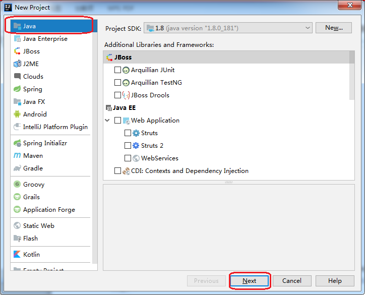

2. 选择命令行程序模板。

    

3. 填写工程名、路径以及包名。

    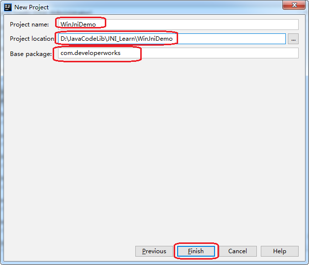


#### 新建 Environment 类和 HelloJNI 类

在包 com.developerworks 下新建 `Environment` 类和 `HelloJNI` 类。`Environment` 类的作用在于统一加载 Java 程序所调用的 C/C++ 编写的动态库，`HelloJNI` 类是对应的 C/C++ 动态库的 Java 接口类，代码如下：

**清单 1\. `Environment` 类和 `HelloJNI` 类代码**

```
//Environment.java
package com.developerworks;

public class Environment {

    public static boolean initEnvironment() {

         String OS = System.getProperty("os.name").toLowerCase();
         boolean isLinux = false;

         if (OS.indexOf("windows") > -1) {

             String strLibPath = "D:\\JavaCodeLib\\JNI_Learn\\hello\\OutDir\\Release_x64\\hello.dll";
             System.load(strLibPath);
             return true;

         } else if (OS.indexOf("linux") > -1) {

             String strLibPath = "/home/work/JavaCodeLib/JNI_Learn/hello/hello/hello.so";
             System.load(strLibPath);
             return true;
         }
         else if (OS.indexOf("linux") > -1) {

             String strLibPath = "/home/work/JavaCodeLib/JNI_Learn/hello/hello/hello.so";
             System.load(strLibPath);
             return true;
         }
         else if (OS.indexOf("unix") > -1) {

             String strLibPath = "/home/work/JavaCodeLib/JNI_Learn/hello/hello/hello.so";
             System.load(strLibPath);
             return true;
         }
         else if (OS.indexOf("solaris") > -1) {

             String strLibPath = "/home/work/JavaCodeLib/JNI_Learn/hello/hello/hello.so";
             System.load(strLibPath);
             return true;
         }
         else if (OS.indexOf("mac") > -1) {
             String strLibPath = "/Users/wang/javaPrj/hello.dylib";
             System.load(strLibPath);
             return true;
         }
        else
         {
              return false;
         }

    }
}

//HelloJNI.java
packagecom.developerworks;

public class HelloJNI {

public native void sayHello();

}

// 入口主函数调用代码
packagecom.developerworks;

public class Main {

public static void main(String[] args) {
// write your code here
Environment.initEnvironment();
        // invoke the native method
newHelloJNI().sayHello();
    }
}

```

Show moreShow more icon

在上面代码中函数 `System.loadLibrary()` 是加载 dll（Windows）或 so（Linux）库，只需名称即可，无需加入文件名后缀（`.dll` 或 `.so`）。native 关键字将函数 `sayHello()` 声明为本地函数，由 C/C++实现。具体的实现就在 `hello.dll`（Windows 平台）或 `hello.so`（Linux 平台）中。

#### 生成头文件

接下来我们将根据 `HelloJNI`类来生成 C/C++ 程序所需要的头文件。JNI 生成头文件是通过 JDK 中提供的 javah 工具来完成，javah 工具在 `JAVA_HOME` 环境变量所指向的目录下的 `bin` 文件夹中。使用 javah 工具生成头文件的步骤如下：

1. 打开 Windows 的控制台程序，使用 cd 命令进入到 WinJniDemo 工程的 `src` 目录下：

    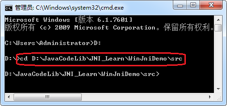

2. 执行 javah 命令生成头文件：`javah -classpath . -jni -encoding UTF-8 com.developerworks.HelloJNI`。

    


命令成功执行后，在 `src` 文件夹下会有一个 `com_developerworks_HelloJNI.h`。命令中 `-classpath .` 表示在当前目录下搜索类，`-encoding UTF-8` 表示使用 UTF-8 作为生成的头文件的编码，`com.developerworks.HelloJNI` 为指定的 Java 接口类。

**清单 2\. `com_developerworks_HelloJNI.h` 代码**

```
/* DO NOT EDIT THIS FILE - it is machine generated */
#include <jni.h>
/* Header for class com_developerworks_HelloJNI */

#ifndef _Included_com_developerworks_HelloJNI
#define _Included_com_developerworks_HelloJNI
#ifdef __cplusplus
extern "C" {
#endif
/*
* Class:     com_developerworks_HelloJNI
* Method:    sayHello
* Signature: ()V
*/
JNIEXPORT void JNICALL Java_com_developerworks_HelloJNI_sayHello
(JNIEnv *, jobject);

#ifdef __cplusplus
}
#endif
#endif

```

Show moreShow more icon

从清单 2 可以看出 C/C++ 动态库的接口头文件已经生成了。

#### 创建动态库工程

接下来我们使用 VS2013 创建一个 Win32 的动态库工程。

1. 创建一个 Win32 的动态库工程。

    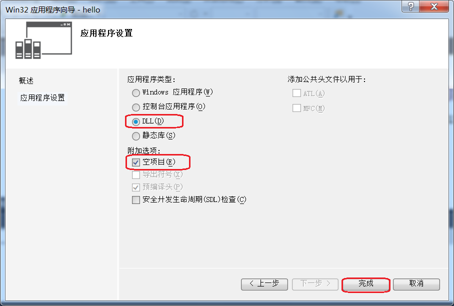

2. 将 `com_developerworks_HelloJNI.h` 加到工程，在工程里添加一个 `com_developerworks_HelloJNI.cpp`，目录结构如下图：

    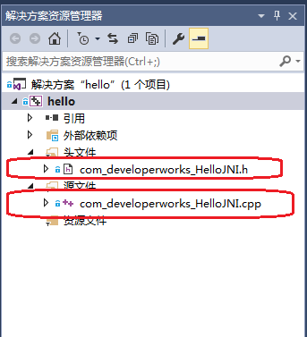

    **清单 3\. com\_developerworks\_HelloJNI.cpp 代码**


    ```
    #include "com_developerworks_HelloJNI.h"
    #include <stdio.h>

    JNIEXPORT void JNICALL Java_com_developerworks_HelloJNI_sayHello
    (JNIEnv* env, jobject obj)
    {
    printf("Hello,JNI!\n");

    ```


    Show moreShow more icon

3. 在工程的`附加包含目录`添加：`$(JAVA_HOME)\include;$(JAVA_HOME)\include\win32`，如下图：

    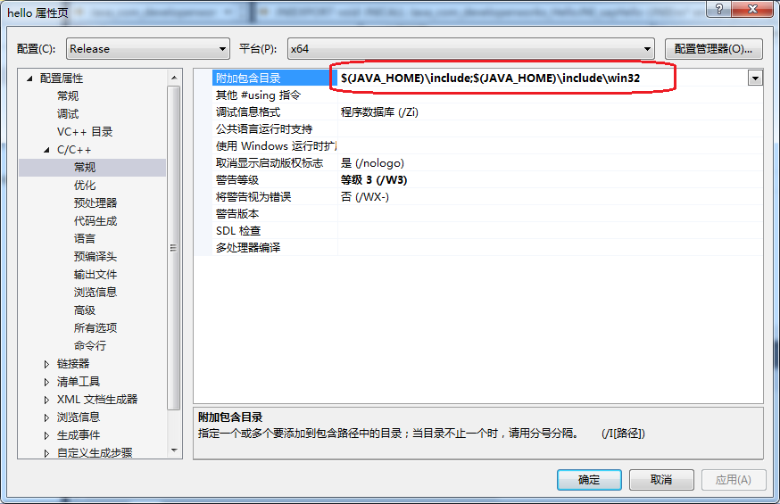


#### 编译运行工程

在 IntelliJ IDEA 2018 编译运行 Java 工程 WinJniDemo，生成 dll 文件，得到下面的运行效果：

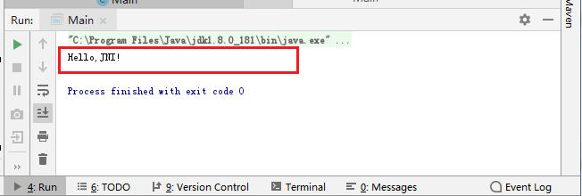

### 在 Linux 平台上进行 JNI 编程

首先确保在 Linux 装有 GCC 和 JDK（Java 语言的软件开发工具包）。本文的代码例子适配的 Linux JDK 版本是 jdk-8u144-linux-x64。

1. 先用 GCC 编译 C/C++ 程序生成 so 库，执行下面的编译脚本：


    ```
    gcc com_developerworks_HelloJNI.cpp -std=c++11 -fPIC -shared -I/usr/local/java/jdk1.8.0_144/include -I/usr/local/java/jdk1.8.0_144/include/linux -lm -o ./hello.so

    ```


    Show moreShow more icon

2. 然后使用 Eclipse 编译运行之前建好的 Java 工程，运行结果如下：

    


## JNI 程序如何传递常用参数和返回值

JNI 程序开发中一个注意事项是参数传递和返回值处理。

### Java 数据类型与 JNI 类型映射

Java 中的基本类型包括 boolean，byte，char，short，int，long，float，double，如果你用这几种类型做 native 方法的参数，当你通过 javah 工具生成 `.h` 文件的时候，这些基本类型分别对应的类型是 jboolean，jbyte，jchar，jshort，jint，jlong，jfloat，jdouble。因此基本类型的传递是可以直接传递的。下面是详细的 Java 数据类型与 JNI 类型映射表：

**表 1\. Java 数据类型与 JNI 类型映射表**

Java 类型本地类型描述booleanjbooleanC/C++8 位整型bytejbyteC/C++ 带符号的 8 位整型charjcharC/C++ 无符号的 16 位整型shortjshortC/C++带符号的 16 位整型intjintC/C++带符号的 32 位整型longjlongC/C++带符号的 64 位整型floatjfloatC/C++32 位浮点型doublejdoubleC/C++64 位浮点型Objectjobject任何 Java 对象，或者没有对应 java 类型的对象ClassjclassClass 对象Stringjstring字符串对象Object[]jobjectArray任何对象的数组boolean[]jbooleanArray布尔型数组byte[]jbyteArray比特型数组char[]jcharArray字符型数组short[]jshortArray短整型数组int[]jintArray整型数组long[]jlongArray长整型数组float[]jfloatArray浮点型数组double[]jdoubleArray双浮点型数组

### String 参数的传递和返回

Java 的 String 和 C++ 的 String 是不能对等起来的，所以需要额外进行处理。具体就是使用 `GetStringUTFChars` 函数将 jstring 类型变成一个 `char*` 类型，返回的时候，要生成一个 `jstring` 类型的对象，也必须通过 `NewStringUTF` 函数来构造。下面是示例代码：

**清单 4\. `Java_com_developerworks_HelloJNI_getLine` 函数代码**

```
JNIEXPORT jstring JNICALL Java_com_developerworks_HelloJNI_getLine
(JNIEnv* env, jobject obj, jstring prompt)
{
    const char* str;
    str = env->GetStringUTFChars(prompt, false);
    if (str == NULL)
    {
        return NULL; /* OutOfMemoryError already thrown */
    }

    std::cout<<str<<std::endl;
    env->ReleaseStringUTFChars(prompt, str);
    char* tmpstr = "return string succeeded";
    jstring rtstr = env->NewStringUTF(tmpstr);

    return rtstr;
}

```

Show moreShow more icon

### 数组类型的传递

和 String 一样，JNI 为 Java 基本类型的数组提供了 `j*Array` 类型，比如 `int[]` 对应的就是 `jintArray`。来看一个传递 int 数组的例子，具体是用 `GetArrayLength` 函数来获取数组的长度，使用 `GetIntArrayElements` 函数将 jintArray 转换为 `jint*` 类型。下面是示例代码：

**清单 5\. `Java_com_developerworks_HelloJNI_sumArray` 函数代码**

```
JNIEXPORT jint JNICALL Java_com_developerworks_HelloJNI_sumArray
(JNIEnv *env, jobject obj, jintArray arr)
{
    jint* carr = NULL;
    carr = env->GetIntArrayElements(arr, false);
    if (carr == NULL)
    {
        return 0; /* exception occurred */
    }
    int size = env->GetArrayLength(arr);
    jint sum = 0;
    for (int i = 0; i < size; i++)
    {
        sum += carr[i];
    }
    env->ReleaseIntArrayElements(arr, carr, 0);
    return sum;
}

```

Show moreShow more icon

## 如何调试 JNI 程序

下面分别介绍如何在 Windows 和 Linux 平台上调试程序。

### 在 Windows 平台上调试程序

在 Windows 平台上调试 JNI 程序的流程如下所示。

1. 在 Idea 上以 Debug 方式运行 Java 程序，在 `String input = hello.getLine("this is a prompt");`这句代码设置一个断点，运行到该断点时停下来，如下图：

    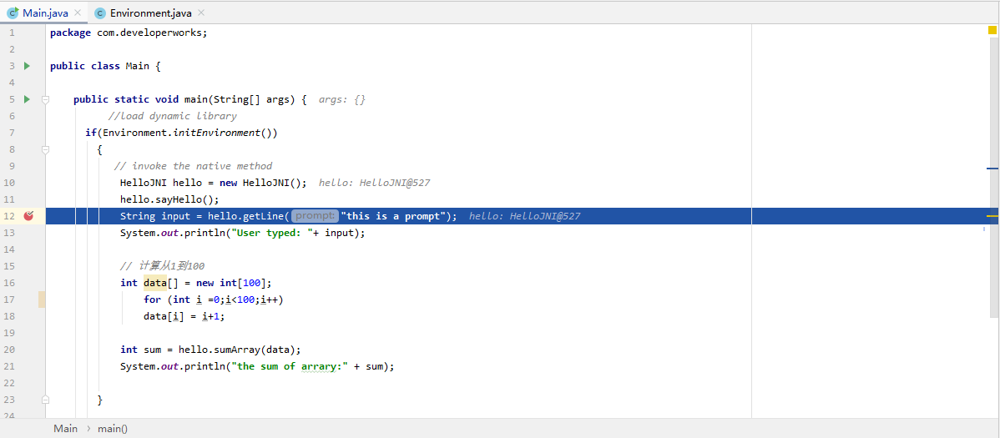

2. 在 VS 2013 上选择附加的 Java 进程，如下图：

    

    然后，选择对应的 Java 进程并进行附加。

    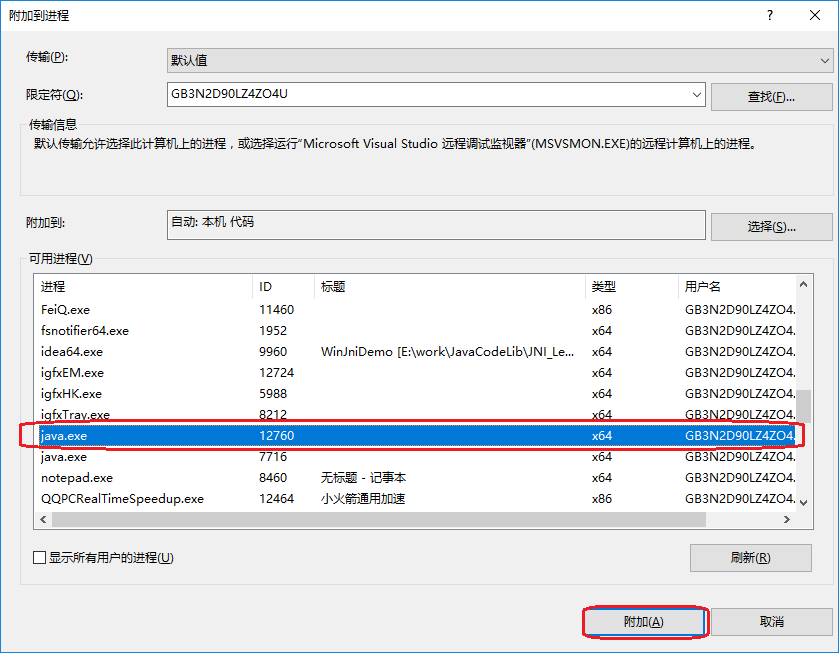

3. 在 C++ 程序中的函数中加上断点，继续运行 Java 程序，一会儿就可以看到程序已经运行到了 C++ 代码中，如下图：

    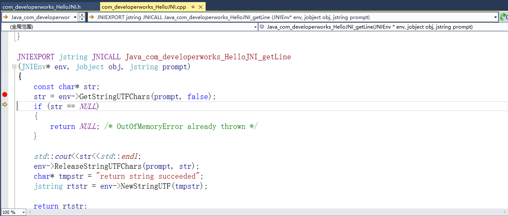


### 在 Linux 平台上调试程序

在 Linux 平台调试 JNI 程序的流程如下所示。

1. 给 Eclipse 安装 CDT 插件，如下图：

    

2. 使用 Eclipse 创建一个 C++ Shared Library 工程（如下图），然后把 `com_developerworks_HelloJNI.h` 和 `com_developerworks_HelloJNI.cpp` 加到工程，编译生成。

    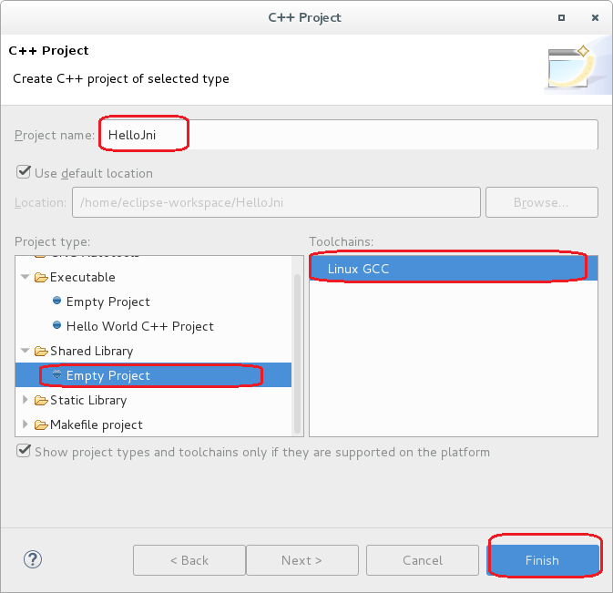

3. 以 Debug 方式运行 Java 程序，在 `String input = hello.getLine("this is a prompt");` 这句代码设置一个断点，运行到该断点时停下来。

4. 设置 Eclipse C++ 工程调试配置。右键选择 C++ Shared Library 工程，在右键菜单中选择 `Debug > Debug Configurations`，在 **Debug Configurations** 窗口里选择 `C/C++ Attach to Application`，在 Debugger 选项卡里勾选 `Non-stop mode`，单击 **Debug** 按钮，如下图：

    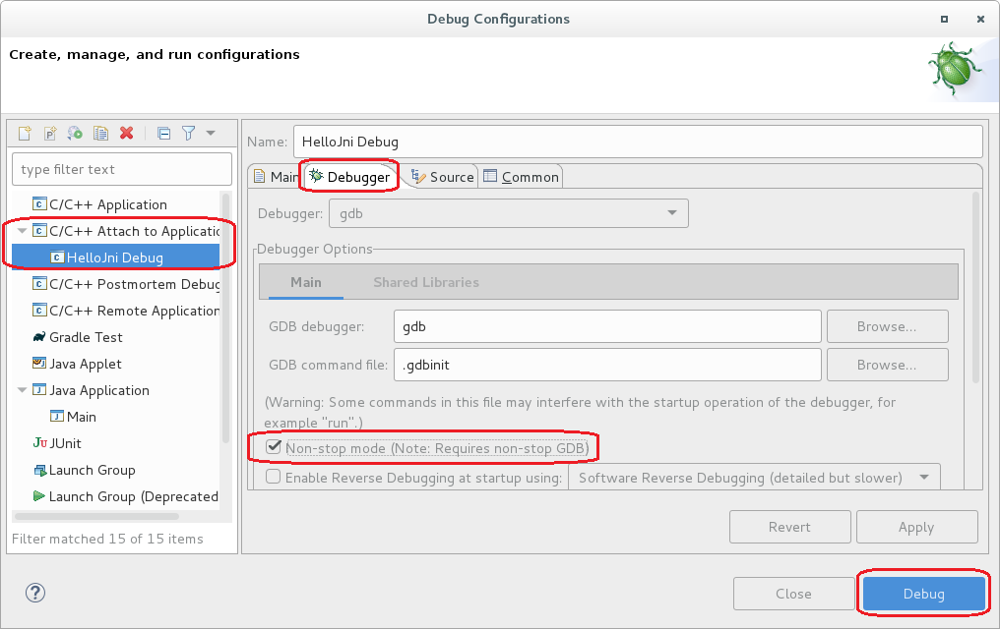

    然后在 Eclipse 上选择附加相应的 Java 程序的进程。

    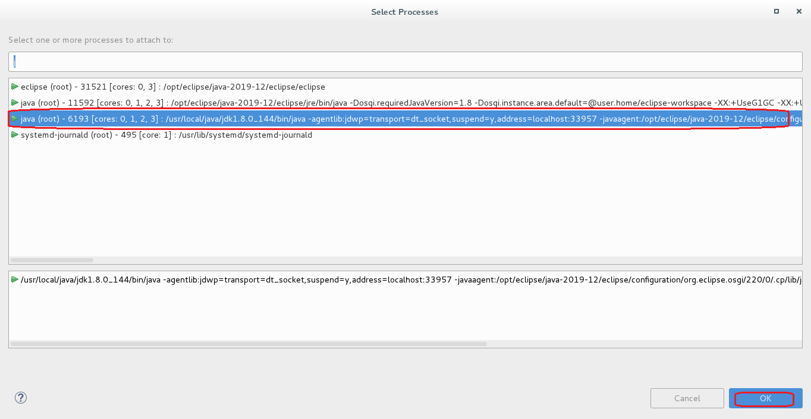

5. 在 C++ 程序中的函数中加上断点，继续运行 Java 程序，一会儿就可以看到程序已经运行到了 C++ 代码中，如下图：

    


## 结束语

通过本文希望大家能大概了解在 Windows 和 Linux 使用 JNI 开发的常规流程。本文只是 JNI 开发的一个快速入门，如果要使用 JNI 进行更高级的开发，还会涉及到 JNI 的异常处理、JNI 中的引用等知识点，大家可以自行展开进一步学习。