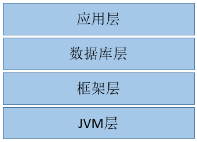
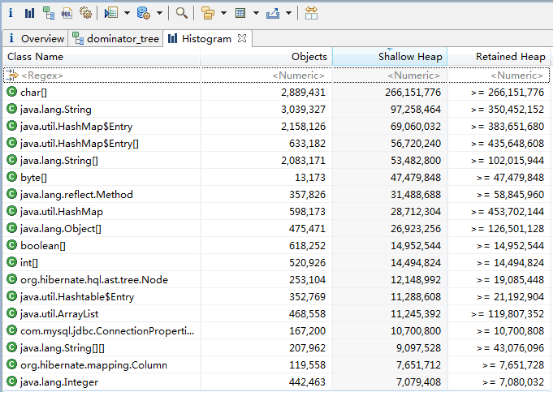
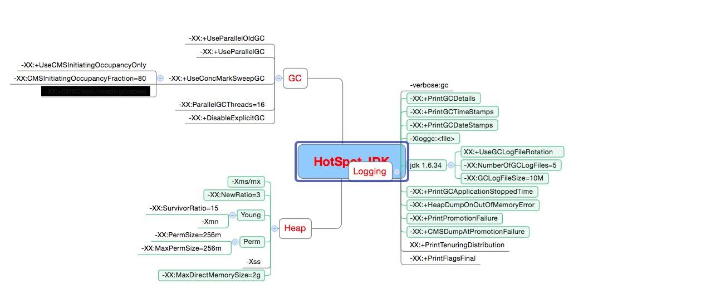
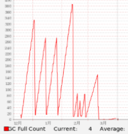
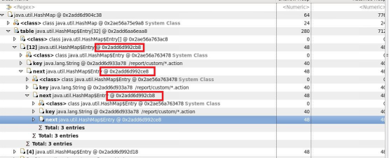
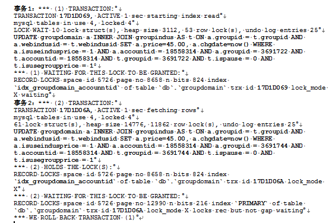

# Java 应用性能调优实践
让 Java 应用运行更快：性能调优工具及实践

**标签:** Java

[原文链接](https://developer.ibm.com/zh/articles/j-lo-performance-tuning-practice/)

张俊城, 郭理勇, 刘建

发布: 2016-06-28

* * *

Java 应用性能优化是一个老生常谈的话题，典型的性能问题如页面响应慢、接口超时，服务器负载高、并发数低，数据库频繁死锁等。尤其是在”糙快猛”的互联网开发模式大行其道的今天，随着系统访问量的日益增加和代码的臃肿，各种性能问题开始纷至沓来。Java 应用性能的瓶颈点非常多，比如磁盘、内存、网络 I/O 等系统因素，Java 应用代码，JVM GC，数据库，缓存等。笔者根据个人经验，将 Java 性能优化分为 4 个层级：应用层、数据库层、框架层、JVM 层，如图 1 所示。

##### 图 1.Java 性能优化分层模型



每层优化难度逐级增加，涉及的知识和解决的问题也会不同。比如应用层需要理解代码逻辑，通过 Java 线程栈定位有问题代码行等；数据库层面需要分析 SQL、定位死锁等；框架层需要懂源代码，理解框架机制；JVM 层需要对 GC 的类型和工作机制有深入了解，对各种 JVM 参数作用了然于胸。

围绕 Java 性能优化，有两种最基本的分析方法：现场分析法和事后分析法。现场分析法通过保留现场，再采用诊断工具分析定位。现场分析对线上影响较大，部分场景（特别是涉及到用户关键的在线业务时）不太合适。事后分析法需要尽可能多收集现场数据，然后立即恢复服务，同时针对收集的现场数据进行事后分析和复现。下面我们从性能诊断工具出发，分享搜狗商业平台在其中的一些案例与实践。

## 性能诊断工具

性能诊断一种是针对已经确定有性能问题的系统和代码进行诊断，还有一种是对预上线系统提前性能测试，确定性能是否符合上线要求。本文主要针对前者，后者可以用各种性能压测工具（例如 JMeter）进行测试，不在本文讨论范围内。针对 Java 应用，性能诊断工具主要分为两层：OS 层面和 Java 应用层面（包括应用代码诊断和 GC 诊断）。

### OS 诊断

OS 的诊断主要关注的是 CPU、Memory、I/O 三个方面。

**CPU 诊断**

对于 CPU 主要关注平均负载（Load Average），CPU 使用率，上下文切换次数（Context Switch）。

通过 top 命令可以查看系统平均负载和 CPU 使用率，图 2 为通过 top 命令查看某系统的状态。

##### 图 2.top 命令示例


平均负载有三个数字：63.66，58.39，57.18，分别表示过去 1 分钟、5 分钟、15 分钟机器的负载。按照经验，若数值小于 0.7\*CPU 个数，则系统工作正常；若超过这个值，甚至达到 CPU 核数的四五倍，则系统的负载就明显偏高。图 2 中 15 分钟负载已经高达 57.18，1 分钟负载是 63.66（系统为 16 核），说明系统出现负载问题，且存在进一步升高趋势，需要定位具体原因了。

通过 vmstat 命令可以查看 CPU 的上下文切换次数，如图 3 所示：

##### 图 3.vmstat 命令示例


上下文切换次数发生的场景主要有如下几种：1）时间片用完，CPU 正常调度下一个任务；2）被其它优先级更高的任务抢占；3）执行任务碰到 I/O 阻塞，挂起当前任务，切换到下一个任务；4）用户代码主动挂起当前任务让出 CPU；5）多任务抢占资源，由于没有抢到被挂起；6）硬件中断。Java 线程上下文切换主要来自共享资源的竞争。一般单个对象加锁很少成为系统瓶颈，除非锁粒度过大。但在一个访问频度高，对多个对象连续加锁的代码块中就可能出现大量上下文切换，成为系统瓶颈。比如在我们系统中就曾出现 log4j 1.x 在较大并发下大量打印日志，出现频繁上下文切换，大量线程阻塞，导致系统吞吐量大降的情况，其相关代码如清单 1 所示，升级到 log4j 2.x 才解决这个问题。

##### 清单 1\. log4j 1.x 同步代码片段

```
for(Category c = this; c != null; c=c.parent) {
// Protected against simultaneous call to addAppender, removeAppender,...
synchronized(c) {
if (c.aai != null) {
write += c.aai.appendLoopAppenders(event);
}
...
}
}

```

Show moreShow more icon

**Memory**

从操作系统角度，内存关注应用进程是否足够，可以使用 free –m 命令查看内存的使用情况。通过 top 命令可以查看进程使用的虚拟内存 VIRT 和物理内存 RES，根据公式 VIRT = SWAP + RES 可以推算出具体应用使用的交换分区（Swap）情况，使用交换分区过大会影响 Java 应用性能，可以将 swappiness 值调到尽可能小。因为对于 Java 应用来说，占用太多交换分区可能会影响性能，毕竟磁盘性能比内存慢太多。

**I/O**

I/O 包括磁盘 I/O 和网络 I/O，一般情况下磁盘更容易出现 I/O 瓶颈。通过 iostat 可以查看磁盘的读写情况，通过 CPU 的 I/O wait 可以看出磁盘 I/O 是否正常。如果磁盘 I/O 一直处于很高的状态，说明磁盘太慢或故障，成为了性能瓶颈，需要进行应用优化或者磁盘更换。

除了常用的 top、 ps、vmstat、iostat 等命令，还有其他 Linux 工具可以诊断系统问题，如 mpstat、tcpdump、netstat、pidstat、sar 等。Brendan 总结列出了 Linux 不同设备类型的性能诊断工具，如图 4 所示，可供参考。

##### 图 4.Linux 性能观测工具


### Java 应用诊断工具

#### 应用代码诊断

应用代码性能问题是相对好解决的一类性能问题。通过一些应用层面监控报警，如果确定有问题的功能和代码，直接通过代码就可以定位；或者通过 top+jstack，找出有问题的线程栈，定位到问题线程的代码上，也可以发现问题。对于更复杂，逻辑更多的代码段，通过 Stopwatch 打印性能日志往往也可以定位大多数应用代码性能问题。

常用的 Java 应用诊断包括线程、堆栈、GC 等方面的诊断。

**jstack**

jstack 命令通常配合 top 使用，通过 top -H -p pid 定位 Java 进程和线程，再利用 jstack -l pid 导出线程栈。由于线程栈是瞬态的，因此需要多次 dump，一般 3 次 dump，一般每次隔 5s 就行。将 top 定位的 Java 线程 pid 转成 16 进制，得到 Java 线程栈中的 nid，可以找到对应的问题线程栈。

##### 图 5\. 通过 top –H -p 查看运行时间较长 Java 线程


如图 5 所示，其中的线程 24985 运行时间较长，可能存在问题，转成 16 进制后，通过 Java 线程栈找到对应线程 0x6199 的栈如下，从而定位问题点，如图 6 所示。

##### 图 6.jstack 查看线程堆栈


**JProfiler**

JProfiler 可对 CPU、堆、内存进行分析，功能强大，如图 7 所示。同时结合压测工具，可以对代码耗时采样统计。

##### 图 7\. 通过 JProfiler 进行内存分析


#### GC 诊断

Java GC 解决了程序员管理内存的风险，但 GC 引起的应用暂停成了另一个需要解决的问题。JDK 提供了一系列工具来定位 GC 问题，比较常用的有 jstat、jmap，还有第三方工具 MAT 等。

**jstat**

jstat 命令可打印 GC 详细信息，Young GC 和 Full GC 次数，堆信息等。其命令格式为

jstat –gcxxx -t pid ，如图 8 所示。

##### 图 8.jstat 命令示例


**jmap**

jmap 打印 Java 进程堆信息 jmap –heap pid。通过 jmap –dump:file=xxx pid 可 dump 堆到文件，然后通过其它工具进一步分析其堆使用情况

**MAT**

MAT 是 Java 堆的分析利器，提供了直观的诊断报告，内置的 OQL 允许对堆进行类 SQL 查询，功能强大，outgoing reference 和 incoming reference 可以对对象引用追根溯源。

##### 图 9.MAT 示例



图 9 是 MAT 使用示例，MAT 有两列显示对象大小，分别是 Shallow size 和 Retained size，前者表示对象本身占用内存的大小，不包含其引用的对象，后者是对象自己及其直接或间接引用的对象的 Shallow size 之和，即该对象被回收后 GC 释放的内存大小，一般说来关注后者大小即可。对于有些大堆 (几十 G) 的 Java 应用，需要较大内存才能打开 MAT。通常本地开发机内存过小，是无法打开的，建议在线下服务器端安装图形环境和 MAT，远程打开查看。或者执行 mat 命令生成堆索引，拷贝索引到本地，不过这种方式看到的堆信息有限。

为了诊断 GC 问题，建议在 JVM 参数中加上-XX:+PrintGCDateStamps。常用的 GC 参数如图 10 所示。

##### 图 10\. 常用 GC 参数



对于 Java 应用，通过 top+jstack+jmap+MAT 可以定位大多数应用和内存问题，可谓必备工具。有些时候，Java 应用诊断需要参考 OS 相关信息，可使用一些更全面的诊断工具，比如 Zabbix（整合了 OS 和 JVM 监控）等。在分布式环境中，分布式跟踪系统等基础设施也对应用性能诊断提供了有力支持。

## 性能优化实践

在介绍了一些常用的性能诊断工具后，下面将结合我们在 Java 应用调优中的一些实践，从 JVM 层、应用代码层以及数据库层进行案例分享。

### JVM 调优：GC 之痛

搜狗商业平台某系统重构时选择 RMI 作为内部远程调用协议，系统上线后开始出现周期性的服务停止响应，暂停时间由数秒到数十秒不等。通过观察 GC 日志，发现服务自启动后每小时会出现一次 Full GC。由于系统堆设置较大，Full GC 一次暂停应用时间会较长，这对线上实时服务影响较大。经过分析，在重构前系统没有出现定期 Full GC 的情况，因此怀疑是 RMI 框架层面的问题。通过公开资料，发现 RMI 的 GDC（Distributed Garbage Collection，分布式垃圾收集）会启动守护线程定期执行 Full GC 来回收远程对象，清单 2 中展示了其守护线程代码。

##### 清单 2.DGC 守护线程源代码

```
private static class Daemon extends Thread {
public void run() {
for (;;) {
      //...
long d = maxObjectInspectionAge();
if (d >= l) {
     System.gc();
d = 0;
}
//...
}
      }
}

```

Show moreShow more icon

定位问题后解决起来就比较容易了。一种是通过增加-XX:+DisableExplicitGC 参数，直接禁用系统 GC 的显示调用，但对使用 NIO 的系统，会有堆外内存溢出的风险。另一种方式是通过调大 -Dsun.rmi.dgc.server.gcInterval 和-Dsun.rmi.dgc.client.gcInterval 参数，增加 Full GC 间隔，同时增加参数-XX:+ExplicitGCInvokesConcurrent，将一次完全 Stop-The-World 的 Full GC 调整为一次并发 GC 周期，减少应用暂停时间，同时对 NIO 应用也不会造成影响。从图 11 可知，调整之后的 Full GC 次数 在 3 月之后明显减少。

##### 图 11.Full GC 监控统计



GC 调优对高并发大数据量交互的应用还是很有必要的，尤其是默认 JVM 参数通常不满足业务需求，需要进行专门调优。GC 日志的解读有很多公开的资料，本文不再赘述。GC 调优目标基本有三个思路：降低 GC 频率，可以通过增大堆空间，减少不必要对象生成；降低 GC 暂停时间，可以通过减少堆空间，使用 CMS GC 算法实现；避免 Full GC，调整 CMS 触发比例，避免 Promotion Failure 和 Concurrent mode failure（老年代分配更多空间，增加 GC 线程数加快回收速度），减少大对象生成等。

### 应用层调优：嗅到代码的坏味道

从应用层代码调优入手，剖析代码效率下降的根源，无疑是提高 Java 应用性能的很好的手段之一。

某商业广告系统（采用 Nginx 进行负载均衡）某次日常上线后，其中有几台机器负载急剧升高，CPU 使用率迅速打满。我们对线上进行了紧急回滚，并通过 jmap 和 jstack 对其中某台服务器的现场进行保存。

##### 图 12\. 通过 MAT 分析堆栈现场



堆栈现场如图 12 所示，根据 MAT 对 dump 数据的分析，发现最多的内存对象为 byte[] 和 java.util.HashMap $Entry，且 java.util.HashMap $Entry 对象存在循环引用。初步定位在该 HashMap 的 put 过程中有可能出现了死循环问题（图中 java.util.HashMap $Entry 0x2add6d992cb8 和 0x2add6d992ce8 的 next 引用形成循环）。查阅相关文档定位这属于典型的并发使用的场景错误 (`http://bugs.java.com/bugdatabase/view_bug.do?bug_id=6423457`) ，简要的说就是 HashMap 本身并不具备多线程并发的特性，在多个线程同时 put 操作的情况下，内部数组进行扩容时会导致 HashMap 的内部链表形成环形结构，从而出现死循环。

针对此次上线，最大的改动在于通过内存缓存网站数据来提升系统性能，同时使用了懒加载机制，如清单 3 所示。

##### 清单 3\. 网站数据懒加载代码

```
private static Map<Long, UnionDomain> domainMap = new HashMap<Long, UnionDomain>();
    private boolean isResetDomains() {
        if (CollectionUtils.isEmpty(domainMap)) {
            // 从远端 http 接口获取网站详情
            List<UnionDomain> newDomains = unionDomainHttpClient
                    .queryAllUnionDomain();
            if (CollectionUtils.isEmpty(domainMap)) {
                domainMap = new HashMap<Long, UnionDomain>();
                for (UnionDomain domain : newDomains) {
                    if (domain != null) {
                        domainMap.put(domain.getSubdomainId(), domain);
                    }
                }
            }
            return true;
        }
        return false;
    }

```

Show moreShow more icon

可以看到此处的 domainMap 为静态共享资源，它是 HashMap 类型，在多线程情况下会导致其内部链表形成环形结构，出现死循环。

通过对前端 Nginx 的连接和访问日志可以看到，由于在系统重启后 Nginx 积攒了大量的用户请求，在 Resin 容器启动，大量用户请求涌入应用系统，多个用户同时进行网站数据的请求和初始化工作，导致 HashMap 出现并发问题。在定位故障原因后解决方法则比较简单，主要的解决方法有：

（1）采用 ConcurrentHashMap 或者同步块的方式解决上述并发问题;

（2）在系统启动前完成网站缓存加载，去除懒加载等；

（3）采用分布式缓存替换本地缓存等。

对于坏代码的定位，除了常规意义上的代码审查外，借助诸如 MAT 之类的工具也可以在一定程度对系统性能瓶颈点进行快速定位。但是一些与特定场景绑定或者业务数据绑定的情况，却需要辅助代码走查、性能检测工具、数据模拟甚至线上引流等方式才能最终确认性能问题的出处。以下是我们总结的一些坏代码可能的一些特征，供大家参考：

（1）代码可读性差，无基本编程规范；

（2）对象生成过多或生成大对象，内存泄露等；

（3）IO 流操作过多，或者忘记关闭；

（4）数据库操作过多，事务过长;

（5）同步使用的场景错误;

（6）循环迭代耗时操作等。

### 数据库层调优：死锁噩梦

对于大部分 Java 应用来说，与数据库进行交互的场景非常普遍，尤其是 OLTP 这种对于数据一致性要求较高的应用，数据库的性能会直接影响到整个应用的性能。搜狗商业平台系统作为广告主的广告发布和投放平台，对其物料的实时性和一致性都有极高的要求，我们在关系型数据库优化方面也积累了一定的经验。

对于广告物料库来说，较高的操作频繁度（特别是通过批量物料工具操作）很极易造成数据库的死锁情况发生，其中一个比较典型的场景是广告物料调价。客户往往会频繁的对物料的出价进行调整，从而间接给数据库系统造成较大的负载压力，也加剧了死锁发生的可能性。下面以搜狗商业平台某广告系统广告物料调价的案例进行说明。

某商业广告系统某天访问量突增，造成系统负载升高以及数据库频繁死锁，死锁语句如图 13 所示。

##### 图 13\. 死锁语句



其中，groupdomain 表上索引为 idx\_groupdomain\_accountid (accountid)，idx\_groupdomain\_groupid(groupid)，primary(groupdomainid) 三个单索引结构，采用 Mysql innodb 引擎。

此场景发生在更新组出价时，场景中存在着组、组行业（groupindus 表）和组网站（groupdomain 表）。当更新组出价时，若组行业出价使用组出价（通过 isusegroupprice 标示，若为 1 则使用组出价）。同时若组网站出价使用组行业出价（通过 isuseindusprice 标示，若为 1 则使用组行业出价）时，也需要同时更新其组网站出价。由于每个组下面最大可以有 3000 个网站，因此在更新组出价时会长时间的对相关记录进行锁定。从上面发生死锁的问题可以看到，事务 1 和事务 2 均选择了 idx\_groupdomain\_accountid 的单列索引。根据 Mysql innodb 引擎加锁的特点，在一次事务中只会选择一个索引使用，而且如果一旦使用二级索引进行加锁后，会尝试将主键索引进行加锁。进一步分析可知事务 1 在请求事务 2 持有的`idx_groupdomain_accountid`二级索引加锁（加锁范围”space id 5726 page no 8658 n bits 824 index”），但是事务 2 已获得该二级索引 (“space id 5726 page no 8658 n bits 824 index”) 上所加的锁，在等待请求锁定主键索引 PRIMARY 索引上的锁。由于事务 2 等待执行时间过长或长时间不释放锁，导致事务 1 最终发生回滚。

通过对当天访问日志跟踪可以看到，当天有客户通过脚本方式发起大量的修改推广组出价的操作，导致有大量事务在循环等待前一个事务释放锁定的主键 PRIMARY 索引。该问题的根源实际上在于 Mysql innodb 引擎对于索引利用有限，在 Oracle 数据库中此问题并不突出。解决的方式自然是希望单个事务锁定的记录数越少越好，这样产生死锁的概率也会大大降低。最终使用了（accountid, groupid）的复合索引，缩小了单个事务锁定的记录条数，也实现了不同计划下的推广组数据记录的隔离，从而减少该类死锁的发生几率。

通常来说，对于数据库层的调优我们基本上会从以下几个方面出发：

（1）在 SQL 语句层面进行优化：慢 SQL 分析、索引分析和调优、事务拆分等；

（2）在数据库配置层面进行优化：比如字段设计、调整缓存大小、磁盘 I/O 等数据库参数优化、数据碎片整理等；

（3）从数据库结构层面进行优化：考虑数据库的垂直拆分和水平拆分等；

（4）选择合适的数据库引擎或者类型适应不同场景，比如考虑引入 NoSQL 等。

## 总结与建议

性能调优同样遵循 2-8 原则，80%的性能问题是由 20%的代码产生的，因此优化关键代码事半功倍。同时，对性能的优化要做到按需优化，过度优化可能引入更多问题。对于 Java 性能优化，不仅要理解系统架构、应用代码，同样需要关注 JVM 层甚至操作系统底层。总结起来主要可以从以下几点进行考虑：

1）基础性能的调优

这里的基础性能指的是硬件层级或者操作系统层级的升级优化，比如网络调优，操作系统版本升级，硬件设备优化等。比如 F5 的使用和 SDD 硬盘的引入，包括新版本 Linux 在 NIO 方面的升级，都可以极大的促进应用的性能提升；

2）数据库性能优化

包括常见的事务拆分，索引调优，SQL 优化，NoSQL 引入等，比如在事务拆分时引入异步化处理，最终达到一致性等做法的引入，包括在针对具体场景引入的各类 NoSQL 数据库，都可以大大缓解传统数据库在高并发下的不足；

3）应用架构优化

引入一些新的计算或者存储框架，利用新特性解决原有集群计算性能瓶颈等；或者引入分布式策略，在计算和存储进行水平化，包括提前计算预处理等，利用典型的空间换时间的做法等；都可以在一定程度上降低系统负载；

4）业务层面的优化

技术并不是提升系统性能的唯一手段，在很多出现性能问题的场景中，其实可以看到很大一部分都是因为特殊的业务场景引起的，如果能在业务上进行规避或者调整，其实往往是最有效的。

## 相关主题

- [Linux 性能观测工具](http://www.brendangregg.com/Slides/Velocity2015_LinuxPerfTools.pdf)