# PyDev for Eclipse 简介
了解 PyDev

**标签:** Python

[原文链接](https://developer.ibm.com/zh/articles/os-cn-ecl-pydev/)

郑伟芳

发布: 2008-11-27

* * *

## PyDev 简介

2003 年 7 月 16 日，以 [Fabio Zadrozny](http://sourceforge.net/users/fabioz/) 为首的三人开发小组在全球最大的开放源代码软件开发平台和仓库 SourceForge 上注册了一款新的项目，该项目实现了一个功能强大的 Eclipse插件，用户可以完全利用 Eclipse 来进行 Python 应用程序的开发和调试。这个能够将 Eclipse当作 Python IDE 的项目就是 PyDev。

PyDev 插件的出现方便了众多的 Python 开发人员，它提供了一些很好的功能，如：语法错误提示、源代码编辑助手、Quick Outline、Globals Browser、Hierarchy View、运行和调试等等。基于 Eclipse 平台，拥有诸多强大的功能，同时也非常易于使用，PyDev 的这些特性使得它越来越受到人们的关注。

如今，该项目还在不断地推进新的发布版本，目前最新的版本是2008年10月3日发布的1.3.22。本文接下来将介绍 PyDev 的安装配置方法，并在此基础上详细介绍如何使用 PyDev把 Eclipse 当作 Python IDE 进行 Python 的开发和调试。

## PyDev 安装和配置

### 安装 PyDev

在安装 PyDev 之前，要保证您已经安装了 Java 1.4 或更高版本、Eclipse 以及 Python。接下来，开始安装 PyDev 插件。

1. 启动 Eclipse，利用 Eclipse Update Manager 安装 PyDev。在 Eclipse 菜单栏中找到 Help栏，选择 Help > Software Updates > Find and Install。

2. 选择 Search for new features for install，然后单击 Next。在显示的窗口中，选择 new remote site。此时，会弹出一个对话框，要求输入新的更新站点的名称和链接。这里，名称项输入 PyDev，当然，您也可以输入其他的名称；链接里输入 [http://www.fabioz.com/pydev/updates](http://www.fabioz.com/pydev/updates) ，也可以填 [http://pydev.sourceforge.net/updates](http://pydev.sourceforge.net/updates) 。然后，单击 Ok。

    图 1\. 新的更新站点

    

3. 这样，一个新的 PyDev 的站点就建好了，选择该站点，然后 Finish。接下来，Eclipse 的Update Manager 将会在刚才输入的站点中搜索安装包，选中搜索出的结果 PyDev，并单击 Next。

    图 2\. 安装 Pydev

    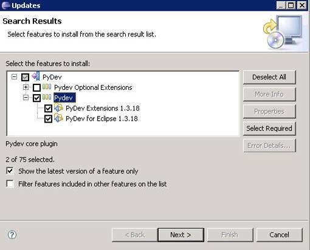

4. 阅读许可证条款，如果接受，则可单击 Next。进入安装路径选择界面，使用默认设置，然后 Finish。

5. Eclipse Update Manager 将下载 PyDev，您可以从 Eclipse 任务栏中看到下载的进度。下载完后，显示一个需要您确认是否安装的界面，单击 Install All 便开始安装了。


安装完后，需要重启 Eclipse 使安装生效。

### 验证是否成功安装 PyDev

如何才能验证 Eclipse Update Manager 是否已经成功安装了所需的 PyDev 插件了呢？

选择 Help->About Eclipse SDK->Plug-in Details，将会出现 About Eclipse SDK Plug-ins 窗口，该窗口里列出了所有已经安装了的 Eclipse 插件。检查一下在 Plug-in Id 一栏中是否至少有五个以上分别以 com.python.pydev 和 **org.python.pydev** 开头的插件。如果是，那么 PyDev已经被成功安装，否则，安装出了一些问题，需要根据具体问题来做具体的分析。

##### 图 3\. 验证 PyDev 插件

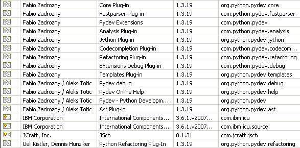

### 配置 PyDev

安装好 PyDev 之后，需要配置 Python/Jython 解释器，配置过程很简单。

在 Eclipse 菜单栏中，选择 Window > Preferences > Pydev > Interpreter – (Python/Jython)，在这里配置 Python/Jython 解释器，下面以 Python 为例介绍如何配置。

首先需要添加已安装的解释器。这里，Python 安装在 C:\\Python25 路径下。单击 New，选择 Python 解释器 python.exe，打开后显示出一个包含很多复选框的窗口，选择需要加入系统 **PYTHONPATH 的路径，单击 Ok。**

##### 图 4\. 配置 PyDev

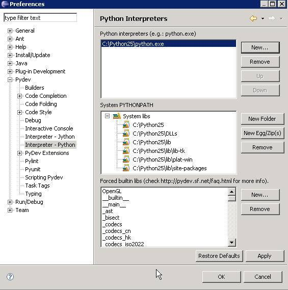

接下来，检查一下配置的结果是否正确。

在 System **PYTHONPATH 里，检查是否包含配置过程中加入的那些路径。这里列出了所有的系统所需的库文件夹。**

另外，在 Forced builtin libs 里，列出了 Python 的内置库。对于 Python 而言，这样的内置库大约有50个，而对于 Jython 来说，则有30个左右。

这样，Python 解释器就配置好了。

## PyDev Package Explorer

### 创建项目

在开展工作之前，需要创建一个新的项目。在 Eclipse 菜单栏中，选择 File > New > Project > Pydev > Pydev Project，单击 Next。

##### 图 5\. 创建 Pydev 项目

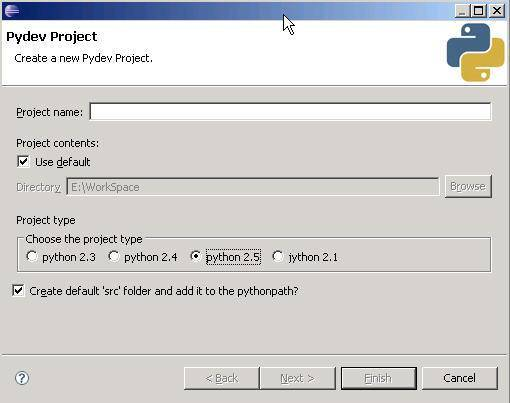

这时，显示出 Pydev Project 窗口，输入项目名称、选择工作路径、选择 Python 解释器的版本类型并选中复选框，然后单击 Next，进入关联项目的窗口，如果不需要关联其他项目，则可以直接单击 Finish，完成项目的创建。

### 创建 Python 包和模块

接下来，在刚创建的项目中开始创建 Python 包和模块。

1. 进入 Pydev 透视图，在 Python Package Explorer 中，右键单击 src，选择 New->Pydev Package，输入 Package 名称并单击 Finish，Python 包就创建好了，此时，自动生成 **init**.py 文件，该文件不包含任何内容。

    注意：如果在创建项目的时候没有选中”Create default src folder and add it to the pythonpath”复选框，则需要通过 File > New > Other > Source Folder 手动创建一个源代码文件夹。

2. 创建完 Pydev Package 后，右键单击创建的包，选择 New->Pydev Module，输入模块名称，单击 Finish。这样，Python 模块就建成了。


### 编辑源程序

对于源程序的一些基本编辑方法，就不做介绍了。下面介绍几点 Pydev 提供的非常实用的编辑功能。

#### 语法错误提示

Python 开发者在创建修改程序的过程中，如果能及时发现编辑过程中出现的语法错误，无疑对整个项目开发的质量和进展都是非常重要的。在 Python 透视图中，Pydev Package Explorer 中列出了项目的源代码，双击其中某一个 Python 文件，如果该文件包含语法错误，错误会以很醒目的方式展现出来。

##### 图 6\. Pydev 文件语法错误提示

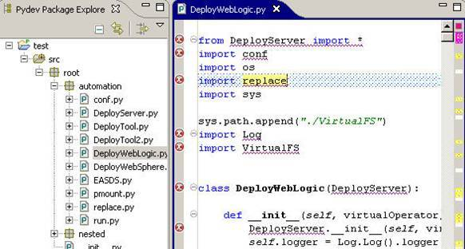

如果想把整个项目中所有包含语法错误的文件显示出来，可以从 Python 透视图自由切换到 Java 透视图。在 Java Package 里，一个个醒目的小红叉标记了所有包含语法错误的 Python文件。

##### 图 7\. Pydev 项目语法错误提示

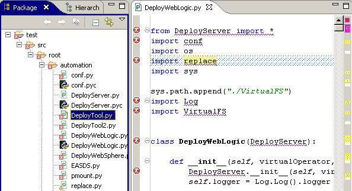

#### 源代码编辑助手 (Content Assistents)

源代码编辑助手 (Content Assistents，以下简称 CA)，顾名思义，即用于帮助开发者编辑源程序，它提供了诸多方便实用的功能，引导开发者进行高效快速的项目开发。

通过快捷键 Ctrl+1 可以激活 CA，它支持的功能如下：

**PyDev**

1. Move import to global scope
2. Create docstring
3. Assign result to new local variable (or field)
4. Assign parameters to attributes
5. Surround code with try..except or try..finally

**PyDev Extensions**

1. Make import for undefined token
2. Ignore error
3. Don’t analyze module

在安装 PyDev 时，PyDev 和 PyDev Extensions 包都已安装，所以 CA 的这几大功能现在都支持。首先，先介绍如何使用 PyDev 包含的 CA 功能。

**PyDev 的 CA 功能**

**1\. Move import to global scope**

以如下代码为例，将光标移至 import sys 后，启动快捷键 Ctrl+1 激活 CA，”Move import to global scope” 出现在标签中，按 Enter 应用此功能。如果不想应用该功能，可以按 Esc 键取消。

```
#!/usr/bin/python –u
sys.path.append("./VirtualFS”)
import sys

```

Show moreShow more icon

应用该功能后，import sys 被成功移至全局范围内，消除了之前的错误。改变后的代码如下。

```
#!/usr/bin/python –u
import sys
sys.path.append("./VirtualFS”)

```

Show moreShow more icon

**2\. Create docstring**

Create docstring 功能可以自动为函数添加参数注解。将光标移至如下代码行，启动快捷键Ctrl+1 激活 CA，标签栏中出现 ”Make docstring”。

```
def __init__(self, dbUser, dbPswd, dbHost):

```

Show moreShow more icon

按 Enter 应用该功能后，自动为该函数添加了参数注解。

```
def __init__(self, dbUser, dbPswd, dbHost):

        @param virtualOperator:
        @param database:
        @param hostname:
        @param workDir:
    '''

```

Show moreShow more icon

**3\. Assign result to new local variable (or field)**

CA 还提供一种功能能够将函数返回结果赋给新的内部变量。以函数 callMethod 为例，将光标移至 a.callMethod() 行激活 CA。

```
def method (self, a):
    a.callMethod()

```

Show moreShow more icon

选择 ”Assign to field(self, callMethod)” 或者 ”Assign to local(callMethod)”，可以将a.callMethod() 结果赋给新的内部变量 self.callMethod，改变后的代码如下。

```
def method (self, a):
    self.callMethod = a.callMethod()

```

Show moreShow more icon

**4\. Assign parameters to attributes**

在程序编辑过程中，如果需要把函数参数赋给变量，可以使用 CA 的 Assign parameters to attributes 功能自动完成这样的需求。将光标移至函数 m1 所在行，激活 CA。

```
class Foo(object):
    Def m1(self, a, b):

```

Show moreShow more icon

在标签栏中选择 ”Assign parameters to attributes”，自动生成两行代码将参数 a，b 赋给同名变量。

```
class Foo(object):
    def m1(self, a, b):
        self.a = a
        self.b = b

```

Show moreShow more icon

**5\. Surround code with try..except or try..finally**

对可能产生异常的代码，要进行异常捕获，通常使用 try..except 或者 try..finally 语句来捕获异常。选中一段代码 print usage，激活 CA 的 ” Surround code with try..except or try..finally”功能，可以自动对 print usage 进行异常捕获。

```
import sys
def method (self, usage):
      try:
          print usage
      except:
          raise

```

Show moreShow more icon

下面，再介绍 PyDev Extensions 包含的 CA 功能是如何被运用的。

##### PyDev Extension 的 CA 功能

**1\. Make import for undefined token**

以如下一段代码为例，xmlreader 未定义，语法分析出错。

```
class Test:
    def method(self):
         xmlreader

```

Show moreShow more icon

将鼠标移至出错行，启动快捷键 Ctrl+1 激活 CA，选择标签栏中的 ”Import xmlreader(xml.sax)”，自动生成一行代码 from xml.sax import xmlreader，语法错误消除。

```
from xml.sax import xmlreader
class Test:
    def method(self):
         xmlreader

```

Show moreShow more icon

**2\. Ignore error**

仍以上述代码为例，由于 xmlreader 没有被定义，包含语法错误，在这一行激活 CA，选择 ”UndefinedVariable”，语法错误被忽略，xmlreader 后自动生成一行注释标明 ”#@UndefinedVariable”。

```
class Test:
    def method(self):
         xmlreader #@UndefinedVariable

```

Show moreShow more icon

**3\. Don’t analyze module**

语法分析器可以帮助显示包含语法错误的代码，但在程序编辑过程中，有时候需要刻意取消对程序的语法分析，CA 的 Don’t analyze module 提供了这样的功能。

将光标移至程序第一行，激活 CA，选择 ”@PydevCodeAnalysisIgnore”，自动生成一行代码 ”#@ PydevCodeAnalysisIgnore”，忽略对程序体的语法分析。

```
#@PydevCodeAnalysisIgnore
class Test:
    def method(self):
                  xmlreader

```

Show moreShow more icon

**4\. Quick Outline**

对特定的 Python 文件，Pydev Extensions 提供的 Quick Outline 能最简单快捷地获取该文件的组织结构，并能在该文件中方便地查询定位所需信息。

在 Pydev 透视图中，选择 Source -> Show Quick Outline，或者使用快捷键 Ctrl+O 启动该功能。

Python 文件的类、函数等组织架构便以树状形式被形象地展现出来。同时，Filter 提供了查询定位的功能，可以方便地查询所需信息并定位到相应的代码段。

##### 图 8\. Quick Outline

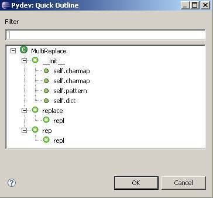

**5\. Globals Browser**

Globals Browser 是 Pydev Extensions 提供的另外一种强大的查询定位功能。它可以查询定位整个工程内的一些定义和属性，包括：

- 类定义
- 方法定义
- 全局变量
- 类以及实例属性

通过三种方式可以启动该功能。

- 在 Pydev 透视图中，从菜单栏中选择 Pydev -> Globals Browser。

    图 9\. 菜单栏启动 Globals Browser

    

- 在Pydev 透视图中，工具栏有如下的一个小图标，鼠标移至该图标上方，显示 ”Pydev: Globals Browser” 标注。点击该图标按钮，可以启动 Globals Browser 功能。

    图 10\. 工具栏启动 Globals Browser

    

- 通过快捷键 Ctrl + Shift + T，可以快速启动 Globals Browser 功能。

    在 Filter 中输入所要查询的定义、变量或者属性，Globals Browser 可以快速地定位到相应的代码段。

    图 11\. Globals Browser

    


**6\. Hierarchy View**

当某个 python 文件包含多个类时，如何才能简单直观地了解各个类之间的依存关系？Hierarchy View 提供了这样的功能，它能将多个类之间的层次关系以树状结构直观地显示出来。

以一段 Python 代码为例，定义了 Super1, Super2, ToAnalyze 和 Sub1 四个类。在 Pydev透视图中，选择 Windows -> Show View -> Other，在弹出的 Show View 窗口中，选择 Pydev -> Hierarchy View。按快捷键 F4 激活 Hierarchy View，可以看到树状图中显示出了类间的层次关系。

##### 图 12\. 在 Hierarchy View 中显示类的层次关系

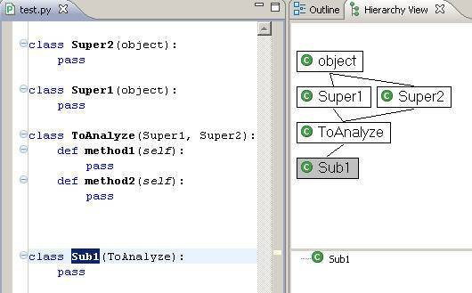

Hierarchy View 还支持以下四个功能：

- 在层次图中，用鼠标单击某个类，图下方即显示出该类的方法。
- 如果双击某个类、方法或者属性，则会调出源程序，进入对该类、方法或者属性的编辑状态。
- 在 Hierarchy View 中，按住鼠标右键，并相左或向右移动鼠标，层次图则会相应地缩小或放大。
- 在 Hierarchy View 中，按住鼠标左键移动鼠标，层次图则会被随意拖动到相应的位置。

## 运行和调试

### 运行程序

要运行 Python 源程序，有两种方法可供选择。下面以一段代码 example.py 为例介绍这两种运行方式。

- 在 Pydev Package Explorer 中双击 example.py，选择 Run -> Run As -> Python Run。程序example.py 立即被运行，在控制台 Console 里显示出程序的执行结果。

    图 13\. Python 程序及运行结果

    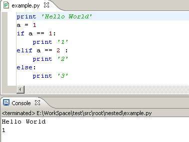

- 在 Pydev Package Explorer 中，用鼠标右键单击 example.py，在弹出的菜单栏中选择 Run As -> Python Run。同样，example.py 被执行，Console 中显示程序的执行结果。


以上两种方式是运行源程序的基本方法。Pydev 还提供一种特有的源程序运行功能 Run As Python Coverage，该功能不仅能显示出程序的运行结果，而且能将程序运行过程中代码的覆盖率显示出来。

要查看代码的覆盖率，首先需要打开 Code Coverage Results View。在 Pydev 透视图中，选择 Windows -> Show View -> Code Coverage Results View。在弹出视图的左栏中，可以看到三个按钮，”Choose dir!”, “Clear coverage information!” 和 ”Refresh Coverage infomation”。

##### 图 14\. Code Coverage Results View


用鼠标左键单击 ”Choose dir!”，在弹出的 Folder Selection 窗口中选择需要运行的程序所在的包，单击 Ok。这样，这个包中所有的源程序便显示在左栏中。

接下来，仍以 example.py 为例，看看 Run As Python Coverage 功能展现出的结果。选择Run As -> Python Coverage，控制台 Console 中显示出了程序的运行结果。切换到刚才打开的 Code Coverage Results View 视图，单击左栏中的 example.py。

##### 图 15\. 在 Code Coverage Results View 中显示代码覆盖率


代码运行过程中的覆盖情况很清楚地显示在右栏中。

双击左栏中的 example.py，没有覆盖到的代码便在编辑器中以醒目的错误标志被标注出来。

##### 图 16\. 以错误标志显示没有被覆盖到的代码

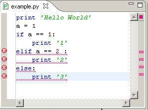

如果关闭 Code Coverage Results View 视图，代码的覆盖信息并没有丢失，重新打开该视图同样可以显示出这些信息。只有通过单击左栏的 “Clear coverage information!” 按钮，才可以清除程序运行后得到的这些覆盖信息。

### 调试程序

调试是程序开发过程中必不可少的，熟练掌握调试技能是开发者进行高效开发的前提和基础。下面仍以 example.py 为例，介绍如何使用 Pydev 的调试功能。

调试需从添加断点开始，有三种方式可以设置断点。

- 双击编辑器中标尺栏左边灰白的空白栏，在某行添加断点。

    图 17\. 双击标尺栏左边灰白的空白栏添加断点

    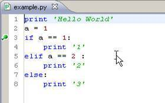

- 鼠标右键单击标尺栏，在弹出的菜单栏中选择 ”Add Breakpoint” 添加断点。

    图 18\. 右键单击标尺栏添加断点

    

- 将鼠标移至需要添加断点的代码行，使用快捷键 Ctrl+F10，在弹出的菜单栏中选择 ”Add Breakpoint” 添加断点。


添加好断点后，选择 Debug As -> Python Run 启动调试器，弹出一个对话框，询问是否切换到调试器透视图，单击 Yes，即显示调试模式。

##### 图 19\. 调试器透视图


程序调试过程中，常用的几个快捷键如下：

- 单步跳入 Step Into: F5
- 单步跳过 Step Over: F6
- 单步返回 Step Return: F7
- 重新开始 Resume: F8

在控制台 Console 中，显示出断点之前代码的执行结果。如果要查看某个变量的值，以变量 a 为例，可以手动在控制台中键入一行代码 ”print ‘a is:’, a”，再连续按两次 Enter 键，即显示出变量的值。

##### 图 20\. 控制台显示变量值

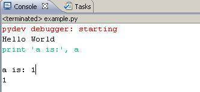

在调试模式下，要查看表达式的值，选中后单击鼠标右键，选择 Watch。弹出 Expression面板，显示出了相应的变量或表达式的值。

##### 图 21\. Expression 面板中显示表达式值

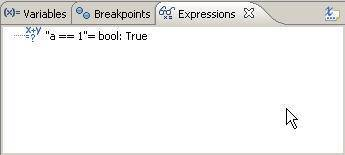

如果想要在满足一定条件下已经添加的断点才有效，可以设置断点的属性。在编辑器的标尺栏中单击鼠标右键，弹出的菜单栏中选择 Breakpoint Properties。在显示的窗口中，选中复选框 ”Enable Condition”，输入需要满足的条件，单击 Ok。

##### 图 22\. 设置断点属性

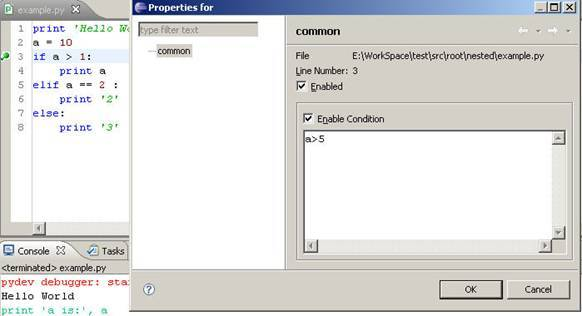

这样，当重新执行程序调试的时候，只有满足条件的情况下，该断点才有效。

## 结束语

Pydev 结合 Ecplise 实现了如此功能强大且易用的 Python IDE，本文不能一应俱全地介绍出来，对于一些基本的功能没有做过于详尽的介绍，主要突出 Pydev 特有的一些功能。Pydev for Eclipse 的出现为 Python 开发人员实现高效的项目开发提供了很好的条件，该项目也在不断的发展之中，其功能将会越来越强大。