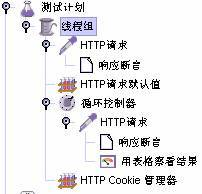
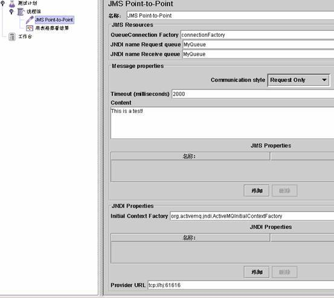

# 使用 JMeter 完成常用的压力测试
以 JMeter 为例完成最常用的三种类型服务器

**标签:** DevOps,Java

[原文链接](https://developer.ibm.com/zh/articles/os-pressiontest/)

胡键

发布: 2006-06-26

* * *

讲到测试，人们脑海中首先浮现的就是针对软件正确性的测试，即常说的功能测试。但是软件仅仅只是功能正确是不够的。在实际开发中，还有其它的非功能因素也起着决定性的因素，例如软件的响应速度。影响软件响应速度的因素有很多，有些是因为算法不够高效；还有些可能受用户并发数的影响。

在众多类型的软件测试中，压力测试正是以软件响应速度为测试目标，尤其是针对在较短时间内大量并发用户的访问时，软件的抗压能力。本文以 JMeter 为例，介绍了如何使用它来完成常用的压力测试：Web 测试、数据库测试和 JMS 测试。

## 概述

JMeter 最早是为了测试 Tomcat 的前身 JServ 的执行效率而诞生的。到目前为止，它的最新版本是 2.1.1，它的测试能力也不再仅仅只局限于对于Web服务器的测试，而是涵盖了数据库、JMS、Web Service、LDAP等多种对象的测试能力。在最新的 2.1.1 中，它还提供了对于 JUNIT 的测试。

JMeter 的安装非常简单，从 [官方网站](http://jakarta.apache.org/jmeter/) 上下载，解压之后即可使用。运行命令在%JMETER\_HOME%/bin 下，对于 Windows 用户来说，命令是 jmeter.bat。运行前请检查JMeter 的文档，查看是否具备相关的运行条件。对于最新版（即 2.1.1），需要JDK的版本要求是JDK 1.4。

JMeter 的主要测试组件总结如下：

1. 测试计划是使用 JMeter 进行测试的起点，它是其它 JMeter 测试元件的容器。

2. 线程组代表一定数量的并发用户，它可以用来模拟并发用户发送请求。实际的请求内容在Sampler中定义，它被线程组包含。

3. 监听器负责收集测试结果，同时也被告知了结果显示的方式。

4. 逻辑控制器可以自定义JMeter发送请求的行为逻辑，它与Sampler结合使用可以模拟复杂的请求序列。

5. 断言可以用来判断请求响应的结果是否如用户所期望的。它可以用来隔离问题域，即在确保功能正确的前提下执行压力测试。这个限制对于有效的测试是非常有用的。

6. 配置元件维护Sampler需要的配置信息，并根据实际的需要会修改请求的内容。

7. 前置处理器和后置处理器负责在生成请求之前和之后完成工作。前置处理器常常用来修改请求的设置，后置处理器则常常用来处理响应的数据。

8. 定时器负责定义请求之间的延迟间隔。


JMeter的使用非常的容易，在 ONJava.com 上的文章 [Using JMeter](http://www.onjava.com/pub/a/onjava/2003/01/15/jmeter.html) 提供了一个非常好的入门。

## 常用测试

压力测试不同于功能测试，软件的正确性并不是它的测试重点。它所看重的是软件的执行效率，尤其是短时间内访问用户数爆炸性增长时软件的响应速度，压力测试往往是在功能测试之后进行的。在实际的开发过程中，软件潜在的效率瓶颈一般都是那些可能有多个用户同时访问的节点。

就目前 Java EE 的平台下开发的软件来说，这种节点通常可能是：Web 服务器、数据库服务器和 JMS 服务器。它们都是请求主要发生的地点，请求频率较其它的节点要高，而且处于请求序列的关键路径之上。如果它们效率无法提高的话，对于整个软件的效率有致命的影响。而且在这些节点上一般都会发生较大规模的数据交换，有时其中还包含有业务逻辑处理，它们正是在进行压力测试时首先需要考虑的。

本文以这三种节点为例，介绍如何使用 JMeter 来完成针对于它们的压力测试。

### Web 服务器

对于大多数的项目来说，并不会自行开发一个 Web 服务器，因此Web服务器压力测试的对象实际就是–发布到Web服务器中的软件。最简单的 Web 测试计划只需要三个 JMeter 的测试元件，如下图：


其中：

- 在线程组中定义线程数、产生线程发生的时间和测试循环次数。
- 在http请求中定义服务器、端口、协议和方法、请求路径等。
- 表格监听器负责收集和显示结果。

这种设置对于包含了安全机制的 web 应用是不够的，典型的 web 应用一般都会：

1. 有一个登录页，它是整个应用的入口。当用户登录之后，应用会将用户相关的安全信息放到 session 中。

2. 有一个 filter，它拦截请求，检查每个请求相关的 session 中是否包含有用户安全信息。如果没有，那么请求被重定向到登录页，要求用户提供安全信息。


在这种配置下应用上面的测试计划，那么除了登录页之外的其它请求都将因为缺少用户安全信息，而使请求实际定位到登录页。如果不加断言，那么在监听器看来所有的请求都是成功。而实际上，这些请求最终都没有到达它们应该去的地方。显然，这种测试结果不是我们所期望的。

为了成功的测试，至少有2种方法：

- 方法一，去掉程序的安全设置，如filter，使得不需要用户安全信息也能访问受限内容；
- 方法二，不修改程序，使用JMeter提供的”Http URL重写修饰符”或”Http Cookie管理器”。

对于第一种方法，有其局限性：

- 需要修改程序配置，如去掉web.xml中关于安全filter的设置。需要维护多个版本的web.xml，如压力测试和功能测试分别各自的web.xml，增加了维护成本，而且有可能会在测试之后忘记将web.xml修改回来。
- 对于一些需要用户安全信息的页面无能为力，如某些业务审计操作需要用户安全信息来记录。因为缺少这样的信息，注定了测试的失败。如果解决为了这个问题进一步的修改程序，那么因为存在多个版本的程序，那么其维护难度将大大增加。

虽然，第二种方法配置难度增加了，但是它不用修改程序。而且还可将测试计划保存成文件，以便重复使用。因此，选用第二种方法是较为理想的做法。下面以一个简化的例子说明使用方法二的配置步骤。

例子由以下几个文件组成：

- AuthorizenFilter.java，过滤器负责检验session中是否存在用户信息。如果没有，那么就转向到 login.jsp。它的主要方法 doFilter 内容如下：


    ```
    public void doFilter(ServletRequest request,
                         ServletResponse response,
                         FilterChain chain)
                         throws IOException, ServletException {
        HttpServletRequest req = (HttpServletRequest)request;
        HttpServletResponse res = (HttpServletResponse)response;
        HttpSession session= req.getSession();
        User user = (User)session.getAttribute("user");
        if(null == user){
            String uri= req.getRequestURI();
            //如果请求页是登录页，不转向
            if( uri.equalsIgnoreCase("/gWeb/login.jsp")){
                chain.doFilter(request, response);
            } else{
                res.sendRedirect("/gWeb/login.jsp");
            }
        }else{
            chain.doFilter(request, response);
        }
    }

    ```


    Show moreShow more icon

- User.java，用户类负责记录用户的信息。为了简化，这里的登录操作只允许指定用户名和密码。主要内容如下：


    ```
    public class User {
        private String user;
        private String pwd;
        public User(String user, String pwd) {
            this.user = user;
            this.pwd = pwd;
        }
        public boolean login(){
            return user.equals("foxgem") && pwd.equals("12345678");
        }
        public String getUser() {
            return user;
        }
        public void setUser(String user) {
            this.user = user;
        }
    }

    ```


    Show moreShow more icon

- Login.jsp 和welcome.jsp。其中 login.jsp 负责生成 User 对象，并调用 User 的login。当 login 返回为 true 时转向到 welcome.jsp。其验证部分的代码：


    ```
    <%
    if( request.getParameter("Submit") != null) {
          User ur= new User( request.getParameter("user"), request.getParameter("pwd"));
          if( ur.login()){
               session.setAttribute("user", ur);
             response.sendRedirect("/gWeb/welcome.jsp");
          } else{
             session.setAttribute( "LOGIN_ERROR_MSG",
    "无效的用户，可能原因：用户不存在或被禁用。");
             response.sendRedirect("/gWeb/index.jsp");
             return;
          }
    }
    %>

    ```


    Show moreShow more icon

- web.xml，配置 filter 拦截所有访问 JSP 页面的请求：


    ```
    <filter>
        <filter-name>authorizen</filter-name>
        <filter-class>org.foxgem.jmeter.AuthorizenFilter</filter-class>
    </filter>
    <filter-mapping>
        <filter-name>authorizen</filter-name>
        <url-pattern>*.jsp</url-pattern>
    </filter-mapping>

    ```


    Show moreShow more icon


创建如下结构的 Web 测试计划：



其中主要测试元件说明如下：

- http请求默认值负责记录请求的默认值，如服务器、协议、端口等。
- 第一个http请求，请求login.jsp，并附加验证所需要的参数（user=foxgem，pwd=12345678，Submit=Submit）；其包含的响应断言验证url中包含”welcome.jsp”，这一点可以从程序中反应。
- 第二个http请求，请求是welcome.jsp；其包含的响应断言验证响应文本中包含”foxgem”，它是welcome.jsp页面逻辑的一部分。
- http cookie管理器负责管理整个测试过程中使用的cookie，它不需要设置任何属性。
- 循环控制器设置发送第二个请求的循环次数，表格监听器负责收集和显示第二个请求的测试结果。

启动测试计划之后，执行的顺序是：首先，第一个请求登录页进行登录；成功登录之后，使用循环控制器执行第二个请求。请求welcome.jsp时，响应断言用来验证是否确实是welocme.jsp来处理请求，而不是因为其它页。在这个测试计划中需要注意的是http cookie管理器。正是由于它的作用，使得第二个请求能顺利的发送到welcome.jsp进行处理，而不是因为缺少用户安全信息转发到login.jsp。

在这个例子中，我们并没有在程序中使用cookie（使用的是 session），那么http cookie管理器怎么会起作用呢？这是因为在servlet/jsp规范中对于session的状态跟踪有2种方式：

- 使用cookie，保留和传递sessionid。它不要求程序对于url有什么特殊的处理，但是要求浏览器允许cookie。在这个例子中，就是这种情形。
- 使用url重写，每次显式的在浏览器和服务器之间传递sessionid。它要求程序对url进行编码，对浏览器没有要求。

对于第二种情形，可以使用JMeter前置管理器中的http url重写修饰符来完成。对于Tomcat，Session参数是jsessionid，路径扩展使用”；”。使用url编码时需要注意，必须将浏览器的cookie功能关闭。因为url编码函数，如encodeURL，会判断是否需要将sessionid编码到url中。当浏览器允许cookie时，就不会进行编码。

如果cookie而不是session来保存用户安全信息，那么直接使用http cookie管理器就行了。此时，需要将使用的cookie参数和值直接写到管理器中，由它负责管理。对于其它的cookie使用，也是如此操作。

登录问题解决之后，对于 Web 服务器的测试就没什么难点了。剩下的就是根据实际需要，灵活运用相关的测试组件搭建编写的测试计划。（当然，对于安全问题还有其它的使用情景。在使用时需要明确：JMeter 是否支持，如果支持使用哪种测试组件解决。）

### 数据库服务器

数据库服务器在大多数企业项目中是不可缺少的，对于它进行压力测试是为了找出：数据库对象是否可以有效地承受来自多个用户的访问。这些对象主要是：索引、触发器、存储过程和锁。通过对于SQL语句和存储过程的测试，JMeter 可以间接的反应数据库对象是否需要优化。

JMeter 使用 JDBC 发送请求，完成对于数据库的测试。一个数据库测试计划，建立如下结构即可：


其中：

- JDBC连接配置，负责配置数据库连接相关的信息。如：数据库url、数据库驱动类名、用户名和密码等等。在这些配置中，”绑定到池的变量名”（Variable Name Bound to Pool）是一个非常重要的属性，这个属性会在JDBC请求中被引用。通过它， JDBC请求和JDBC连接配置建立关联。（测试前，请将所需要的数据库驱动放到JMeter的classpath中）。
- JDBC请求，负责发送请求进行测试。
- 图形结果，收集显示测试结果。

在实际的项目中，至少有2种类型的JDBC请求需要关注：select语句和存储过程。前者反应了select语句是否高效，以及表的索引等是否需要优化；后者则是反应存储过程的算法是否高效。它们如果效率低下，必然会带来响应上的不尽如人意。对于这两种请求，JDBC请求的配置略有区别：

- Select语句

    

- 存储过程

    


如果对于 Oracle，如果测试的是函数，那么也可以使用 select 语句来进行配置，此时可以使用：select 函数(入参) from dual 形式的语句来测试，其中dual是oracle的关键字，表示哑表。对于其它厂商的数据库产品，请查找手册。

### JMS服务器

MOM 作为消息数据交换的平台，也是影响应用执行效率的潜在环节。在 Java 程序中，是通过 JMS 与 MOM 进行交互的。作为 Java 实现的压力测试工具，JMeter 也能使用 JMS 对应用的消息交换和相关的数据处理能力进行测试。这一点应该不难理解，因为在整个测试过程中，JMeter 测试的重点应该是消息的产生者和消费者的本身能力，而不是 MOM本身。

根据 JMS 规范，消息交换有2种方式：发布/订阅和点对点。JMeter针对这两种情形，分别提供了不同的Sampler进行支持。以下MOM我们使用ActiveMQ 3.2.1，分别描述这两种消息交换方式是如何使用 JMeter 进行测试。

#### 测试前的准备（两种情况都适用）

JMeter 虽然能使用 JMS 对 MOM 进行测试，但是它本身并没有提供JMS需要使用的包。因此，在测试之前需要将这些包复制到 %JMETER\_HOME%/lib 下。对于 ActiveMQ 来说，就是复制 %ACTIVEMQ\_HOME%/lib。%ACTIVEMQ\_HOME%/optional 是可选包，可根据实际情况来考虑是否复制。

JMeter 在测试时使用了 JNDI，为了提供 JNDI 提供者的信息，需要提供 jndi.properties。同时需要将 jndi.properties 放到 JMeter 的 classpath 中，建议将它与 bin下的 ApacheJMeter.jar 打包在一起。对于 ActiveMQ，jndi.properties 的示例内容如下：

```
java.naming.factory.initial = org.activemq.jndi.ActiveMQInitialContextFactory
java.naming.provider.url = tcp://localhost:61616

#指定connectionFactory的jndi名字，多个名字之间可以逗号分隔。
#以下为例：
#对于topic，使用(TopicConnectionFactory)context.lookup("connectionFactry")
#对于queue，(QueueConnectionFactory)context.lookup("connectionFactory")
connectionFactoryNames = connectionFactory

#注册queue，格式：
#queue.[jndiName] = [physicalName]
#使用时：(Queue)context.lookup("jndiName")，此处是MyQueue
queue.MyQueue = example.MyQueue

#注册topic，格式：
# topic.[jndiName] = [physicalName]
#使用时：(Topic)context.lookup("jndiName")，此处是MyTopic
topic.MyTopic = example.MyTopic

```

Show moreShow more icon

#### 发布/订阅

在实际测试时，发布者和订阅者并不是需要同时出现的。例如，有时我们可能想测试单位时间内消息发布者的消息产生量，此时就不需要消息发布者，只需要订阅者就可以了。本例为了说明这两种Sampler的使用，因此建立如下的测试计划：


其中JMS Publisher和JMS Subscriber的属性：选择”使用jndi.properties”，连接工厂是connectionFactory，主题是MyTopic，其它使用默认配置。对于JMS Publisher，还需提供测试用的文本消息。

启动ActiveMQ，运行测试计划。如果配置正确，那么与ActiveMQ成功连接之后，在JMeter的后台会打印出相关信息。在测试过程中，JMeter 后台打印可能会出现java.lang.InterruptedException 信息，这个是正常现象，不会影响测试过程和结果。这一点可以从 bin 下的 jmeter.log 看出。

#### 点对点

对于点对点，JMeter只提供了一种Sampler：JMS Point-to-Point。在例子中，建立如下图的测试计划：



其中：Communication style是Request Only。对于另一种风格：Request Response，会验证收到消息的JMS Header中的JMSCorrelationID，以判断是否是对请求消息的响应。

## 结束语

本文介绍了如何使用JMeter完成最常用的三种类型服务器的压力测试，这三种类型的压力测试涵盖了很大一部分的使用情形，然而需要记住的是工具毕竟是工具。效果好不好，关键还是在于使用的人。而且，对于压力测试，测试计划的好坏是关键。针对不同的情况，分析后有针对的进行测试，比起拿枪乱打、无的放矢显然要高效得多。