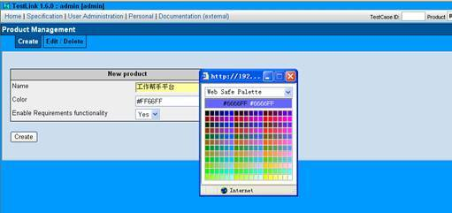
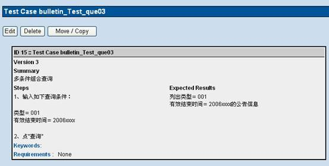
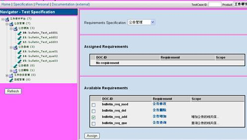
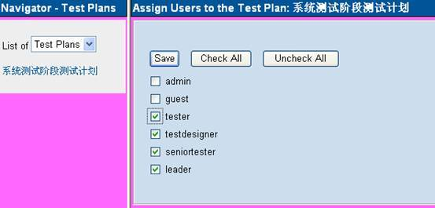
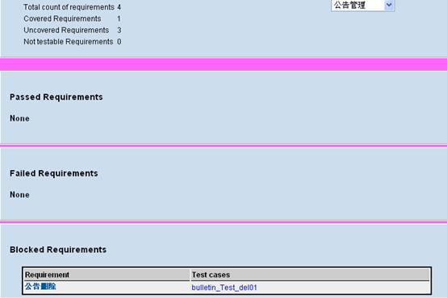
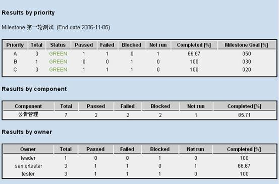

# 使用 TestLink 进行测试管理
将测试过程从测试需求、测试设计、到测试执行完整的管理起来

**标签:** DevOps

[原文链接](https://developer.ibm.com/zh/articles/os-testlink/)

徐异婕

发布: 2006-10-12

* * *

TestLink 是 sourceforge 的开放源代码项目之一。作为基于 we b的测试管理系统，TestLink 的主要功能包括：

- 测试需求管理
- 测试用例管理
- 测试用例对测试需求的覆盖管理
- 测试计划的制定
- 测试用例的执行
- 大量测试数据的度量和统计功能。

TestLink的最新版本是 1.6.2。在本文接下来的部分里，作者将详细地介绍使用 TestLink1.6.0 来进行测试管理的完整过程。

## 第 1 步. 安装启动

1. 在安装 TestLink1.6.0 前，需要完成以下安装运行所需要的环境：Webserver、php4 和 MySQL。笔者推荐的安装环境如下：

    - Apache HTTP Server 2.0.59
    - Php 4.4.1
    - Mysql 4.1.21
2. 将 TestLink 安装包保存到服务器，解压缩到 Apache2 的 htdocs 目录下，并重命名为 testlink。

3. 自动安装 TestLink

    - 在浏览器输入访问地址 `http://yoursite/testlink/install/index.php`，如：`http://localhost:80/testlink/install/index.php`
    - 选择 new install，在进入的页面中，输入登录 MySQL 的用户名和密码，如 root。提示安装成功，详细的安装说明请参照 [http://blog.csdn.net/judyxm/archive/2006/01/12/577148.aspx](http://blog.csdn.net/judyxm/archive/2006/01/12/577148.aspx)
4. 登录 testlink 首页面。系统 为testlink 创建一个默认管理员账号，用户名和密码为：admin/admin。你可以使用这个账号访问 TestLink 。登录`http://127.0.0.1:80/testlink/index.php`，如果你看到的页面如下，就说明你已经安装成功了。

    

## 第 2 步. 初始配置(设置用户、产品)

### 1\. 用户设置

在TestLink系统中，每个用户都可以维护自己的私有信息。admin可以创建用户，但不能看到其它用户的密码。在用户信息中，需要设置Email地址，如果用户忘记了密码，系统可以通过mail获得。

TestLink系统提供了六种角色，分别是admin、leader、senior tester 、tester、guest、testdesigner。相对应的功能权限如下：（详见图）

- Guest：只有读的权限，适合于查看测试用例和测试需求，以及项目分析的用户。
- Testdesigner：可以开展测试用例和测试需求的所有工作。
- Tester：只能执行测试用例。
- Senior tester：可以查看和维护测试用例，并且可以执行测试用例，但是不能管理测试计划、分配测试任务。
- Leader：可以开展测试规格和测试需求的所有工作，还可以管理测试计划、分配测试任务。
- Admin：维护产品，用户。

同时，支持不同地域用户对不同语言的需求，可以根据用户的喜好对用户提供不同的语言支持。

### 2\. 产品设置

TestLink可以对多个产品进行管理，Admin进行产品设置后，测试人员就可以进行测试需求、测试用例、测试计划等相关管理工作了。TestLink支持对每个产品设置不同的背景颜色，方便管理。

## 第 3 步. 测试需求管理

测试需求是我们开展测试的依据。首先，我们对产品的测试需求进行分解和整理。一个产品可以包含多个测试需求规格，一个测试需求规格可以包含多个测试需求；

- 创建测试需求规格

    对测试需求规格的描述比较简单，内容包含名称、范围。

- 创建测试需求

    测试需求内容包含：需求ID、名称、范围、需求的状态，以及覆盖需求的案例。 TestLink提供了两种状态来管理需求：正确的（Valid）、不可测试的（not testable）。

    

- 从文件导入测试需求

    Testlink提供了从文件导入测试需求的功能，支持的的文件类型有csv和csv（door）两种。

## 第 4 步. 测试用例管理

TestLink支持的测试用例的管理包含三层：分别为Component、Category、Test case。我们把Component对应到项目的功能模块，而把Category跟每个模块的function对应，Test case就是写在这些Category里的。我们可以使用测试用例搜索功能从不同的项目、成百上千的测试用例中查到我们需要的测试用例，甚至于可以直接将别的项目里写的测试用例复制过来，这样就解决了测试用例的管理和复用问题。

但是，还有一个问题没有解决，那就是与测试需求的对应问题。在测试管理中，测试用例对测试需求的覆盖率是我们非常关心的，从需求规格说明书中提取出测试需求之后， Testlink提供管理测试需求与测试用例的对应关系的功能。

- 创建Component

    Component的内容包括：名称、介绍、范围、相关的内容、约束。

- 创建Category

    Category的内容包括：名称、测试范围和目标、配置信息、测试数据、测试工具

- 创建 Test case

    测试用例的要素包括：测试用例名称、简要说明、步骤、期望结果、关键字。

    

    创建好的测试用例树如下：

    

- 建立测试用例和测试需求的覆盖关系。

    选中左侧用例树中的测试用例，再选择右侧对应的测试需求，进行Assign即可。

    

## 第 5 步. 测试计划制定

在TestLink系统中，一个完整的测试计划包括：

- 测试阶段的名称（如集成测试阶段、系统测试阶段）
- 里程碑（明确每个测试阶段的开始和截止时间，以及完成A、B、C三种优先级的比例）
- Build版本（定义本测试计划中需要测试的build版本，一般以产品名+时间来命名。）
- 安排测试人员 （从用户列表中选择本测试计划的参与人员。）

    

- 测试用例集

    - 制定优先级规则。优先级分为A、B、C三级，系统会根据用户定义的重要级别和风险级别的组合来确定优先级的归属。重要级别分为三级：Low、Medium、High。风险级别包括三级：1、2、3。
    - 从测试用例中选择本测试计划的测试用例集
    - 设置每个测试用例Category的重要级别和风险级别
    - 设置每个测试用例Category的责任归属。从本测试计划的测试人员列表中选择每个Category的Owner，由他来负责和完成测试用例的执行。

## 第 6 步. 测试执行

执行测试用例，按照对每个build版本的执行情况，记录测试结果。测试结果有四种情况可以选择：

Not Run：还没有执行过

Pass：执行通过

Failed：执行失败

Blocked：由于其它用例失败，导致此用例无法执行，被阻塞。

## 第 7 步. 测试结果分析

TestLink根据测试过程中记录的数据，提供了较为丰富的度量统计功能，可以直观的得到测试管理过程中需要进行分析和总结的数据：

- 测试用例对测试需求的覆盖情况：哪些需求已经通过测试，哪些需求未通过测试，哪些需求处于阻塞状态，哪些需求还未开始测试。

    

- 针对每个版本的测试用例执行情况：

    1. 各种优先级的测试用例执行的比率

    2. 各个模块的测试用例执行的比率

    3. 各个测试人员测试用例的执行比率

    

- 每个版本的执行情况

    

- 所有测试用例在不同build版本的执行情况，显示？的地方表示还未执行。

    

- 阻塞的测试用例列表

    

- 失败的测试用例列表

    

- 每个测试用例的bug数

    如果和bug跟踪系统连接的话，在下表中可以统计出每个测试用例的bug的数目

    

## 第 8 步. 与 bug 跟踪系统集成

TestLink提供了与多种bug跟踪系统关联的接口配置，目前支持的bug系统有Jira、bugzilla、mantis。配置方法的相关文档参照帮助。

## 第 9 步. 其它易用性功能

TestLink还提供了很多易用性的功能，比如：

- 从测试需求直接生成测试用例
- 文档的导入、导出功能
- 测试报告可以导出为excel
- 支持设定keyword

## 结束语

TestLink用于进行测试过程中的管理，通过使用TestLink提供的功能，我们可以将测试过程从测试需求、测试设计、到测试执行完整的管理起来，同时，它还提供了好多种测试结果的统计和分析，使我们能够简单的开始测试工作和分析测试结果。

本文中，作者根据自己的使用经验，详细演示了如何使用TestLink来进行测试管理的全部过程，简单的介绍了TestLink的使用方法。希望能够帮助大家学会使用TestLink的基本功能，同时，大家可以参考这个过程和TestLink的帮助文档来实现对测试过程的管理。