# 使用 Watson Machine Learning Accelerator 训练一个文本分类模型
Watson Machine Learning Accelerator 实践

**标签:** 分析

[原文链接](https://developer.ibm.com/zh/articles/ba-lo-wmla-train-text-classify/)

戴 云, 燕 阳, 李 青, 姜 懿珊

发布: 2019-11-12

* * *

## 简介

[IBM Watson Machine Learning Accelerator](https://www.ibm.com/ca-en/marketplace/deep-learning-platform) 是包括 [IBM Watson Machine Learning Community Edition](https://developer.ibm.com/linuxonpower/deep-learning-powerai/) 、 [IBM Spectrum Conductor](https://www.ibm.com/us-en/marketplace/spark-workload-management) 、 [IBM Spectrum Conductor Deep Learning Impact](https://www.ibm.com/ca-en/marketplace/spectrum-conductor-deep-learning-impact) 的软件解决方案，由 IBM 为包括开源深度学习框架在内的整个堆栈提供支持。Watson Machine Learning Accelerator 为数据科学家提供了端到端的深度学习平台。这包含完整的生命周期管理，从安装和配置到数据读取和准备，再到训练模型的构建、优化和分配，以及将模型移至生产环境。在您要将自己的深度学习环境扩展为包含多个计算节点时，Watson Machine Learning Accelerator 即可大显身手。
现在甚至有免费评估版本可供使用，更多信息可参阅我们的另一篇文章 [利用 IBM Watson Machine Learning Accelerator 对图像进行分类](https://developer.ibm.com/zh/tutorials/use-computer-vision-with-dli-watson-machine-learning-accelerator/) 。

在本教程中，您将使用 Watson Machine Learning Accelerator 来训练一个针对 IMDB 的影评数据进行”正面评价”或者”负面评价”的二元文本分类模型。当然，您也可以在自己的示例中使用既有的二元文本分类数据进行训练。

## 学习目标

完成本教程后，您将掌握如何：

- 熟悉深度学习工作流程
- 利用 Watson Machine Learning Accelerator 对文本进行二元分类
- 使用 Watson Machine Learning Accelerator 构建模型
- 进一步熟悉 IBM Power Systems 服务器生态系统

## 预计完成时间

完整流程大约需要 8 小时。包括约 4 小时的模型训练、安装、配置以及在 GUI 中对模型的处理。

## 前置准备

本教程需要访问 GPU 加速的 IBM Power Systems AC922 型或 S822LC 型服务器。除获取服务器外，还有多种方法可访问 [PowerAI 开发者门户网站](https://developer.ibm.com/linuxonpower/deep-learning-powerai/try-powerai/) 上列出的 Power Systems 服务器。

- 从 [IBM 软件存储库](https://epwt-www.mybluemix.net/software/support/trial/cst/programwebsite.wss?siteId=303&tabId=569&w=rc9ehqk&p=18tkuuj28%20) 下载 IBM Watson Machine Learning Accelerator 试用软件。下载需占用 4.9 GB 空间，并且需要 IBM ID。
- 按照 [IBM Knowledge Center](https://www.ibm.com/support/knowledgecenter/en/SSFHA8_1.1.1/powerai_evaluation.html) 或 [OpenPOWER Power-Up User Guide](https://power-up.readthedocs.io/en/latest/Running-paie.html) 中的具体说明安装并配置 IBM Watson Machine Learning Accelerator。

### 第二步: 下载 TensorFlow 经检测的二分类模型

下载 [dli-1.2.2-tensorflow-samples](https://us-south.git.cloud.ibm.com/ibmconductor-deep-learning-impact/dli-1.2.2-tensorflow-samples/tree/master/tensorflow-1.13.1/nlp?cm_sp=ibmdev-_-developer-tutorials-_-cloudreg) 的 NLP 目录下所有文件并根据提示将 `network/` 目录中的内容拷贝至 `intent_classification/` 目录中。

### 第三步: 下载数据集

1. 先用如下代码从 [https://ai.stanford.edu/~amaas/data/sentiment/](https://ai.stanford.edu/~amaas/data/sentiment/) 上下载由斯坦福大学公开的 Large Movie Review Dataset 数据集：

    1. wget `https://ai.stanford.edu/~amaas/data/sentiment/aclImdb_v1.tar.gz`
2. 对下载好的文件进行解压缩操作：

    1. tar –zxvf aclImdb\_v1.tar.gz
3. 下载数据集准备脚本并保存至以上数据集解压缩后的目录中。
4. 执行以下命令来运行上面脚本准备数据集:

    1. python3 convert\_aclimdb\_to\_wmla\_intention\_classification\_dataset.py
5. 上面脚本执行完毕后会生成一个 csv.tgz 文件。将该文件传输至装有 WMLA 的服务器然后解压缩到一个 Spark Instance Group 的 Execution User 具有读取权限的目录中。

### 第四步: 将数据加载到 Watson Machine Learning Accelerator 中

\*注：在此步之前，在 Spark instance group 中应该已经创建好相应的 SIG，此例中 SIG 使用 python2 的环境。具体步骤请参见 Watson Machine Learning Accelerator 用户手册： [https://www.ibm.com/support/knowledgecenter/SSFHA8\_1.2.1/wmla\_dli\_config.html](https://www.ibm.com/support/knowledgecenter/SSFHA8_1.2.1/wmla_dli_config.html)。
或者我们发表的另一篇教程 “ [利用 IBM Watson Machine Learning Accelerator 对图像进行分类](https://developer.ibm.com/zh/tutorials/use-computer-vision-with-dli-watson-machine-learning-accelerator/) ” 中的步骤 2 至步骤 4。

创建新数据集，将数据与 Watson Machine Learning Accelerator 相关联。

首先打开深度学习界面。在菜单项中选择”Workload”-> “Spark”-> “Deep Learning”。

##### 图 1\. 打开深度学习界面

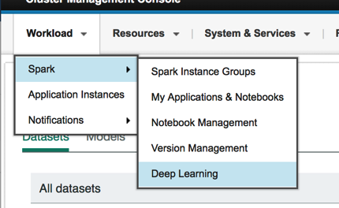

1. 在 **Datasets** 选项卡中，选择 **New** 。

     图 2\. 数据集选项卡 {: #图-2-数据集选项卡}

    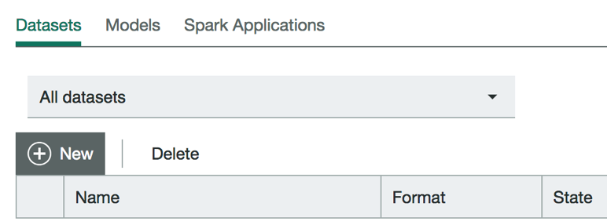

2. 单击 Any。显示对话框后，填写新数据集的详细信息后，然后点击 Create。

     图 3\. 创建数据集详细参数选项界面

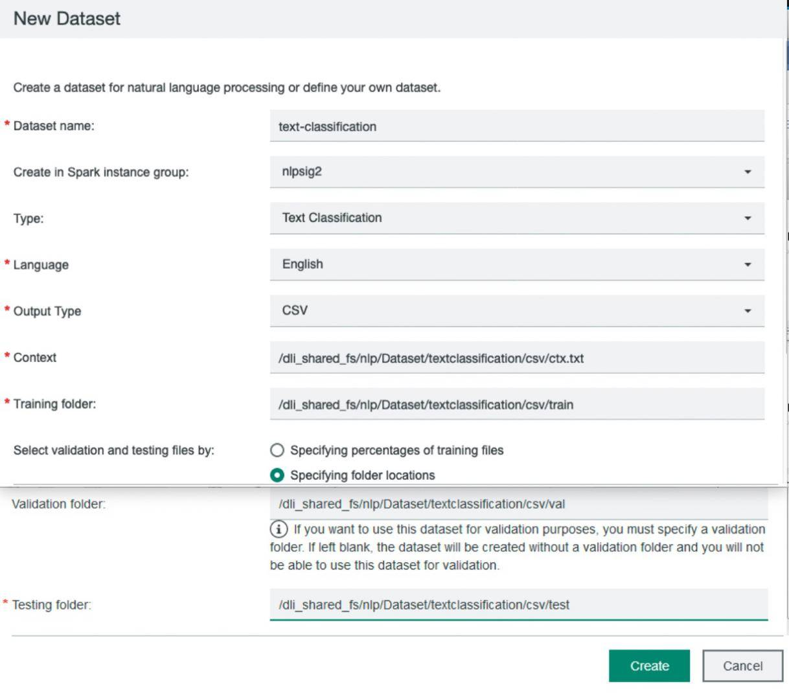

- 在 Dataset name 选项提供唯一名称，例如，”text-classification”。
- 为该数据集选择合适的 SIG。
- 在 Type 选项选择 Text Classification。
- 在 Output Type 选项选择 CSV。
- 在 Context 选项指定先前步骤中 csv.tgz 解压缩后中包含的 ctx.txt 文件路径。
- 在 Training folder 选项指定先前步骤中 csv.tgz 解压缩后 train 目录所在路径。
- 在选择了 Specifying folder locations 后，在 Testing folder 选项指定先前步骤中 csv.tgz 解压缩后 test 目录所在路径。
- 如果需要验证模型，在 validation folder 选项指定验证数据的路径。
- 准备就绪后，单击 Create。

利用 Watson Machine Learning Accelerator 中的数据，您即可开始下一步：构建模型。

### 第五步: 构建模型

修改用户访问权和组，确保 Watson Machine Learning Accelerator 可读取二分类模型文件。

1. 选择 Models 选项卡，然后单击 New。

     图 4\. 添加模型 {: #图-4-添加模型}

    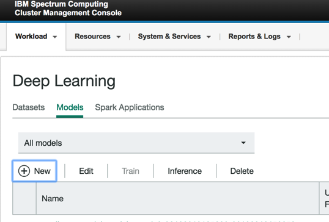

2. 选择 Add Location 打开添加模型模板界面。

     图 5\. 选择模型保存位置 {: #图-5-选择模型保存位置}

    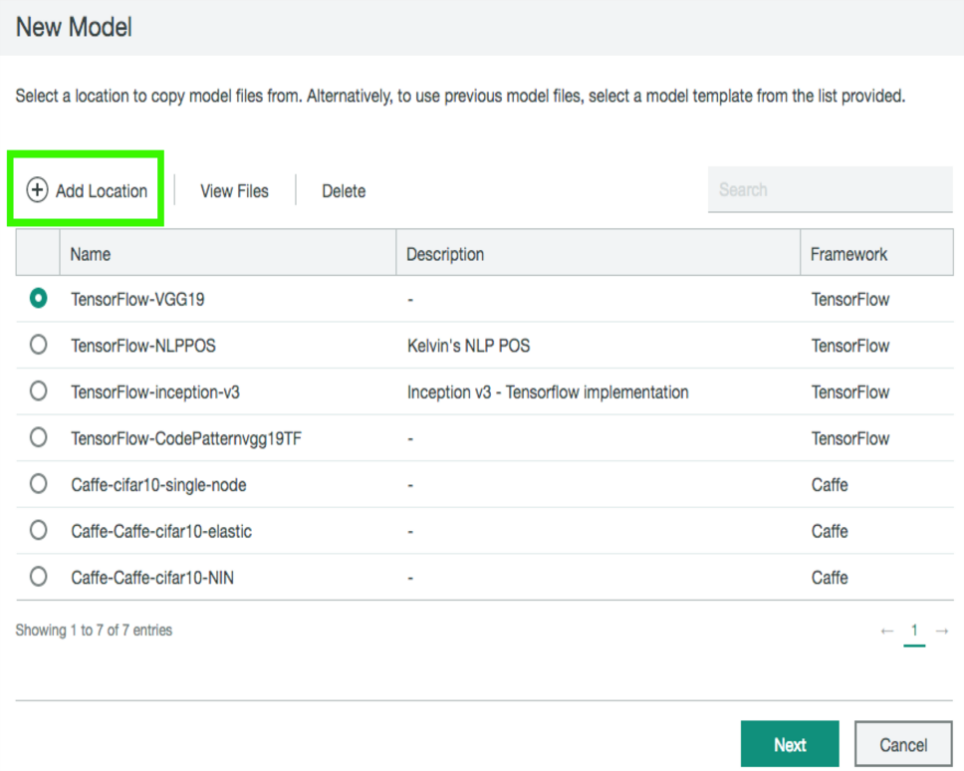

3. 在打开的选线界面 Framework 中选择 TensorFlow 作为框架。

     图 6\. 填写模型保存路径 {: #图-6-填写模型保存路径}

    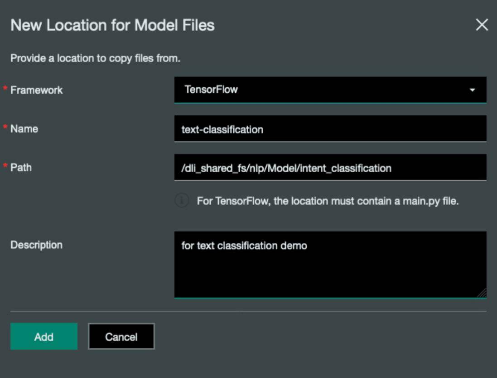

4. 在 Path 选项中，指定存放二分类模型文件路径，该路径含有 main.py 模型文件。然后点击 Add 添加该模型。
5. 然后在下面所示界面中选择 **TensorFlow-text-classification** ，然后单击 Next。

     图 7\. 选择新添加的模型产生实例 {: #图-7-选择新添加的模型产生实例}

    

6. 添加新的 Tensorflow model，指定超参后，点击 **Add** 添加模型。

     图 8\. 填写模型实例超参 {: #图-8-填写模型实例超参}

    

7. 确保”Training engine”设置为 **_singlenode。_**

8. 数据集指向先前为文本二分类模型创建好的数据集。
9. 在”Learning rate policy”指定 Exponential Decay。
10. 将”Base learning rate”设置为 0.001，因为更大的值可能会导致梯度爆炸。
11. 在 Batch size 处填写较小的数值，如果太大的话可能会导致内存溢出的问题。此处建议填写为 1。

### 第六步: 运行训练过程

1. 返回 Models 选项卡，选择您在上一步中创建的模型然后选择 **Train** 以开始模型训练。

     图 9\. 选择模型开始模型训练 {: #图-9-选择模型开始模型训练}

    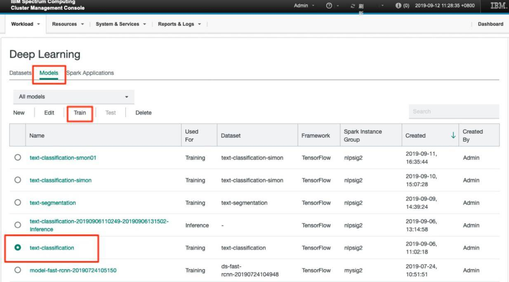

2. 直接单击 **Start Training** 开始模型训练，无需改动页面中的其他参数。

     图 10\. 开始模型训练界面 {: #图-10-开始模型训练界面}

    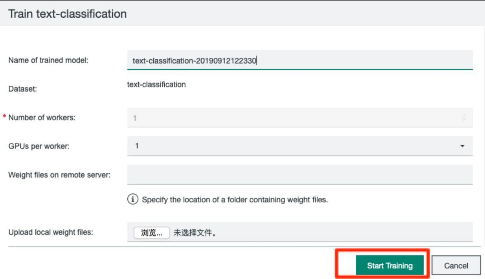

### 第七步: 检验训练运行情况和结果

模型训练开始后，可以通过软件自建的训练监控功能 Insights 来观察当前模型训练的中间状态值，如损失函数值、训练迭代次数、当前模型准确度等。具体做法为：

1. 在 **Models** 选项卡中选择刚刚开始训练的模型打开模型详情页面。

     图 11\. 选择模型进入模型详情界面 {: #图-11-选择模型进入模型详情界面}

    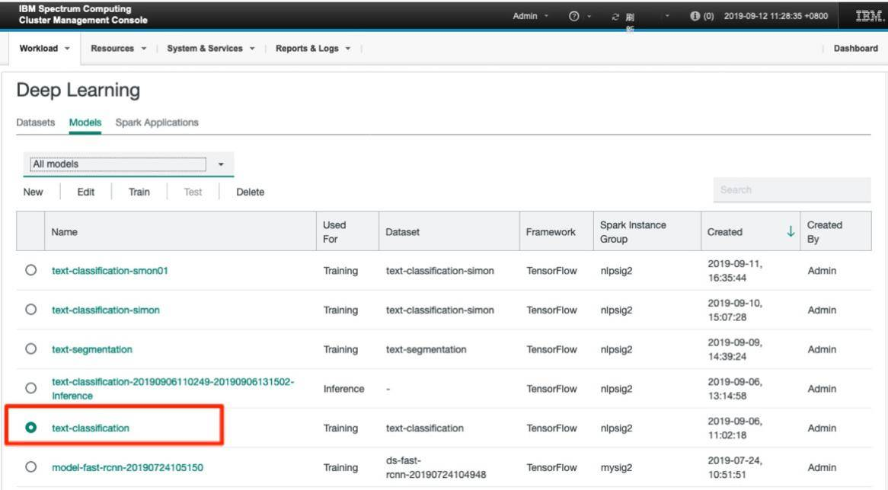

2. 从 Overview 面板浏览至 Training 选项卡，并单击最近训练任务名称打开训练可视化面板。

     图 12.点击训练任务打开训练可视化面板 {: #图-12-点击训练任务打开训练可视化面板}

    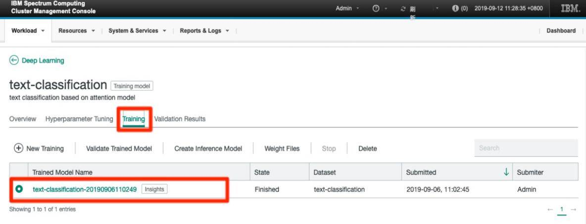

3. 查看训练的过程及结果。

     图 13\. 在训练可视化界面观察训练状态 {: #图-13-在训练可视化界面观察训练状态}

    

### 第八步: 验证模型训练结果

进入模型推理测试前，可以通过软件自建的模型验证功能来验证当前模型的表现。具体做法为：

1. 模型训练完成后，点击验证模型” **Validation Trained Model** ”，创建用来验证模型的作业。

     图 14\. 模型训练作业验证 {: #图-14-模型训练作业验证}

    

2. 在验证模型的作业画面上，选择相应的验证方式后，点击” **Start Validation** ”, 如下图：

     图 15\. 选择验证方式 {: #图-15-选择验证方式}

    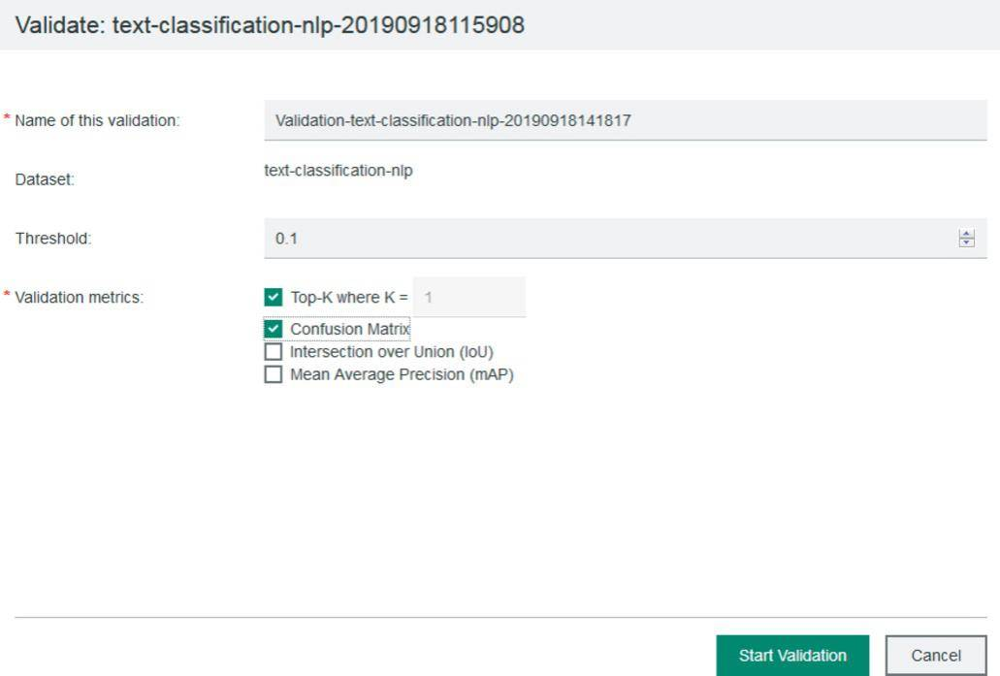

3. 从 **Overview** 面板浏览至 “ **Validation Results** ”画面后，显示验证模型作业运行，等待验证作业状态变成”Finished”状态后，点击” **View Confusion Matrix** ”可以查看验证结果的混淆矩阵图表。

     图 16.验证作业列表 {: #图-16-验证作业列表}

    

     图 17\. 示例作业混淆矩阵 {: #图-17-示例作业混淆矩阵}

    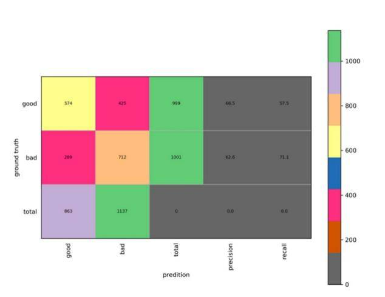

### 第九步: 创建推理模型

验证成功达到预期结果后，可以通过创建推理模型来做模型推理测试，具体操作方法如下：

1. 在 **Training** 视图中单击 **Create Inference Model** 。

     图 18\. 创建推理模型 1 {: #图-18-创建推理模型-1}

    

     图 19\. 创建推理模型 2 {: #图-19-创建推理模型-2}

    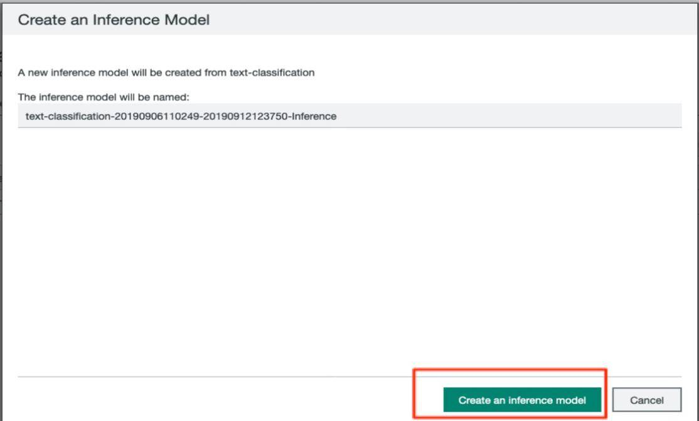

2. 这样会在 Models 选项卡中创建一个用于 inference 的新模型。您可转至 Model 选项卡查看此模型。

     图 20\. 推理模型出现在模型列表中 {: #图-20-推理模型出现在模型列表中}

    

### 第十步: 测试推理模型

1. 通过上一步查看 Inference 模型，进入该模型，单击 **Test** 。在新的测试概述屏幕上选择 **New Test** 。

     图 21\. 开始推理模型测试 {: #图-21-开始推理模型测试}

    

2. 测试前，可以准备若干待推理的文件分别以纯文本文件方式保存在本地。在这个例子中，我们使用了 IMDB 网站上最新的 The Avengers 的一个 10 分影评和一个 1 分影评来做测试。
3. 使用 **_Browse_** 选项来选择文件。单击 Start Test。

     图 22\. 选择测试文件 {: #图-22-选择测试文件}

    

4. 等待测试状态从 **_RUNNING_** 更改为 **_FINISHED_ 。**

     图 23\. 测试任务变为 FINISHED {: #图-23-测试任务变为-finished}

    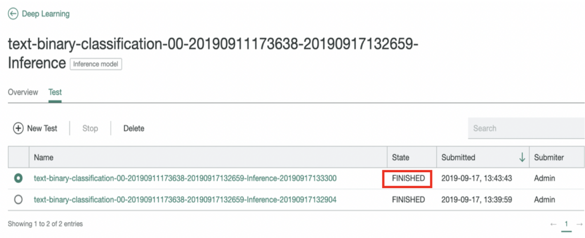

5. 单击链接查看测试结果。

     图 24\. 推理测试结果页面 {: #图-24-推理测试结果页面}

    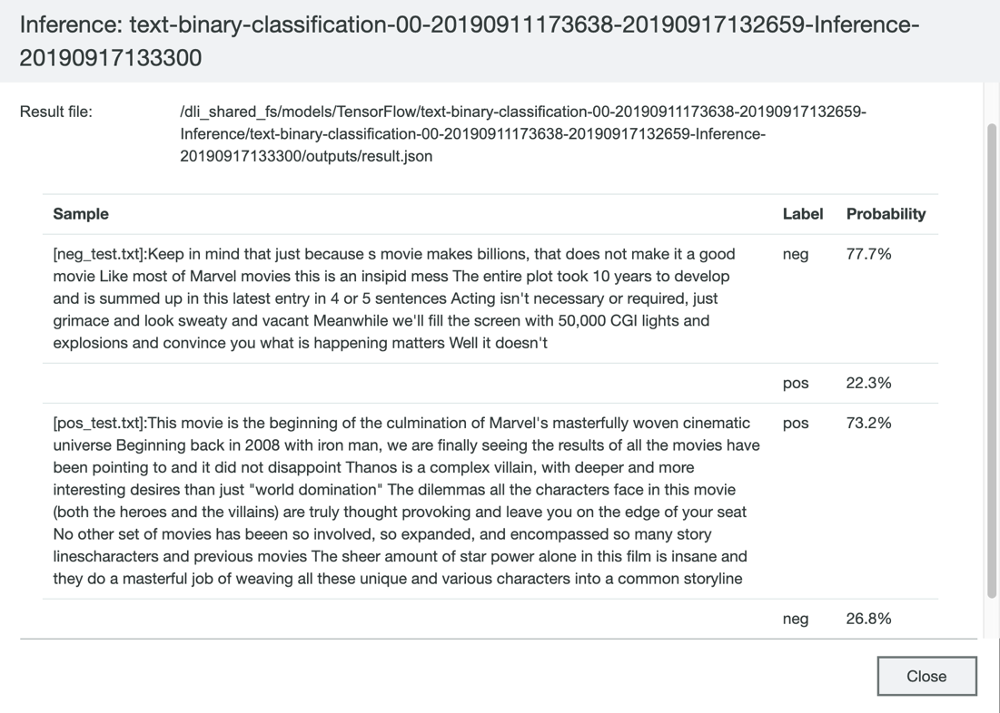

正如您所见，文本在列表框内显示带有分类标签和概率。

## 结束语

进行到这里，您已经完成了将一个开源的文本分类模型和开放数据集导入 IBM Watson Machine Learning Accelerator 的过程。并且我们也利用平台进行了端到端的模型训练和结果的测试验证。至此您已经学会了使用 IBM Watson Machine Learning Accelerator 进行模型训练的基本操作。

我们希望您喜欢阅读本教程。我们将陆续发布使用 Watson Machine Learning Accelerator 的更多教程，欢迎您持续关注我们的 [系列文章](https://developer.ibm.com/zh/series/learn-watson-machine-learning-accelerator/) 。祝您好运！

## 参考资源

- [利用 IBM Watson Machine Learning Accelerator 开展深度学习](https://developer.ibm.com/zh/series/learn-watson-machine-learning-accelerator/)