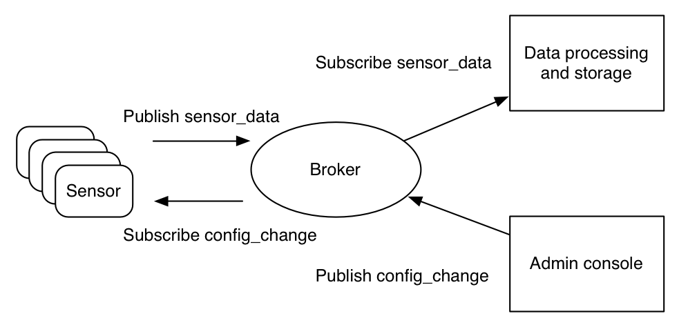
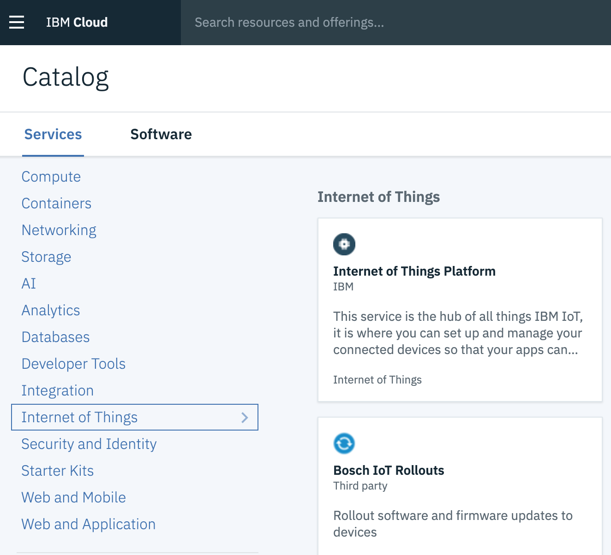

# 初识 MQTT
为什么 MQTT 是最适合物联网的网络协议

**标签:** IoT,MQTT,消息传递

[原文链接](https://developer.ibm.com/zh/articles/iot-mqtt-why-good-for-iot/)

Michael Yuan

更新: 2017-08-07 \| 发布: 2017-06-14

* * *

物联网 (IoT) 设备必须连接互联网。通过连接到互联网，设备就能相互协作，以及与后端服务协同工作。互联网的基础网络协议是 TCP/IP。MQTT（消息队列遥测传输） 是基于 TCP/IP 协议栈而构建的，已成为 IoT 通信的标准。

MQTT 最初由 IBM 于上世纪 90 年代晚期发明和开发。它最初的用途是将石油管道上的传感器与卫星相链接。顾名思义，它是一种支持在各方之间异步通信的消息协议。异步消息协议在空间和时间上将消息发送者与接收者分离，因此可以在不可靠的网络环境中进行扩展。虽然叫做消息队列遥测传输，但它与消息队列毫无关系，而是使用了一个发布和订阅的模型。在 2014 年末，它正式成为了一种 OASIS 开放标准，而且在一些流行的编程语言中受到支持（通过使用多种开源实现）。

## 为何选择 MQTT

MQTT 是一种轻量级的、灵活的网络协议，致力于为 IoT 开发人员实现适当的平衡：

- 这个轻量级协议可在严重受限的设备硬件和高延迟/带宽有限的网络上实现。
- 它的灵活性使得为 IoT 设备和服务的多样化应用场景提供支持成为可能。

为了了解为什么 MQTT 如此适合 IoT 开发人员，我们首先来分析一下为什么其他流行网络协议未在 IoT 中得到成功应用。

## 为什么不选择其他众多网络协议

大多数开发人员已经熟悉 HTTP Web 服务。那么为什么不让 IoT 设备连接到 Web 服务？设备可采用 HTTP 请求的形式发送其数据，并采用 HTTP 响应的形式从系统接收更新。这种请求和响应模式存在一些严重的局限性：

- HTTP 是一种同步协议。客户端需要等待服务器响应。Web 浏览器具有这样的要求，但它的代价是牺牲了可伸缩性。在 IoT 领域，大量设备以及很可能不可靠或高延迟的网络使得同步通信成为问题。异步消息协议更适合 IoT 应用程序。传感器发送读数，让网络确定将其传送到目标设备和服务的最佳路线和时间。
- HTTP 是单向的。客户端必须发起连接。在 IoT 应用程序中，设备或传感器通常是客户端，这意味着它们无法被动地接收来自网络的命令。
- HTTP 是一种 1-1 协议。客户端发出请求，服务器进行响应。将消息传送到网络上的所有设备上，不但很困难，而且成本很高，而这是 IoT 应用程序中的一种常见使用情况。
- HTTP 是一种有许多标头和规则的重量级协议。它不适合受限的网络。

出于上述原因，大部分高性能、可扩展的系统都使用异步消息总线来进行内部数据交换，而不使用 Web 服务。事实上，企业中间件系统中使用的最流行的消息协议被称为 AMQP（高级消息排队协议）。但是，在高性能环境中，计算能力和网络延迟通常不是问题。AMQP 致力于在企业应用程序中实现可靠性和互操作性。它拥有庞大的特性集，但不适合资源受限的 IoT 应用程序。

除了 AMQP 之外，还有其他流行的消息协议。例如，XMPP（Extensible Messaging and Presence Protocol，可扩展消息和状态协议）是一种对等即时消息 (IM) 协议。它高度依赖于支持 IM 用例的特性，比如存在状态和介质连接。与 MQTT 相比，它在设备和网络上需要的资源都要多得多。

那么，MQTT 为什么如此轻量且灵活？MQTT 协议的一个关键特性是发布和订阅模型。与所有消息协议一样，它将数据的发布者与使用者分离。

## 发布和订阅模型

MQTT 协议在网络中定义了两种实体类型：一个消息代理和一些客户端。代理是一个服务器，它从客户端接收所有消息，然后将这些消息路由到相关的目标客户端。客户端是能够与代理交互来发送和接收消息的任何事物。客户端可以是现场的 IoT 传感器，或者是数据中心内处理 IoT 数据的应用程序。

1. 客户端连接到代理。它可以订阅代理中的任何消息“主题”。此连接可以是简单的 TCP/IP 连接，也可以是用于发送敏感消息的加密 TLS 连接。
2. 客户端通过将消息和主题发送给代理，发布某个主题范围内的消息。
3. 代理然后将消息转发给所有订阅该主题的客户端。

因为 MQTT 消息是按主题进行组织的，所以应用程序开发人员能灵活地指定某些客户端只能与某些消息交互。例如，传感器将在“sensor\_data”主题范围内发布读数，并订阅“config\_change”主题。将传感器数据保存到后端数据库中的数据处理应用程序会订阅“sensor\_data”主题。管理控制台应用程序能接收系统管理员的命令来调整传感器的配置，比如灵敏度和采样频率，并将这些更改发布到“config\_change”主题。（参阅下图）

##### IoT 传感器的 MQTT 发布和订阅模型

同时，MQTT 是轻量级的。它有一个用来指定消息类型的简单标头，有一个基于文本的主题，还有一个任意的二进制有效负载。应用程序可对有效负载采用任何数据格式，比如 JSON、XML、加密二进制或 Base64，只要目标客户端能够解析该有效负载。

## MQTT 开发入门

开始进行 MQTT 开发的最简单工具是 Python mosquitto 模块，该模块包含在 [Eclipse Paho 项目](http://www.eclipse.org/paho/) 中，提供了多种编程语言格式的 MQTT SDK 和库。它包含一个能在本地计算机上运行的 MQTT 代理，还包含使用消息与代理交互的命令行工具。可以从 [mosquitto 网站](https://mosquitto.org/) 下载并安装 mosquitto 模块。

mosquitto 命令在本地计算机上运行 MQTT 代理。也可以使用 -d 选项在后台运行它。

`$ mosquitto -d`

接下来，在另一个终端窗口中，可以使用 mosquitto\_sub 命令连接到本地代理并订阅一个主题。运行该命令后，它将等待从订阅的主题接收消息，并打印出所有消息。

`$ mosquitto_sub -t "dw/demo"`

在另一个终端窗口中，可以使用 mosquitto\_pub 命令连接到本地代理，然后向一个主题发布一条消息。

`$ mosquitto_pub -t "dw/demo" -m "hello world!"`

现在，运行 mosquitto\_sub 的终端会在屏幕上打印出“hello world!”。您刚才使用 MQTT 代理发送并接收了一条消息！

当然，在生产系统中，不能使用本地计算机作为代理。相反，可以使用 IBM Cloud Internet of Things Platform 服务，这是一种可靠的按需服务，功能与 MQTT 代理类似。要进一步了解这个 IBM Cloud 服务如何集成并使用 MQTT 作为与设备和应用程序通信的协议，请参阅 [该服务的文档](https://cloud.ibm.com/docs/services/IoT?topic=iot-platform-getting-started#ref-mqtt)。）

[IBM Cloud Internet of Things Platform 服务](https://cloud.ibm.com/docs/services/IoT?topic=iot-platform-getting-started) 的工作原理如下。

- 从 IBM Cloud 控制台，可以在需要时创建 Internet of Things Platform 服务的实例。
- 然后，可以添加能使用 MQTT 连接该服务实例的设备。每个设备有一个 ID 和名称。只有列出的设备能访问该服务，Watson IoT Platform 仪表板会报告这些设备上的流量和使用信息。
- 对于每个设备客户端，IBM Cloud 会分配一个主机名、用户名和密码，用于连接到您的服务实例（MQTT 代理）。（在 IBM Cloud 上，用户名始终为 use-token-auth，密码始终是下图中显示的每个连接设备的令牌。）

##### 在 IBM Cloud 中创建 Internet of Things Platform 服务

使用远程 MQTT 代理时，需要将代理的主机名和身份验证凭证传递给 mosquitto\_sub 和 mosquitto\_pub 命令。例如，下面的命令使用了 IBM Cloud 提供的用户名和密码，订阅我们的 Internet of Things Platform 服务上的 demo 主题：

`$ mosquitto_sub -t "demo" -h host.iotp.mqtt.bluemix.com -u username -P password`

有关使用 mosquitto 工具的更多选择，以及如何使用 mosquitto API 创建自己的 MQTT 客户端应用程序，请参阅 [mosquitto 网站](https://mosquitto.org/documentation/) 上的文档。

有了必要的工具后，让我们来更深入地研究 MQTT 协议。

## 了解 MQTT 协议

MQTT 是一种连接协议，它指定了如何组织数据字节并通过 TCP/IP 网络传输它们。但实际上，开发人员并不需要了解这个连接协议。我们只需要知道，每条消息有一个命令和数据有效负载。该命令定义消息类型（例如 CONNECT 消息或 SUBSCRIBE 消息）。所有 MQTT 库和工具都提供了直接处理这些消息的简单方法，并能自动填充一些必需的字段，比如消息和客户端 ID。

首先，客户端发送一条 CONNECT 消息来连接代理。CONNECT 消息要求建立从客户端到代理的连接。CONNECT 消息包含以下内容参数。

CONNECT 消息参数 {: #connect-消息参数}

**参数****说明**cleanSession此标志指定连接是否是持久性的。持久会话会将所有订阅和可能丢失的消息（具体取决于 QoS） 都存储在代理中。（请参阅 [SUBSCRIBE 消息参数](#subscribe-消息参数) 获取 QoS 的描述。）username代理的身份验证和授权凭证。password代理的身份验证和授权凭证。lastWillTopic连接意外中断时，代理会自动向某个主题发送一条“last will”消息。lastWillQos“last will” 消息的 QoS。（请参阅 [SUBSCRIBE 消息参数](#subscribe-消息参数) 来查看 QoS 的描述。）lastWillMessage“last will” 消息本身。keepAlive这是客户端通过 ping 代理来保持连接有效所需的时间间隔。

客户端收到来自代理的一条 CONNACK 消息。CONNACK 消息包含以下内容参数。

CONNACK 消息参数 {: #connack-消息参数}

**参数****说明**sessionPresent此参数表明连接是否已有一个持久会话。也就是说，连接已订阅了主题，而且会接收丢失的消息。returnCode0表示成功。其他值指出了失败的原因。

建立连接后，客户端然后会向代理发送一条或多条 SUBSCRIBE 消息，表明它会从代理接收针对某些主题的消息。消息可以包含一个或多个重复的参数。如表 3。

SUBSCRIBE 消息参数 {: #subscribe-消息参数}

**参数****说明**qosqos（服务质量或 QoS）标志表明此主题范围内的消息传送到客户端所需的一致程度。

_值 0：不可靠，消息基本上仅传送一次，如果当时客户端不可用，则会丢失该消息。_ 值 1：消息应传送至少 1 次。

\\* 值 2：消息仅传送一次。

\| topic \| 要订阅的主题。一个主题可以有多个级别，级别之间用斜杠字符分隔。例如，“dw/demo” 和 “ibm/bluemix/mqtt” 是有效的主题。\|

客户端成功订阅某个主题后，代理会返回一条 SUBACK 消息，其中包含一个或多个 returnCode 参数。

SUBACK 消息参数 {: #suback-消息参数}

**参数****说明**returnCodeSUBCRIBE命令中的每个主题都有一个返回代码。返回值如下所示。

_值 0 – 2：成功达到相应的 QoS 级别。（参阅 [SUBSCRIBE 消息参数](#subscribe-消息参数) 进一步了解 QoS。）_ 值 128：失败。

与 SUBSCRIBE 消息对应，客户端也可以通过 UNSUBSCRIBE 消息取消订阅一个或多个主题。

UNSUBSCRIBE 消息参数 {: #unsubscribe-消息参数}

**参数****说明**topic此参数可重复用于多个主题。

客户端可向代理发送 PUBLISH 消息。该消息包含一个主题和数据有效负载。代理然后将消息转发给所有订阅该主题的客户端。

PUBLISH 消息参数 {: #publish-消息参数}

**参数****说明**topicName发布的消息的相关主题。qos消息传递的服务质量水平。（请参阅 [SUBSCRIBE 消息参数](#subscribe-消息参数) 来查看 QoS 的描述。）retainFlag此标志表明代理是否保留该消息作为针对此主题的最后一条已知消息。payload消息中的实际数据。它可以是文本字符串或二进制大对象数据。

## 技巧和解决方法

MQTT 的优势在于它的简单性。在可以使用的主题类型或消息有效负载上没有任何限制。这支持一些有趣的用例。例如，请考虑以下问题：

_如何使用 MQTT 发送 1-1 消息？_ 双方可以协商使用一个特定于它们的主题。例如，主题名称可以包含两个客户端的 ID，以确保它的唯一性。

_客户端如何传输它的存在状态？_ 系统可以为“presence”主题协商一个命名约定。例如，“presence/client-id”主题可以拥有客户端的存在状态信息。当客户端建立连接时，将该消息被设置为 true，在断开连接时，该消息被设置为 false。客户端也可以将一条 last will 消息设置为 false，以便在连接丢失时设置该消息。代理可以保留该消息，让新客户端能够读取该主题并找到存在状态。

_如何保护通信？_ 客户端与代理的连接可以采用加密 TLS 连接，以保护传输中的数据。此外，因为 MQTT 协议对有效负载数据格式没有任何限制，所以系统可以协商一种加密方法和密钥更新机制。在这之后，有效负载中的所有内容可以是实际 JSON 或 XML 消息的加密二进制数据。

## 结束语

本文从技术角度介绍了 MQTT 协议。您了解了 MQTT 是什么，MQTT 为什么适合 IoT 应用程序，以及如何开始开发使用 MQTT 的应用程序。

本文翻译自： [Getting to know MQTT](https://developer.ibm.com/articles/iot-mqtt-why-good-for-iot/)（2017-08-07）