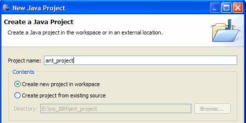
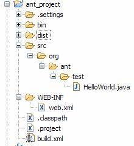
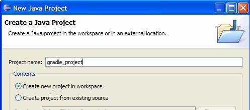
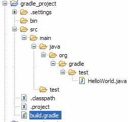

# 在 Eclipse 下利用 Gradle 构建系统
了解如何在 Eclipse 下利用 Gradle 构建系统

**标签:** DevOps,Java

[原文链接](https://developer.ibm.com/zh/articles/os-cn-gradle/)

苏春波

发布: 2010-08-13

* * *

## 在 Eclipse 下利用 Gradle 构建系统

基本开发环境

- **操作系统：** 本教程使用的为 Windows Vista Enterprise, 如果您的系统是 Linux 的，请选择下载对应版本的其他工具，包括开发工具、Java EE 服务器、Apache Ant、SoapUI。
- **开发工具：** Eclipse IDE for SOA Developers 版本，请到 [http://www.eclipse.org/downloads/](http://www.eclipse.org/downloads/) 网站下载，当然任何版本的 eclipse 都是可以的。
- **Java EE 服务器：** Apache-Tomcat-6.0.18，可以到 [http://tomcat.apache.org/download-60.cgi](http://tomcat.apache.org/download-60.cgi) 下载，使用 5.0 以上的任何版本都可以的，当然，您也可以使用 Jboss 等其他 Java EE 服务器。
- **Jdk：** 到 `http://java.sun.com` 下载 1.5.0\_17 版本，下载后安装即可。

### Ant，Maven，Gradle 简单比较

Ant 是我们过去构建系统基本都会用到的，xml 脚本文件中包括若干 task 任务，任务之间可以互相依赖，对于一个大的项目来说，这些 XML 文件维护起来的确不是一件容易的事情，还有那些项目依赖的而没有版本号的 jar 包，有时真的让人头疼，后来 Maven 出现了，基于中央仓库的编译相对于 Ant 来说的确是好了很多，但是，是不是 Ant, Maven 就是我们构建项目的唯一选择呢？呵呵，当然不了，利用 Gradle 来构建系统我认为将成为 Java 构建项目的最佳选择，简单，快速，对初学者无苛刻要求，可以说是拿来就会用，而且我们再也不用看那些冗长而复杂的 XML 文件了，因为 Gradle 是基于 Groovy 语言的，Groovy 大家应该很熟悉吧，是基于 Java Virtual Machine 的敏捷开发语言，它结合了 Python、Ruby 和 Smalltalk 的许多强大的特性，如果你是一个 Ant 的完全支持者，也没有问题，因为 Gradle 可以很平滑的来调用 Ant 文件的，我这样说你可能不接受 Gradle，下面我们就会通过一个个具体实例来讲解 Ant, Maven, Gradle 构建项目的过程，通过例子我们能很容易明白它们的差异。Let’s go。

### 用 Ant 来构建简单系统

新建一个 Java project, 命名为 ant\_project

##### 图 1\. 新建 ant\_project 项目



然后新建一个 HelloWorld 类，我们下面就是将这个项目通过 Ant 来编译，打包，类的代码列表如清单 1 所示：

##### 清单 1\. HelloWorld 类

```
package org.ant.test;

public class HelloWorld {
     public String sayHello(String name){
         return "Hello "+name;
     }
}

```

Show moreShow more icon

然后再新建一个 build 文件，命名为 build.xml, 内容如清单 3 所示：

##### 清单 2\. build.xml

```
<?xml version="1.0" encoding="UTF-8"?>
<project name="project" default="default">
    <target name="default" depends="depends" description="description">
        <javac srcdir="src" destdir="bin" includes="org/**"></javac>
         <jar basedir="bin" destfile="dist/ant_project.jar"></jar>
         <war destfile="dist/ant_project.war" webxml="WEB-INF/web.xml">
             <classes dir="bin"></classes>
         </war>
    </target>
    <!-- - - - - - - - - - - - - - - - - -
          target: depends
         - - - - - - - - - - - - - - - - - -->
    <target name="depends">
    </target>
</project>

```

Show moreShow more icon

熟悉 ant 的同学们对于上面的脚本应该很容易看明白，这里就不详细解释了，主要功能就是把这个工程编译然后打成 jar 和 war 包。 到目前为止 ant\_project 的目录结构如图 2 所示：

##### 图 2\. ant\_project 工程目录结构



运行 ant 脚本。

```
E:\gdcc\tools\apache-ant-1.6.5\bin\ant -f  E:\ws_IBM\ant_project\build.xml

注：ant 放在了 E:\gdcc\tools\apache-ant-1.6.5 目录下。
执行结果如下：
Buildfile: E:\ws_IBM\ant_project\build.xml
depends:
default:
    [javac] Compiling 1 source file to E:\ws_IBM\ant_project\bin
      [jar] Building jar: E:\ws_IBM\ant_project\dist\ant_project.jar
      [war] Building war: E:\ws_IBM\ant_project\dist\ant_project.war
BUILD SUCCESSFUL
Total time: 859 milliseconds

```

Show moreShow more icon

这是个非常简单的工程，我们将他打成了 jar，war 包，所需要的 build 文件大约在 10 行左右，下面我们再看看用 Gradle 的情况。

### 用 Gradle 来构建简单系统

### 准备环境：

1. 下载 gradle-0.9-preview-1。从 [Gradle](https://gradle.org/) 网站上选择一个版本，然后解压到指定目录，将 Gradle 的 bin 目录添加到 Path 变量中。
2. 使用 cmd 命令，然后敲入 gradle – version，如出现以下信息，表示环境配置成功。

```
C:\Documents and Settings\suchu>gradle -version
Gradle 0.9-preview-1
Gradle buildtime: Monday, March 29, 2010 4:51:14 PM CEST
Groovy: 1.7.1
Ant: Apache Ant version 1.8.0 compiled on February 1 2010
Ivy: 2.1.0
Java: 1.6.0_12
JVM: 11.2-b01
JVM Vendor: Sun Microsystems Inc.

```

Show moreShow more icon

注：以上信息根据不同版本的 Gradle 或者不同的环境也许不同，但都是正确的。

### Gradle 常用的使用方法介绍

新建一个 Java project, 命名为 gradle\_project

##### 图 3\. 新建 gradle\_project 项目



然后新建一个 java bean 名为 HelloWorld 内容和上面的一样，可以参考 ant\_project。 为了实现编译，打包功能，我们需要新建一个名为 build.gradle 的文件。 文件内容见清单 3 所示：

##### 清单 3\. build.gradle 内容

```
apply plugin: 'java'

```

Show moreShow more icon

是不是很惊讶，的确，真的就只要这么短短的一行，而它的功能却是相当的强大的，能编译，打成 jar 包，运行测试脚本等。 到目前为止，项目的结构如图 4 所示：

##### 图 4\. gradle\_project 项目结构图



这里需要注意一点的是，项目包的结构最好是按照 Gradle 期望的来建立，当然也可以通过配置来改变。 下面我们来运行下 build.gradle 文件。运行 cmd 命令，进入 gradle\_project 项目路径下，然后运行 gradle build 命令，命令显示信息如清单 4 所示。

##### 清单 4\. build.gradle 运行显示信息

```
E:\ws_IBM\gradle_project>gradle build
:compileJava
:processResources
:classes
:jar
:assemble
:compileTestJava
:processTestResources
:testClasses
:test
:check
:build

BUILD SUCCESSFUL

Total time: 5.125 secs

```

Show moreShow more icon

我们再看下生成物，这个命令首先在 gradle\_project 下新建了 build 目录，build 目录包含 classes, dependency-cache, libs,tmp 四个目录，libs 下包含 jar 包，jar 包包含 main 下的所有 java 文件和和资源文件。 一个简单的例子到这里就演示完了，怎么样是不是脚本很简洁，用起来很简单，产生想继续学习的兴趣了吧，别急，下面我们会继续来探究 Gradle 的神奇之处。

下面我们来介绍几个常用的命令，clean，这个命令是将刚才产生的 build 目录删除掉； Assemble，这个命令是编译 java 文件但是不运行检查代码质量等的命令，运行时显示的信息如清单 5 所示：

##### 清单 5\. assemble 命令显示的信息

```
E:\ws_IBM\gradle_project>gradle assemble
:compileJava
:processResources UP-TO-DATE
:classes
:jar
:assemble

BUILD SUCCESSFUL

```

Show moreShow more icon

和清单 4 比较下，他们的区别应该很容易看出来，那么我们怎么样来运行检查代码质量的命令而不需要打成 jar 包之类的额外工作呢，check 命令正好满足你的要求，此命令就是编译 java 文件并运行那些类似 Checkstyle，PMD 等外部插件命令来检查我们自己的源代码。Check 命令运行显示的信息如清单 6 所示：

##### 清单 6\. check 命令运行时信息

```
E:\ws_IBM\gradle_project>gradle check
:compileJava UP-TO-DATE
:processResources UP-TO-DATE
:classes UP-TO-DATE
:compileTestJava UP-TO-DATE
:processTestResources UP-TO-DATE
:testClasses UP-TO-DATE
:test UP-TO-DATE
:check UP-TO-DATE

BUILD SUCCESSFUL

```

Show moreShow more icon

这里需要说明一点的是 Gradle 是增量式编译的，只编译那些有变动的 java 类或资源文件的，如 UP-TO-DATE 表示是有更新的。 现在 javadoc 越来越受到人们的重视，尤其对于那些复杂的需要接口调用的的项目，javadoc 的地位就更加突出了，如果我们使用 Ant 需要在 build 文件中增加清单 7 的片段。

##### 清单 7\. 利用 Ant 生成 javadoc

```
<target name="javadoc">
      <!-- destdir 是 javadoc 生成的目录位置 -->
     <javadoc destdir="${distDir}" encoding="UTF-8" docencoding="UTF-8">
         <!-- dir 是你的源代码位置，记住是 java 文件的位置而不是 class 文件的位置，
                      第一次用这个命令容易忽略这点 切记 -->
               <packageset dir="${srcDir}">
          <!-- exclude 是去掉那些不想生成 javadoc 的类文件 -->
                            <exclude name="${excludeClasses}" />
                                  </packageset>
                          </javadoc>
       </target>

```

Show moreShow more icon

然后我们用 ant javadoc 命令来运行，即可生成 javadoc。那么我们 利用 Gradle 是怎样来生成 javadoc 的呢，都需要做那些额外的工作呢？ build.gradle 文件是否需要修改呢？我们的回答是，不用，什么都不用修改，什么都不用做，只需利用 gradle javadoc 命令，即可生成我们期望的 javadoc。 通常我们新建一个项目，.classpath 文件的内容如清单 8 所示：

##### 清单 8\. .classpath 文件内容

```
<?xml version="1.0" encoding="UTF-8"?>
<classpath>
     <classpathentry kind="src" path="src"/>
     <classpathentry kind="con" path="org.eclipse.jdt.launching.JRE_CONTAINER
        /org.eclipse.jdt.internal.debug.ui.launcher.StandardVMType/jdk1.6.0_12"/>
     <classpathentry kind="output" path="bin"/>
</classpath>

```

Show moreShow more icon

通过上面的知识我们知道，Gradle 期望的目录结构和自动生成的是有些差别的，比如源码路径，编译后的文件放置目录等，那么我们能不能通过 Gradle 命令来统一一下呢，使原项目结构与 Gradle 期望的一致，以免开发者将代码放置到了错误的目录结构下，那样 Gradle 是不管理它们的。下面我们就通过一个简单的方法来实现上面的需求，首先我们来简单修改下 build.gradle 文件，添加 apply plugin: ‘eclipse’这么一行，然后我们使用命令 gradle eclipse 即可。.classpath 文件的变化如清单 9 所示。

##### 清单 9\. 修改后的 .classpath 文件内容

```
<?xml version="1.0" encoding="UTF-8"?>
<classpath>
<classpathentry kind="src" path="src/main/java"/>
<classpathentry kind="output" path="build/classes/main"/>
<classpathentry kind="con" path="org.eclipse.jdt.launching.JRE_CONTAINER"/>
</classpath>

```

Show moreShow more icon

War 包是我们经常要用到的，上面我们利用 Ant 脚本生成过 war 包，那么 Gradle 又是怎样来生成 war 包的呢？经过上面的学习或许你已经猜出来了，需要增加一个 plugin，完全正确，只需要将 apply plugin: ‘war’ 这一行加入到 build.gradle 文件中，然后运行 gradle War 命令即可，简单的简直要命，是不是，呵呵！

### 如何在老项目上使用 Gradle

我们上面讲过，Gradle 对其所能控制的目录结构是有一定的要求的，那么如果我们的项目已经开始很长时间了，现在的项目结构不满足 Gradle 的要求，那么我们还能不能利用 Gradle 呢？答案当然是肯定的，下面我们就介绍怎样在老项目上使用 Gradle，方法很简单，当然如果过于复杂我们也没必要再这里介绍它了，直接使用 Ant 就好了。首先我们需要在 build.gradle 文件中增加如清单 10 所示的内容。

##### 清单 10\. 匹配老项目的结构

```
sourceSets {
     main {
         java.srcDir "$projectDir/src"
     }
}

```

Show moreShow more icon

然后我们就可以使用 Gradle 提供的所有命令和方法了。

### 如何加入项目所依赖的 jar 包

大家都知道，一个项目在编译过程中要依赖很多 jar 包的，在 Ant 中我们通过添加 classpath 来实现的，如清单 11 所示。

##### 清单 11\. ant 中添加依赖的 jar 包

```
<path id="j2ee">
         <pathelement location="${servlet.jar}" />
         <pathelement location="${jsp-api.jar}" />
         <pathelement location="${ejb.jar}" />
         <pathelement location="${jms.jar}" />
</path>
<javac destdir="${build.classes}" srcdir="${src.dir}" debug="${javac.debug}"
                 deprecation="${javac.deprecation}">
             <include name=" "/>
             <classpath refid="j2ee"/>
         </javac>

```

Show moreShow more icon

那么 Gradle 又是怎样来做的呢？通过上面的知识的学习，你是否有一个大概的思路呢？假如我们现在有一个 java 类叫 HelloWorldTest，这个类中引用了 junit 这个 jar 包中的类，这时候我们用 Gradle 要怎样来编译这个类呢？ 首先我们新建一个目录叫 libs，这个目录就是放置项目所依赖的所有 jar 包，当然包括 HelloWorldTest 类所依赖的 junit-4.4.jar 包，然后我们要修改下 build.gradle 文件，增加内容见清单 12。

##### 清单 12\. 工程所依赖 jar 包添加方法

```
repositories {
     flatDir(dirs: "$projectDir/libs")
}
dependencies {
     compile ':junit:4.4'
}

```

Show moreShow more icon

注：repositories 相当一个存储 jar 包的仓库，我们可以指定本地的依赖 jar 包，也可以利用 Maven 所指定的仓库，如 mavenCentral()； 通过 dependencies 来包含所有真正要依赖的 jar 包，格式为 goup：name：version，’:junit:4.4:’ 就是表示 dirs 路径下的 junit-4.4.jar 这个包。

### 如何实现 copy 工作

Copy 是我们经常要用到的一个命令，java 类的 copy，资源文件的 copy 等等。如果是 Ant 我们会在 build.xml 文件中加入清单 13 中的内容。

##### 清单 13\. Ant 中的 copy 任务

```
复制单个文件到另一个文件
<copy file="myfile.txt" tofile="mycopy.txt"/>
复制单个文件到一个目录
<copy file="myfile.txt" todir="../some/other/dir"/>
复制一个目录到另一个目录
<copy todir="../new/dir">
    <fileset dir="src_dir"/>
</copy>
复制一部分文件到一个目录下
<copy todir="../dest/dir">
    <fileset dir="src_dir">
      <exclude name="**/*.java"/>
    </fileset>
</copy>
<copy todir="../dest/dir">
    <fileset dir="src_dir" excludes="**/*.java"/>
</copy>

```

Show moreShow more icon

我们知道 copy 任务中有很多属性，这里我们就不一一列出了，我们还是主要看下 Gradle 是如何来实现这些功能的。

### 使用 Gradle 实现目录之间 copy 文件任务

我们只需要在 build.gradle 文件中加入清单 14 中的内容。

##### 清单 14\. gradle 中实现目录间复制文件

```
task copyOne(type: Copy) {
     from 'src/main/test'
     into 'build/anotherDirectory'
}

```

Show moreShow more icon

注：把 test 目录下的所有文件复制到 anotherDirectory 目录下。 然后我们利用命令 E:\\ws\_IBM\\gradle\_project>gradle copyOne 来执行即可。

### 对 copy 文件的过滤

有时候一个目录下的文件数目很多，而我们只想复制某一部分文件，比如只复制 java 文件或资源文件等，这时候我们就要用到 copy 任务的 include 属性，这一点和 Ant 是一样的。比如只复制 java 文件到某一指定目录，实现这个需求我们要在 build.gradle 文件中增加清单 15 的内容。

##### 清单 15\. copy java 文件到指定目录

```
task copyTwo(type: Copy) {
     from 'src/main/test'
     into 'build/anotherDirectory'
     include '**/*.java'
}

```

Show moreShow more icon

如果我们只想排除一些文件，不想把这一类文件 copy 过去，这时候我们要用到 exclude 属性，比如我们不想把 java 文件复制到指定目录中，那么我们只需要将上面清单 15 中的 include 替换成 exclude 即可。

### 发布 jar 文件

做项目时经常会遇到一个 project 中的类依赖另一个 project 中类的情况，如果用 Ant，我们会这样做，首先将被依赖的类文件打成 jar 包，然后利用 copy 命令将这个 jar 包复制到指定目录下，我们可以想象到要向 build.xml 添加好多行代码，这里我们就不一一列出了，不会的同学们可以参考上面的知识。下面我们看下 Gradle 是怎样来完成这一需求的，Gradle 不但可以讲 jar 包发布到本地的指定目录中，而且还可以发布到远程目录中，我们看下清单 16 的内容。

##### 清单 16\. 发布 jar 包到本地目录

```
publishJarFile {
     repositories {
         flatDir(dirs: file('jarsDerectory'))
     }
}

```

Show moreShow more icon

然后我们利用 gradle publishJarFile 命令即可。 注：清单 16 是将工程下的 java 类文件全部打成 jar 包，然后放到工程目录下的 jarsDerectory 子目录中。

Maven 对于 jar 包的仓库管理方法给我们提供了很多方便，Gradle 完全可以利用 Maven 的这一优点的，我们在上面已经讲过了如何来使用，那么我们又是怎么来做到将项目所需要的 jar 包更新到仓库中呢？具体解决方法见清单 17。

##### 清单 17\. 发布 jar 文件到 Maven 的仓库中

```
apply plugin: 'maven'
publishToMaven {
repositories.mavenDeployer {
repository(url: "file://localhost/tmp/myRepo/")
}
}

```

Show moreShow more icon

### Gradle 在多个工程中的应用

做项目时候，经常会碰到多个工程的情况，最通常的情况我们也分为服务器端和客户端两部分，这种情况我们过去用 Ant 时候会在每个工程下面都建立个 build.xml 文件或者建立一个 build.xml 文件，然后在这个 build.xml 文件中建立不同工程的 target，将将被引用的工程打成 jar 包来供其他工程引用，那么 Gradle 是怎样来完成这样的需求的呢？下面我们举个具体的例子来详细演示下。首先我们新建一个主工程命名为 gradle\_multiProject, 然后在主工程下在新建一个子工程命名为 sub\_projectOne, 在两个工程下面都有一个各自独立的 src 并且符合 Gradle 要求的目录结构，在每个工程下面都建个类命名为 HelloWorld，类内容同清单 1. 然后我们新建个 settings.gradle 文件，内容见清单 18。

##### 清单 18\. settings.gradle 文件内容

```
include "sub_projectone"

```

Show moreShow more icon

然后在新建一个我们熟悉的 build.gradle 文件，文件内容见清单 19。

##### 清单 19\. 主工程目录下 build.gradle 文件内容

```
Closure printProjectName = { task -> println "I'm $task.project.name" }
task hello << printProjectName
project(':sub_projectone') {
     task hello << printProjectName
}

```

Show moreShow more icon

然后我们使用命令 gradle – q hello 运行一下，运行结果如清单 20 所示。

##### 清单 20\. 命令运行结果

```
E:\ws_IBM\gradle_multiProject>gradle -q hello
I'm gradle_multiProject
I'm sub_projectone

```

Show moreShow more icon

我们会发现，这个命令将主工程和子工程的名字都打印出来了，为什么会这样呢？我想你一定猜对了，因为我们在 build.gradle 文件中使用了 project() 方法，方法内传入的是子工程的名称，如果我们子工程不止一个，那么我们又该怎样来调用呢？这时候我们只需要调用另一个方法 allprojects 即可，注意 allprojects 方法是不需要传入参数的，它返回的是当前工程和当前工程下面的所有子工程的列表。上面演示的内容其实我们不经常用到的，这里简单的介绍下就是为了说明 gradle 给我们提供了好多方法来供我们调用，在多工程的环境下我们可以灵活的使用它们来达到我们的要求，下面我们就步入正题来看看在多工程情况下，gradle 是如何来编译，打包各自工程的。这里我们添加些内容到 build.gradle 文件，内容见清单 21。

##### 清单 21\. 添加到 build.gradle 文件中的内容

```
subprojects{
apply plugin: 'java'
}

```

Show moreShow more icon

然后我们用命令 gradle build，发现主工程下面的所有子工程都新增了一个 build 文件夹，这个文件夹下包含编译生成的 class 文件和 jar 文件，而主工程的 src 下的代码却没有被编译，打包。那么我们怎样做能让主工程和子工程同时被编译，打包呢？方法很简单，我们只需要在 build.gradle 文件中增加 apply plugin: ‘java’ 这么一行代码，现在完整的 build.gradle 内容见清单 22。

##### 清单 22\. 完整的 build.gradle 文件内容

```
apply plugin: 'java'
subprojects{
apply plugin: 'java'
}

```

Show moreShow more icon

是不是很难想象，就这么几行代码就完成了将所有工程中的代码都编译了并且都打成了 jar 文件。有的朋友会问了，如果子工程与主工程他们打成的包不一样，有的是需要 jar 包，有的需要打成 war 包等等，这样的需求我们该怎样做呢，很简单我们只需要在需要打成 war 包的工程下面新建立个 build.gradle 文件，该文件内容为 apply plugin: ‘war’，然后我们我们在主工程目录下使用 gradle build 命令即可生成我们需要的 war 包了，Gradle 就是使用这种方法来满足那种差异性的需求的。

使用 Ant 的朋友们一定会深有感触的吧！也许有些朋友会有反面的一些声音，尤其对那些 Ant 的热爱者们，一定会说，Ant 如果你使用的好，封装的好一样可以很简洁并且也能达到这个效果的，的确是这样的，Gradle 只不过是把我们经常要使用的一些功能项给封装成了方法，然后我们调用这些方法即可了，再说了，Gradle 调用 Ant 脚本也是可以的，如果你一定要用 Ant, 那么你用 Gradle 来组织一下逻辑也是不错的选择。下面我们简单看下在 Gradle 中式怎样来调用 Ant 脚本的。

### Gradle 中调用 Ant 脚本

首先我们建立 Ant 文件 build.xml, 文件详细内容见清单 23.

##### 清单 23\. build.xml 文件内容

```
<project>
    <target name="hello">
        <echo>Hello, from Ant</echo>
    </target>
</project>

```

Show moreShow more icon

然后我们在建立个 build.gradle 文件，文件详细内容见清单 24。

##### 清单 24\. build.gradle 文件内容

```
ant.importBuild 'build.xml'

```

Show moreShow more icon

简单吧，一句话的事情而已，呵呵。然后我们使用 gradle hello 命令来看下结果，结果见清单 25。

##### 清单 25\. Gradle 调用 Ant 文件的运行结果

```
E:\gdcc\me\gradle-0.9-preview-1\samples\userguide\ant\hello>gradle hello
:hello
[ant:echo] Hello, from Ant

BUILD SUCCESSFUL

Total time: 9.734 secs

```

Show moreShow more icon

可以看出，的确调用的是 Ant 的 build.xml 文件吧。

### 结束语

本教程通具体实例来讲解如何使用 Gradle 来构建工程的，并在具体实例中引入我们熟悉的 Ant 来对比完成，这样能使 Ant 的爱好者们能更快的上手，并能一目了然的看到两者的优缺点，最后并讲解了怎样和 Ant 来集成，每一个实例都是通过从新建工程开始一步一步的带领大家来继续的，我们知道仅仅通过一片文章来很详细的将 Gradle 的方方面面都阐述的很清楚，那是不可能的，本教程提供了最基本，最基础的开发过程，任何复杂的事务归根结底还是源于基础，我一向倡导，”授之以鱼，不如授之以渔”，我想只要方向对了，知道如何下手了，就不会有大的失误。最后祝大家工作顺利。