# 基于 RTC, Jenkins, PagerDuty, Slack 的持续交付和事件实时通知
更新您的 DevOps 流程和实现

**标签:** DevOps

[原文链接](https://developer.ibm.com/zh/articles/d-rtc-jenkins-pagerduty-slack/)

王琳, 侯大为, 蔡超

发布: 2018-03-20

* * *

## 背景

最近我们团队（Digital Commerce）更新了自己的 DevOps 流程和实现，实现了项目的持续交付和线上事件的实时通知。在新的 DevOps 流程里，我们采用了像 RTC(IBM Rational Team Concert), Jenkins, PagerDuty， Slack 等新的技术。RTC 用来支持整个软件交付环境；Jenkins 用来实现软件集成管理，实现代码打包和发布；PagerDuty 用来实现线上事件的监控，触发和创建，并且发送事件通知给相应 on-call 的人；Slack 用来接收、发送事件相关的消息以方便团队成员基于 Slack 通道中的信息进行沟通、讨论。希望通过本文，你可以获得集成 RTC, Jenkins, PagerDuty 和 Slack 的相关方法并应用到自己的 DeveOps 实现中。

## 持续交付: Jenkins +RTC + Slack 集成

IBM® Rational Team Concert™ 是一款支持分散团队进行实时相关协作的软件生命周期管理解决方案。Rational Team Concert 基于 IBM Rational® Jazz™ 平台，提供流程配置、指导和实施框架，可以支持整个软件交付环境。 Jenkins 是一个用 Java 编写的开源的持续集成工具。Jenkins 提供了软件开发的持续集成服务。它运行在 Servlet 容器中（例如 Apache Tomcat）。它支持软件配置管理（SCM）工具（包括 AccuRev SCM、CVS、Subversion、Git、Perforce、Clearcase 和 RTC），可以执行基于 Apache Ant 和 Apache Maven 的项目，以及任意的 Shell 脚本和 Windows 批处理命令。 Slack 统一整个团队的沟通，使我们的工作流程变得更好。几乎所有用到的应用程序都能无缝地集成到 Slack 上，我们可以轻松地在一个地方搜索和查找所有的文件，发送消息，呼叫同事等等。

### 前提条件:

本文假设你已经在相应的 DevOps 环境上安装了以下的工具：

**Name****Version**Jenkins1.642.4Jenkins Team Concert Plugin1.1.9.7RTC build toolkit5.0.2Slack2.3.2Jenkins Slack Notification Plugin2.0.1

### 概述:

下面的图片展示了 Jenkins, RTC, Slack 集成的总体框架图：

##### 图 1\. 总体框架图

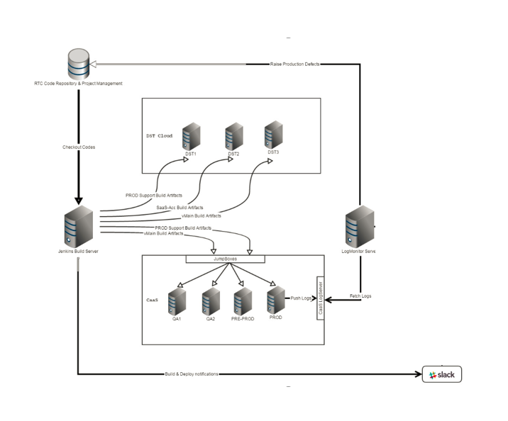

使用 RTC 来支持整个软件交付环境，主要用来实现代码控制；使用 Jenkins 来控制整个持续交付的流程；集成 Slack 来接收、发送事件相关的消息以方便团队成员基于 Slack 通道中的信息进行沟通、讨论。

### 步骤：

配置 Jenkins：

打开 Configure System 页面（Jenkins > Manage Jenkins > Configure System），找到”Rational Team Concert (RTC)”，设置配置信息如下图所示:

##### 图 2\. 配置信息

配置RTC：

- 参照上图所示在 RTC 中创建新的 Stream 流，输入对应的名字，用于区分相应的代码分支：

##### 图 3\. 创建新的 Stream 流

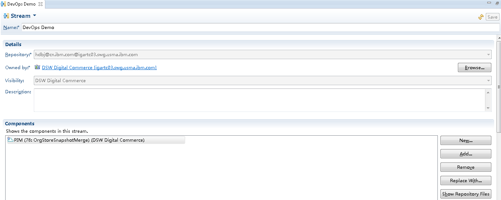

- 创建新的 Jenkins 构建引擎：

    - 在”New Build Engine”页面中，引擎类型选择”Hudson／Jenkins Engine”，为新的引擎命名然后点击”Finish”按钮：

##### 图 4\. 创建新的 Jenkins 构建引擎：

- 参照下图所示，更新引擎配置信息：

    -Hudson/Jenkins URL 为 Jenkins 服务器的地址。

    -勾选 Validate Hostname 用于每次建立连接时先验证 Jenkins 主机名称。

    -勾选 Authorization Required，输入用户名密码用于登录 Jenkins 服务器。

    -点击 Test Connection 按钮来测试 RTC 到 Jenkins 的连接。

##### 图 5\. 测试 RTC 到 Jenkins 的连接

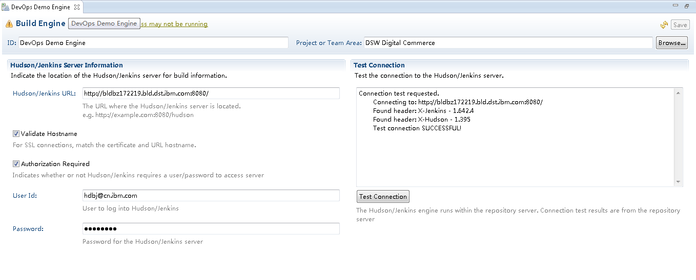

- 创建新的 build 定义：

    - 在”New Build Definition”页面中，模板选择”Hudson／Jenkins Engine”，为该构建定义命名然后点击下一步：

##### 图6\. 创建新的 build 定义

- 勾选”Jazz Source Control”：

##### 图7\. 勾选

- 在 Overview 页面中，添加我们之前配置的”DevOps Demo Engine”：

##### 图 8\. 配置 Overview 页面

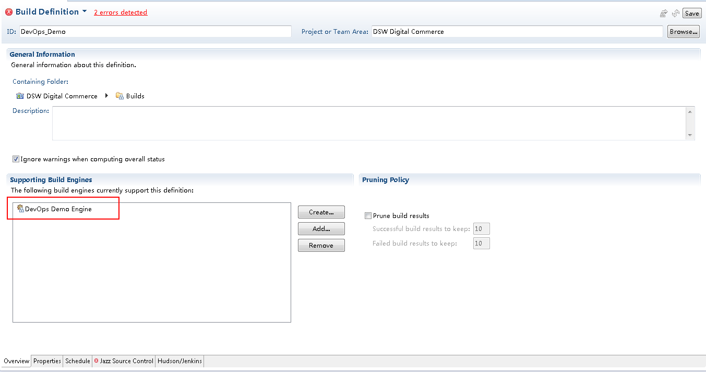

- 在”Jazz Source Control”页面中， 创建新的 reposit ory workspace 用于下载 DevOps Demo stream 的代码。

##### 图9\. 创建新的 reposit ory workspace

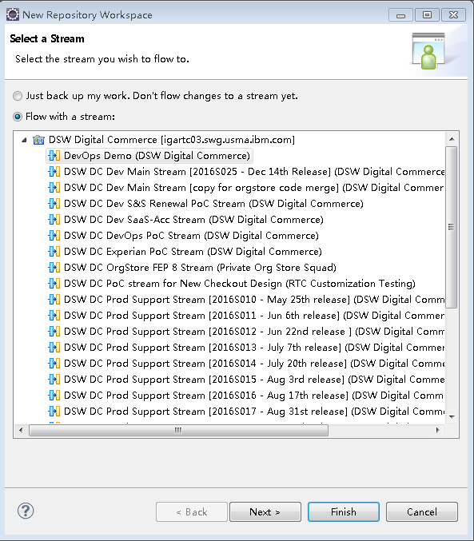

- 更新默认下载目录：

##### 图 10\. 更新默认下载目录

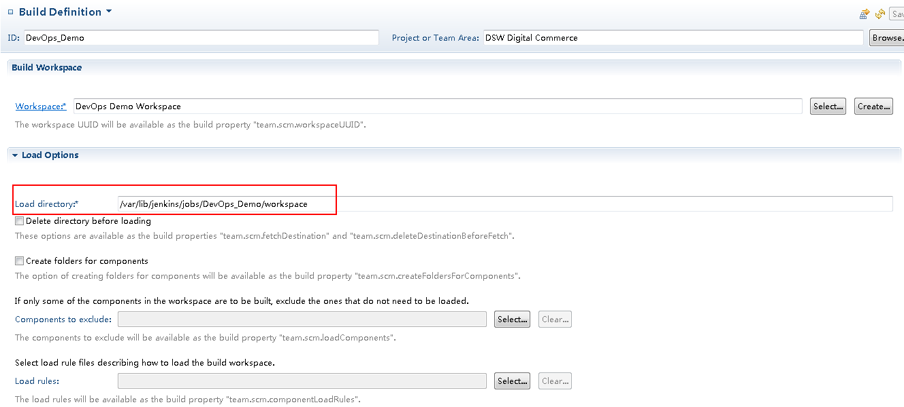

- 在 Jenkins 控制台创建新的 freestyle 项目:

    - 在”Source Code Management”部分，勾选”Rational Team Concert (RTC)”：

<h5 id=”图11-勾选” rational-team-concert-rtc-”>图 11. 勾选”Rational Team Concert (RTC)”

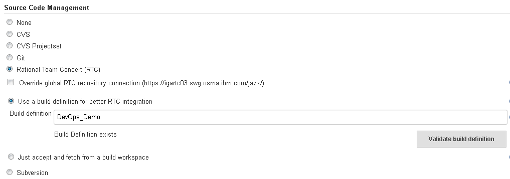

- 为当前的项目添加 build 步骤：

##### 图 12\. 添加 build 步骤

- 回到 RTC build 定义”DevOps\_Demo”，然后在”Hudson/Jenkins”页面中更新 Jenkins job：

##### 图 13\. 更新 Jenkins job

配置 Slack:

- 在 Slack 频道里，添加一个程序或者集成项：

##### 图14.添加一个程序或者集成项

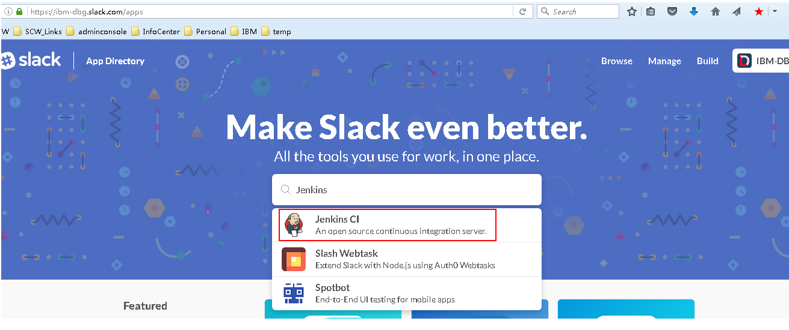

发布 Jenkins 通知到 Slack 频道里：

##### 图15\. 发布 Jenkins 通知

##### 图16\. 发布 Jenkins 通知到 Slack 频道里

- 返回到 Jenkins 项目”DevOps\_Demo “，然后在”Slack notifications”里做如下更新：

##### 图17\. Jenkins 项目更新

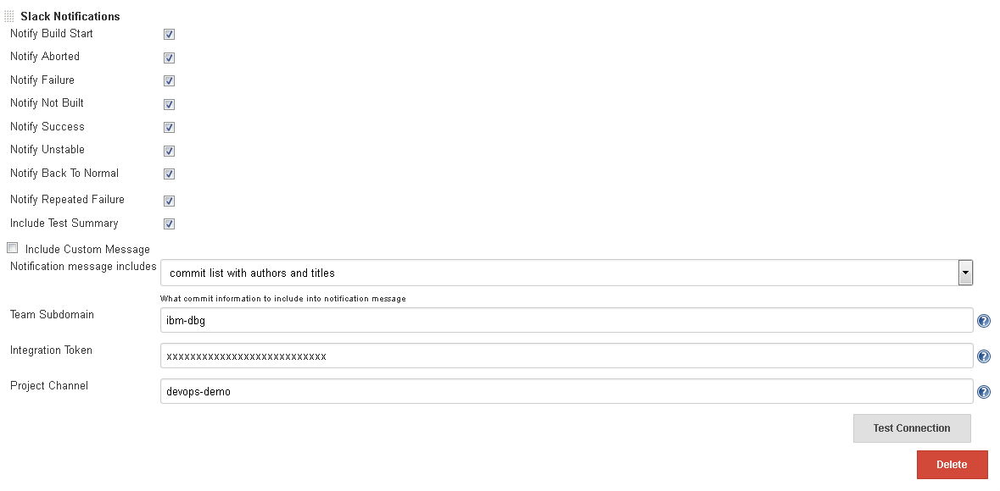

测试连接，成功后你会看到如下信息：

##### 图18\. 测试连接

- 执行 Jenkins job，job 结束后，在 RTC 和 Slack 里查看输出结果：

    **Jenkins:**

##### 图19\. 查看输出结果

**RTC:**

##### 图20\. 查看 RTC 输出结果

**Slack:**

##### 图21\. 查看 Slack 输出结果

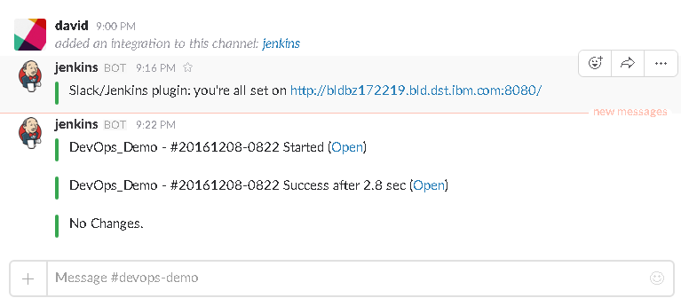

## 事件实时通知: PagerDuty + Slack 集成

### 概述:

PagerDuty 是一个操作平台，可以在事件生命周期的每一步，聚集系统的信息通知团队。在 PagerDuty 中，可以设置发送通知机制，设置电话调度机制，设置升级政策，事件跟踪机制，以此来增加应用程序，服务器，网站和数据库的正常运行时间。 下图描述了 PagerDuty，Slack 和目前我们项目实现的监控工具的集成：

##### 图22\. 描述 PagerDuty

![]描述 PagerDuty( [https://developer.ibm.com/developer/default/articles/d-rtc-jenkins-pagerduty-slack/images/image022.png](https://developer.ibm.com/developer/default/articles/d-rtc-jenkins-pagerduty-slack/images/image022.png))

PagerDuty 作为通知工具，跟监控工具集成，接收监控工具发送的缺陷通知，将接收的通知发送到配置的 Slack 频道中，Slack 用来接收、呈现事件相关的消息以方便团队成员基于 Slack 通道中的信息进行沟通、讨论解决事件涉及的问题。

### 步骤:

配置 PagerDuty:

- 注册一个 PagerDuty 账号： [https://signup.pagerduty.com/accounts/new](https://signup.pagerduty.com/accounts/new)
- 按照下图所示，在 PagerDuty 中创建一个新的服务，使用该服务给相应的 slack 频道发送测试通知：

##### 图23\. 发送测试通知

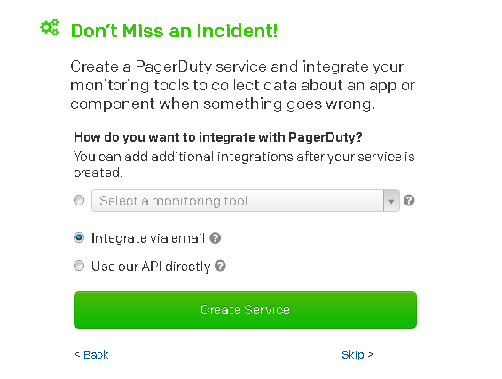

- 创建一个新的测试通知，发送到 slack 频道：

##### 图24\. 创建新的测试通知

- 在 pagerduty 里建立新的扩展接口，用于与 Slack 进行交互：

##### 图25\. 建立新的扩展接口

配置 Slack：

- 点击”authorize”为 Slack 账号授权： “Post to”指定接收事件通知的 Slack 频道

##### 图26\. 指定接收事件

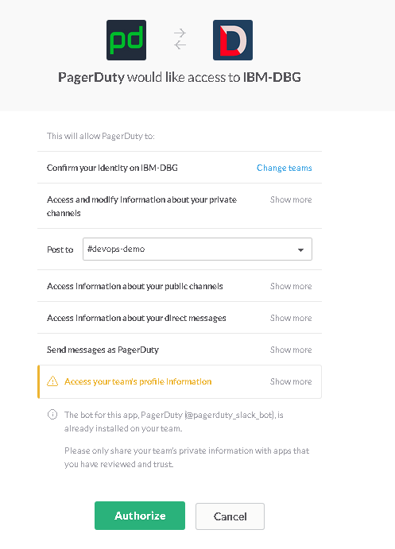

- 在 PagerDuty 的控制台查看配置信息：

##### 图27\. 查看配置信息

在相应的 Slack 频道中会收到如下配置成功的消息:

##### 图28\. 配置成功的消息

##### 图29\. 配置成功的消息（2）

触发新的事件：

- 日志监控工具监测到一个缺陷，从而触发 PagerDuty 创建新的事件：

##### 图30\. 触发 PagerDuty 创建新的事件

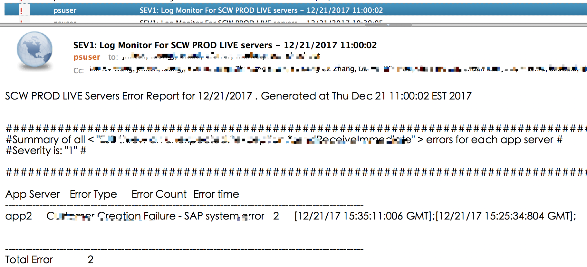

- 可以在 PagerDuty 控制台中看到，PagerDuty 为其创建了一个新的事件：

##### 图31\. 创建了一个新的事件

- 在集成的 Slack 频道里，新创建的事件的通知消息如下所示：

##### 图32\. 新创建的事件的通知消息

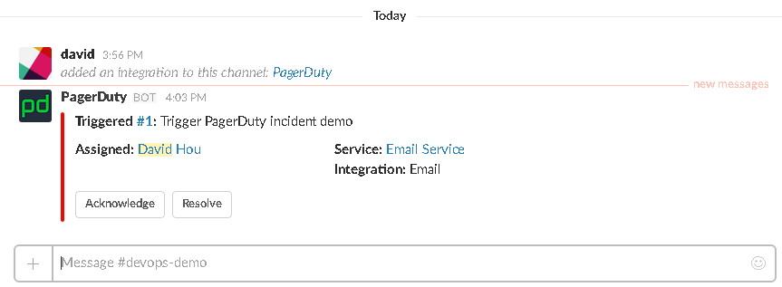

- 团队中 on-call 的人可以直接在 Slack 中对该事件进行操作，比如通过点击 ‘Acknowledge’ 按钮去告知团队开始处理该事件：

##### 图33\. 告知团队开始处理该事件

- 返回 PagerDuty 控制台，可以看到事件的状态已经更改为”Acknowledged”如下所示：

##### 图34\. 更改事件的状态

- 并且，我们可以直接在 PagerDuty 控制力对事故通知做更改。例如，事件更改之后，可以直接点击”Resolve”来关掉该通知：

## 结束语

通过集成 RTC、Jenkins、PagerDuty 和 Slack 实现的持续交付和事件实时通知在运行了一段时间后，收到了非常好的反馈，提高了产品交付的效率，并且通过实时的事件通知，团队能快速响应解决线上问题，提高了用户满意度。