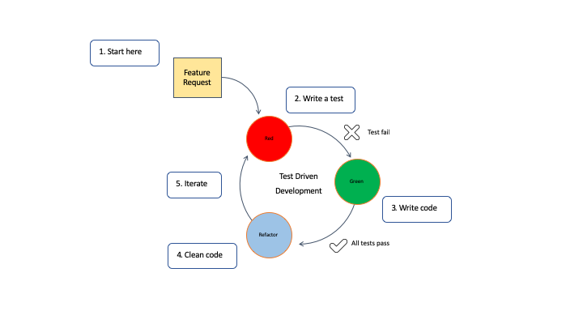

# 测试驱动开发的 5 个步骤
了解测试驱动开发并查看实战

**标签:** JavaScript,Node.js,持续交付,持续集成,软件开发

[原文链接](https://developer.ibm.com/zh/articles/5-steps-of-test-driven-development/)

Grant Steinfeld

发布: 2021-01-25

* * *

在本文中，我将向您介绍测试驱动开发 (TDD) 的一些基本概念。如果您是一名敏捷软件开发者，那么最好在软件开发生命周期中使用 TDD。通过本文，您将了解测试驱动开发的定义和基本流程，并了解单元测试如何成为 TDD 的基石。最后，了解为什么要在开发过程中使用测试驱动开发。

## 什么是测试驱动开发？

与传统开发测试相比，测试驱动开发刚好反过来了。测试驱动开发不是先编写代码再返回来拟合测试以验证刚编写的代码，而是指示您先编写测试，然后更改代码，直到代码通过了您所编写的测试为止。

在 TDD 中，您首先编写单元测试，观察该测试是否失败，然后更改代码，直到该测试通过。这听起来刚好反过来了，对吧？但从长远角度来看，使用这种测试方法编写的代码更加简洁，而且不容易被破坏。

单元测试是仅覆盖一小部分逻辑（例如，算法）的测试。单元测试应具有确定性。所谓“确定性”指的是单元测试绝不会有副作用，例如调用要传递随机或可变数据的外部 API。但是，它会使用模拟数据来代替可随时间变化的数据。

## 测试驱动开发的 5 个步骤

TDD 流程包含以下 5 个步骤：

1. 读取、理解并处理功能或错误请求。
2. 通过编写单元测试来转换需求。如果您设置了热重载，那么在尚未实现任何代码时，单元测试将运行失败。
3. 编写并实现满足需求的代码。运行所有测试，如果没有重复此步骤，则表示这些测试都通过了。
4. 通过重构来清除代码。
5. 重复工作。

图 1 显示了这些步骤及其敏捷、周期性和迭代的特性：

此工作流程有时称为“红绿重构”，它取决于循环内测试的状态。

- 红色阶段表示代码无效。
- 绿色阶段表示一切正常，但并非以最佳方式运行。
- 蓝色阶段表示测试人员正在重构代码，但证明了他们的代码已被测试覆盖，这使测试人员可以放心地更改并改进代码。

### 测试驱动开发和 CI/CD

[持续集成](https://www.thoughtworks.com/continuous-integration)(CI) 是一种开发实践，要求开发人员一天内多次将代码集成到共享存储库中。每次集成都通过自动化构建来验证，以便团队能够尽早发现问题。 通过定期集成，您可以快速检测到错误并更轻松地定位错误。

TDD 中的单元测试也是持续集成/持续交付 (CI/CD) 过程的组成部分。TDD 特别涉及单元测试和持续集成/持续交付流水线，例如 [CircleCI](https://circleci.com/)、 [GoCD](https://www.gocd.org/) 或 [Travis CI](https://travis-ci.org/)，这些流水线在提交时运行所有单元测试。

这些测试将在部署管道中运行。如果所有测试都通过了，那么将执行集成和部署过程。另一方面，如果有任何测试失败，那么该流程将暂停以确保“构建不会损坏”。

## 首先设置工具、工具链和 IDE

要完成软件驱动开发，您首先需要设置工具、工具链和 IDE。在 [使用测试驱动开发来构建 Node.js 应用程序](/patterns/use-test-driven-development-to-build-a-nodejs-application/) 这个 Code Pattern 中，我们正在开发一个 Node.js 示例，下面是我们设置的一些关键工具：

- 用于 Node.js 和 NPM 的 nvm（节点版本管理器）：NVM 允许您运行所需的 Node.js 版本并对其进行更改，而不会影响系统节点。
- 用于开发的 npm 库：
    - 用于单元测试的 [Jest](https://jestjs.io/)
    - 用于检测代码的 [ESLint](https://eslint.org/)
    - 用于格式化的 [Prettier](https://prettier.io/)
    - 用于预提交 Git 挂钩的 Husky 和 [lint-staged](https://www.npmjs.com/package/lint-staged?activeTab=dependencies)

## 如何编写失败的单元测试

可使用以下几种方式来编写失败的单元测试。

1. 编写一个引用代码中不存在的函数的测试。这将导致该测试失败，并返回“未找到”错误（例如 404 错误）。

2. 更改 Assert 语句以使其失败。Assert 语句说明被测试代码应返回什么样的值；这种语句对单元测试十分关键。Assert 语句应反映出功能或错误修复请求。

因此，要使该语句失败，您可以编写一个返回意外值（例如，在要扩充的数据结构中）的 Assert 语句。 例如，您的 JSON 返回一个人的姓名，但最新要求是要包含这个人的电话号码。首先，您需要编写一个 Assert 语句以仅包含这个人的姓名，这将导致该语句失败。然后，您再添加代码以包含这个人的电话号码。

或者，在实际编码中：Assert 语句可以为：
`assert actualResult == {‘track’:‘foo fighters’}`。一旦连接了该代码（函数），404 错误就会消失，但实际结果可能是像 {} 这样的空对象。然后将函数中的结果硬编码为 {‘track’:‘foo fighters’}。

现在，该测试可以通过了（绿色！）。显然，该代码目前还只是一个子代码，但您已对它有了基本的了解。该测试已正确连接到代码中的某个点。在那里，您可以实现实际的业务逻辑，例如，读取文件/db/调用外部 API。

## 决定何时编写单元测试

通常，在两种情况下会编写单元测试：

**情况一**：您可以为一个表示功能请求的简明案例编写单元测试。例如，功能请求可能是计算支持特定货币兑换的国家/地区数量。
首先编写一个单元测试，然后查看该测试是否失败。然后反复更改代码，直到单元测试通过。

**情况二**：生产中断时出现一段错误代码。此错误会引发一个问题（需要应用修订/补丁来修复）。我们回到货币兑换这个示例，当手动运行该代码时，用户希望在许多国家或地区使用美元，但由于操作错误，只有一个国家或地区返回了结果。

首先编写一个单元测试，然后查看该测试是否失败。然后更正我的实现代码，直到测试通过。 这不仅修复了代码并消除了错误，还提供了单元测试，我可以重复使用该单元测试来确保这段代码完整。

## 结束语

大多数程序员本应使用测试驱动开发来编写代码，但他们实际上没有这样做。测试驱动开发可以创建更好、容错能力更强的代码。希望您能通过本文了解 TDD 的原理以及如何将其运用到软件开发实践中。

## 后续步骤

敬请关注有关如何用 Node.js、Java 和 Python 语言进行测试驱动开发的新博客和文章。

## 相关资源

### 推荐的单元测试框架

- [Pytest](https://docs.pytest.org/en/latest/)：一个简单易懂的开源工具，可以简化单元测试
- Java： [Junit 5](https://junit.org/junit5/)：程序员友好型 Java 测试框架
- NodeJS： [Jest](https://jestjs.io/)：一个简单的 JavaScript 测试框架，侧重于简明性

### 有用的书籍和文章

- [Using Test-Driven Development for Microservices](https://nordicapis.com/using-test-driven-development-for-microservices/)，作者 Bill Doerrfeld
- [Test-driven Java development: Invoke TDD principles for end-to-end application developmnet](https://www.amazon.com/Test-Driven-Java-Development-Viktor-Farcic-ebook/dp/B00YSIM3SC)，第 2 版，作者 Viktor Farcic
- [Unit testing principles, practices, and patterns](https://www.manning.com/books/unit-testing)，作者 Vladimir Khorikov

本文翻译自： [5 steps of test-driven development](https://developer.ibm.com/articles/5-steps-of-test-driven-development/)（2020-02-07）