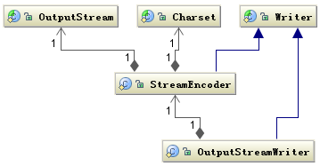
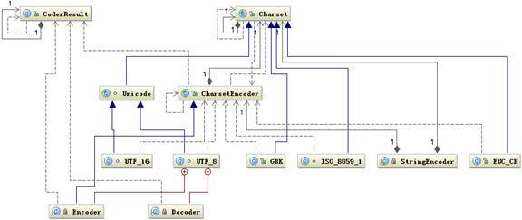
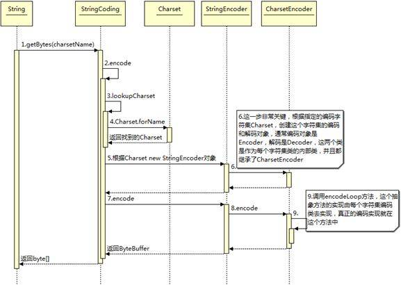
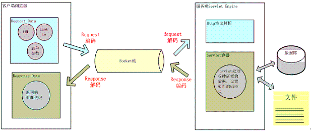
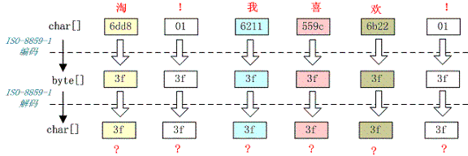

# 深入分析 Java 中的中文编码问题
Java 编码格式的区别和常见场景介绍，以及如何避免编码问题

**标签:** Java

[原文链接](https://developer.ibm.com/zh/articles/j-lo-chinesecoding/)

许令波

发布: 2011-07-06

* * *

## 几种常见的编码格式

### 为什么要编码

不知道大家有没有想过一个问题，那就是为什么要编码？我们能不能不编码？要回答这个问题必须要回到计算机是如何表示我们人类能够理解的符号的，这些符号也就是我们人类使用的语言。由于人类的语言有太多，因而表示这些语言的符号太多，无法用计算机中一个基本的存储单元—— byte 来表示，因而必须要经过拆分或一些翻译工作，才能让计算机能理解。我们可以把计算机能够理解的语言假定为英语，其它语言要能够在计算机中使用必须经过一次翻译，把它翻译成英语。这个翻译的过程就是编码。所以可以想象只要不是说英语的国家要能够使用计算机就必须要经过编码。这看起来有些霸道，但是这就是现状，这也和我们国家现在在大力推广汉语一样，希望其它国家都会说汉语，以后其它的语言都翻译成汉语，我们可以把计算机中存储信息的最小单位改成汉字，这样我们就不存在编码问题了。

所以总的来说，编码的原因可以总结为：

1. 计算机中存储信息的最小单元是一个字节即 8 个 bit，所以能表示的字符范围是 0~255 个
2. 人类要表示的符号太多，无法用一个字节来完全表示
3. 要解决这个矛盾必须需要一个新的数据结构 char，从 char 到 byte 必须编码

<h3 id=”如何” 翻译”>如何”翻译”

明白了各种语言需要交流，经过翻译是必要的，那又如何来翻译呢？计算中提拱了多种翻译方式，常见的有 ASCII、ISO-8859-1、GB2312、GBK、UTF-8、UTF-16 等。它们都可以被看作为字典，它们规定了转化的规则，按照这个规则就可以让计算机正确的表示我们的字符。目前的编码格式很多，例如 GB2312、GBK、UTF-8、UTF-16 这几种格式都可以表示一个汉字，那我们到底选择哪种编码格式来存储汉字呢？这就要考虑到其它因素了，是存储空间重要还是编码的效率重要。根据这些因素来正确选择编码格式，下面简要介绍一下这几种编码格式。

- ASCII 码

学过计算机的人都知道 ASCII 码，总共有 128 个，用一个字节的低 7 位表示，0~31 是控制字符如换行回车删除等；32~126 是打印字符，可以通过键盘输入并且能够显示出来。

- ISO-8859-1

128 个字符显然是不够用的，于是 ISO 组织在 ASCII 码基础上又制定了一些列标准用来扩展 ASCII 编码，它们是 ISO-8859-1~ISO-8859-15，其中 ISO-8859-1 涵盖了大多数西欧语言字符，所有应用的最广泛。ISO-8859-1 仍然是单字节编码，它总共能表示 256 个字符。

- GB2312

它的全称是《信息交换用汉字编码字符集 基本集》，它是双字节编码，总的编码范围是 A1-F7，其中从 A1-A9 是符号区，总共包含 682 个符号，从 B0-F7 是汉字区，包含 6763 个汉字。

- GBK

全称叫《汉字内码扩展规范》，是国家技术监督局为 windows95 所制定的新的汉字内码规范，它的出现是为了扩展 GB2312，加入更多的汉字，它的编码范围是 8140~FEFE（去掉 XX7F）总共有 23940 个码位，它能表示 21003 个汉字，它的编码是和 GB2312 兼容的，也就是说用 GB2312 编码的汉字可以用 GBK 来解码，并且不会有乱码。

- GB18030

全称是《信息交换用汉字编码字符集》，是我国的强制标准，它可能是单字节、双字节或者四字节编码，它的编码与 GB2312 编码兼容，这个虽然是国家标准，但是实际应用系统中使用的并不广泛。

- UTF-16

说到 UTF 必须要提到 Unicode（Universal Code 统一码），ISO 试图想创建一个全新的超语言字典，世界上所有的语言都可以通过这本字典来相互翻译。可想而知这个字典是多么的复杂，关于 Unicode 的详细规范可以参考相应文档。Unicode 是 Java 和 XML 的基础，下面详细介绍 Unicode 在计算机中的存储形式。

UTF-16 具体定义了 Unicode 字符在计算机中存取方法。UTF-16 用两个字节来表示 Unicode 转化格式，这个是定长的表示方法，不论什么字符都可以用两个字节表示，两个字节是 16 个 bit，所以叫 UTF-16。UTF-16 表示字符非常方便，每两个字节表示一个字符，这个在字符串操作时就大大简化了操作，这也是 Java 以 UTF-16 作为内存的字符存储格式的一个很重要的原因。

- UTF-8

UTF-16 统一采用两个字节表示一个字符，虽然在表示上非常简单方便，但是也有其缺点，有很大一部分字符用一个字节就可以表示的现在要两个字节表示，存储空间放大了一倍，在现在的网络带宽还非常有限的今天，这样会增大网络传输的流量，而且也没必要。而 UTF-8 采用了一种变长技术，每个编码区域有不同的字码长度。不同类型的字符可以是由 1~6 个字节组成。

UTF-8 有以下编码规则：

1. 如果一个字节，最高位（第 8 位）为 0，表示这是一个 ASCII 字符（00 – 7F）。可见，所有 ASCII 编码已经是 UTF-8 了。
2. 如果一个字节，以 11 开头，连续的 1 的个数暗示这个字符的字节数，例如：110xxxxx 代表它是双字节 UTF-8 字符的首字节。
3. 如果一个字节，以 10 开始，表示它不是首字节，需要向前查找才能得到当前字符的首字节

## Java 中需要编码的场景

前面描述了常见的几种编码格式，下面将介绍 Java 中如何处理对编码的支持，什么场合中需要编码。

### I/O 操作中存在的编码

我们知道涉及到编码的地方一般都在字符到字节或者字节到字符的转换上，而需要这种转换的场景主要是在 I/O 的时候，这个 I/O 包括磁盘 I/O 和网络 I/O，关于网络 I/O 部分在后面将主要以 Web 应用为例介绍。下图是 Java 中处理 I/O 问题的接口：


Reader 类是 Java 的 I/O 中读字符的父类，而 InputStream 类是读字节的父类，InputStreamReader 类就是关联字节到字符的桥梁，它负责在 I/O 过程中处理读取字节到字符的转换，而具体字节到字符的解码实现它由 StreamDecoder 去实现，在 StreamDecoder 解码过程中必须由用户指定 Charset 编码格式。值得注意的是如果你没有指定 Charset，将使用本地环境中的默认字符集，例如在中文环境中将使用 GBK 编码。

写的情况也是类似，字符的父类是 Writer，字节的父类是 OutputStream，通过 OutputStreamWriter 转换字符到字节。如下图所示：



同样 StreamEncoder 类负责将字符编码成字节，编码格式和默认编码规则与解码是一致的。

如下面一段代码，实现了文件的读写功能：

##### 清单 1.I/O 涉及的编码示例

```
String file = "c:/stream.txt";
String charset = "UTF-8";
// 写字符换转成字节流
FileOutputStream outputStream = new FileOutputStream(file);
OutputStreamWriter writer = new OutputStreamWriter(
outputStream, charset);
try {
    writer.write("这是要保存的中文字符");
} finally {
    writer.close();
}
// 读取字节转换成字符
FileInputStream inputStream = new FileInputStream(file);
InputStreamReader reader = new InputStreamReader(
inputStream, charset);
StringBuffer buffer = new StringBuffer();
char[] buf = new char[64];
int count = 0;
try {
    while ((count = reader.read(buf)) != -1) {
        buffer.append(buffer, 0, count);
    }
} finally {
    reader.close();
}

```

Show moreShow more icon

在我们的应用程序中涉及到 I/O 操作时只要注意指定统一的编解码 Charset 字符集，一般不会出现乱码问题，有些应用程序如果不注意指定字符编码，中文环境中取操作系统默认编码，如果编解码都在中文环境中，通常也没问题，但是还是强烈的不建议使用操作系统的默认编码，因为这样，你的应用程序的编码格式就和运行环境绑定起来了，在跨环境下很可能出现乱码问题。

### 内存中操作中的编码

在 Java 开发中除了 I/O 涉及到编码外，最常用的应该就是在内存中进行字符到字节的数据类型的转换，Java 中用 String 表示字符串，所以 String 类就提供转换到字节的方法，也支持将字节转换为字符串的构造函数。如下代码示例：

```
String s = "这是一段中文字符串";
byte[] b = s.getBytes("UTF-8");
String n = new String(b,"UTF-8");

```

Show moreShow more icon

另外一个是已经被被废弃的 ByteToCharConverter 和 CharToByteConverter 类，它们分别提供了 convertAll 方法可以实现 byte[] 和 char[] 的互转。如下代码所示：

```
ByteToCharConverter charConverter = ByteToCharConverter.getConverter("UTF-8");
char c[] = charConverter.convertAll(byteArray);
CharToByteConverter byteConverter = CharToByteConverter.getConverter("UTF-8");
byte[] b = byteConverter.convertAll(c);

```

Show moreShow more icon

这两个类已经被 Charset 类取代，Charset 提供 encode 与 decode 分别对应 char[] 到 byte[] 的编码和 byte[] 到 char[] 的解码。如下代码所示：

```
Charset charset = Charset.forName("UTF-8");
ByteBuffer byteBuffer = charset.encode(string);
CharBuffer charBuffer = charset.decode(byteBuffer);

```

Show moreShow more icon

编码与解码都在一个类中完成，通过 forName 设置编解码字符集，这样更容易统一编码格式，比 ByteToCharConverter 和 CharToByteConverter 类更方便。

Java 中还有一个 ByteBuffer 类，它提供一种 char 和 byte 之间的软转换，它们之间转换不需要编码与解码，只是把一个 16bit 的 char 格式，拆分成为 2 个 8bit 的 byte 表示，它们的实际值并没有被修改，仅仅是数据的类型做了转换。如下代码所以：

```
ByteBuffer heapByteBuffer = ByteBuffer.allocate(1024);
ByteBuffer byteBuffer = heapByteBuffer.putChar(c);

```

Show moreShow more icon

以上这些提供字符和字节之间的相互转换只要我们设置编解码格式统一一般都不会出现问题。

## Java 中如何编解码

前面介绍了几种常见的编码格式，这里将以实际例子介绍 Java 中如何实现编码及解码，下面我们以”I am 君山”这个字符串为例介绍 Java 中如何把它以 ISO-8859-1、GB2312、GBK、UTF-16、UTF-8 编码格式进行编码的。

##### 清单 2.String 编码

```
public static void encode() {
        String name = "I am 君山";
        toHex(name.toCharArray());
        try {
            byte[] iso8859 = name.getBytes("ISO-8859-1");
            toHex(iso8859);
            byte[] gb2312 = name.getBytes("GB2312");
            toHex(gb2312);
            byte[] gbk = name.getBytes("GBK");
            toHex(gbk);
            byte[] utf16 = name.getBytes("UTF-16");
            toHex(utf16);
            byte[] utf8 = name.getBytes("UTF-8");
            toHex(utf8);
        } catch (UnsupportedEncodingException e) {
            e.printStackTrace();
        }
}

```

Show moreShow more icon

我们把 name 字符串按照前面说的几种编码格式进行编码转化成 byte 数组，然后以 16 进制输出，我们先看一下 Java 是如何进行编码的。

下面是 Java 中编码需要用到的类图

##### 图 1\. Java 编码类图



首先根据指定的 charsetName 通过 Charset.forName(charsetName) 设置 Charset 类，然后根据 Charset 创建 CharsetEncoder 对象，再调用 CharsetEncoder.encode 对字符串进行编码，不同的编码类型都会对应到一个类中，实际的编码过程是在这些类中完成的。下面是 String. getBytes(charsetName) 编码过程的时序图

##### 图 2.Java 编码时序图



从上图可以看出根据 charsetName 找到 Charset 类，然后根据这个字符集编码生成 CharsetEncoder，这个类是所有字符编码的父类，针对不同的字符编码集在其子类中定义了如何实现编码，有了 CharsetEncoder 对象后就可以调用 encode 方法去实现编码了。这个是 String.getBytes 编码方法，其它的如 StreamEncoder 中也是类似的方式。下面看看不同的字符集是如何将前面的字符串编码成 byte 数组的？

如字符串”I am 君山”的 char 数组为 49 20 61 6d 20 541b 5c71，下面把它按照不同的编码格式转化成相应的字节。

### 按照 ISO-8859-1 编码

字符串”I am 君山”用 ISO-8859-1 编码，下面是编码结果：


从上图看出 7 个 char 字符经过 ISO-8859-1 编码转变成 7 个 byte 数组，ISO-8859-1 是单字节编码，中文”君山”被转化成值是 3f 的 byte。3f 也就是”？”字符，所以经常会出现中文变成”？”很可能就是错误的使用了 ISO-8859-1 这个编码导致的。中文字符经过 ISO-8859-1 编码会丢失信息，通常我们称之为”黑洞”，它会把不认识的字符吸收掉。由于现在大部分基础的 Java 框架或系统默认的字符集编码都是 ISO-8859-1，所以很容易出现乱码问题，后面将会分析不同的乱码形式是怎么出现的。

### 按照 GB2312 编码

字符串”I am 君山”用 GB2312 编码，下面是编码结果：


GB2312 对应的 Charset 是 sun.nio.cs.ext. EUC\_CN 而对应的 CharsetDecoder 编码类是 sun.nio.cs.ext. DoubleByte，GB2312 字符集有一个 char 到 byte 的码表，不同的字符编码就是查这个码表找到与每个字符的对应的字节，然后拼装成 byte 数组。查表的规则如下：

```
c2b[c2bIndex[char >> 8] + (char & 0xff)]

```

Show moreShow more icon

如果查到的码位值大于 oxff 则是双字节，否则是单字节。双字节高 8 位作为第一个字节，低 8 位作为第二个字节，如下代码所示：

```
if (bb > 0xff) {    // DoubleByte
            if (dl - dp < 2)
                return CoderResult.OVERFLOW;
            da[dp++] = (byte) (bb >> 8);
            da[dp++] = (byte) bb;
} else {                      // SingleByte
            if (dl - dp < 1)
                return CoderResult.OVERFLOW;
            da[dp++] = (byte) bb;
}

```

Show moreShow more icon

从上图可以看出前 5 个字符经过编码后仍然是 5 个字节，而汉字被编码成双字节，在第一节中介绍到 GB2312 只支持 6763 个汉字，所以并不是所有汉字都能够用 GB2312 编码。

### 按照 GBK 编码

字符串”I am 君山”用 GBK 编码，下面是编码结果：


你可能已经发现上图与 GB2312 编码的结果是一样的，没错 GBK 与 GB2312 编码结果是一样的，由此可以得出 GBK 编码是兼容 GB2312 编码的，它们的编码算法也是一样的。不同的是它们的码表长度不一样，GBK 包含的汉字字符更多。所以只要是经过 GB2312 编码的汉字都可以用 GBK 进行解码，反过来则不然。

### 按照 UTF-16 编码

字符串”I am 君山”用 UTF-16 编码，下面是编码结果：


用 UTF-16 编码将 char 数组放大了一倍，单字节范围内的字符，在高位补 0 变成两个字节，中文字符也变成两个字节。从 UTF-16 编码规则来看，仅仅将字符的高位和地位进行拆分变成两个字节。特点是编码效率非常高，规则很简单，由于不同处理器对 2 字节处理方式不同，Big-endian（高位字节在前，低位字节在后）或 Little-endian（低位字节在前，高位字节在后）编码，所以在对一串字符串进行编码是需要指明到底是 Big-endian 还是 Little-endian，所以前面有两个字节用来保存 BYTE\_ORDER\_MARK 值，UTF-16 是用定长 16 位（2 字节）来表示的 UCS-2 或 Unicode 转换格式，通过代理对来访问 BMP 之外的字符编码。

### 按照 UTF-8 编码

字符串”I am 君山”用 UTF-8 编码，下面是编码结果：


UTF-16 虽然编码效率很高，但是对单字节范围内字符也放大了一倍，这无形也浪费了存储空间，另外 UTF-16 采用顺序编码，不能对单个字符的编码值进行校验，如果中间的一个字符码值损坏，后面的所有码值都将受影响。而 UTF-8 这些问题都不存在，UTF-8 对单字节范围内字符仍然用一个字节表示，对汉字采用三个字节表示。它的编码规则如下：

##### 清单 3.UTF-8 编码代码片段

```
private CoderResult encodeArrayLoop(CharBuffer src,
ByteBuffer dst){
            char[] sa = src.array();
            int sp = src.arrayOffset() + src.position();
            int sl = src.arrayOffset() + src.limit();
            byte[] da = dst.array();
            int dp = dst.arrayOffset() + dst.position();
            int dl = dst.arrayOffset() + dst.limit();
            int dlASCII = dp + Math.min(sl - sp, dl - dp);
            // ASCII only loop
            while (dp < dlASCII && sa[sp] < '\u0080')
                da[dp++] = (byte) sa[sp++];
            while (sp < sl) {
                char c = sa[sp];
                if (c < 0x80) {
                    // Have at most seven bits
                    if (dp >= dl)
                        return overflow(src, sp, dst, dp);
                    da[dp++] = (byte)c;
                } else if (c < 0x800) {
                    // 2 bytes, 11 bits
                    if (dl - dp < 2)
                        return overflow(src, sp, dst, dp);
                    da[dp++] = (byte)(0xc0 | (c >> 6));
                    da[dp++] = (byte)(0x80 | (c & 0x3f));
                } else if (Character.isSurrogate(c)) {
                    // Have a surrogate pair
                    if (sgp == null)
                        sgp = new Surrogate.Parser();
                    int uc = sgp.parse(c, sa, sp, sl);
                    if (uc < 0) {
                        updatePositions(src, sp, dst, dp);
                        return sgp.error();
                    }
                    if (dl - dp < 4)
                        return overflow(src, sp, dst, dp);
                    da[dp++] = (byte)(0xf0 | ((uc >> 18)));
                    da[dp++] = (byte)(0x80 | ((uc >> 12) & 0x3f));
                    da[dp++] = (byte)(0x80 | ((uc >>  6) & 0x3f));
                    da[dp++] = (byte)(0x80 | (uc & 0x3f));
                    sp++;  // 2 chars
                } else {
                    // 3 bytes, 16 bits
                    if (dl - dp < 3)
                        return overflow(src, sp, dst, dp);
                    da[dp++] = (byte)(0xe0 | ((c >> 12)));
                    da[dp++] = (byte)(0x80 | ((c >>  6) & 0x3f));
                    da[dp++] = (byte)(0x80 | (c & 0x3f));
                }
                sp++;
            }
            updatePositions(src, sp, dst, dp);
            return CoderResult.UNDERFLOW;
}

```

Show moreShow more icon

UTF-8 编码与 GBK 和 GB2312 不同，不用查码表，所以在编码效率上 UTF-8 的效率会更好，所以在存储中文字符时 UTF-8 编码比较理想。

### 几种编码格式的比较

对中文字符后面四种编码格式都能处理，GB2312 与 GBK 编码规则类似，但是 GBK 范围更大，它能处理所有汉字字符，所以 GB2312 与 GBK 比较应该选择 GBK。UTF-16 与 UTF-8 都是处理 Unicode 编码，它们的编码规则不太相同，相对来说 UTF-16 编码效率最高，字符到字节相互转换更简单，进行字符串操作也更好。它适合在本地磁盘和内存之间使用，可以进行字符和字节之间快速切换，如 Java 的内存编码就是采用 UTF-16 编码。但是它不适合在网络之间传输，因为网络传输容易损坏字节流，一旦字节流损坏将很难恢复，想比较而言 UTF-8 更适合网络传输，对 ASCII 字符采用单字节存储，另外单个字符损坏也不会影响后面其它字符，在编码效率上介于 GBK 和 UTF-16 之间，所以 UTF-8 在编码效率上和编码安全性上做了平衡，是理想的中文编码方式。

## Java Web 涉及到的编码

对于使用中文来说，有 I/O 的地方就会涉及到编码，前面已经提到了 I/O 操作会引起编码，而大部分 I/O 引起的乱码都是网络 I/O，因为现在几乎所有的应用程序都涉及到网络操作，而数据经过网络传输都是以字节为单位的，所以所有的数据都必须能够被序列化为字节。在 Java 中数据被序列化必须继承 Serializable 接口。

这里有一个问题，你是否认真考虑过一段文本它的实际大小应该怎么计算，我曾经碰到过一个问题：就是要想办法压缩 Cookie 大小，减少网络传输量，当时有选择不同的压缩算法，发现压缩后字符数是减少了，但是并没有减少字节数。所谓的压缩只是将多个单字节字符通过编码转变成一个多字节字符。减少的是 String.length()，而并没有减少最终的字节数。例如将”ab”两个字符通过某种编码转变成一个奇怪的字符，虽然字符数从两个变成一个，但是如果采用 UTF-8 编码这个奇怪的字符最后经过编码可能又会变成三个或更多的字节。同样的道理比如整型数字 1234567 如果当成字符来存储，采用 UTF-8 来编码占用 7 个 byte，采用 UTF-16 编码将会占用 14 个 byte，但是把它当成 int 型数字来存储只需要 4 个 byte 来存储。所以看一段文本的大小，看字符本身的长度是没有意义的，即使是一样的字符采用不同的编码最终存储的大小也会不同，所以从字符到字节一定要看编码类型。

另外一个问题，你是否考虑过，当我们在电脑中某个文本编辑器里输入某个汉字时，它到底是怎么表示的？我们知道，计算机里所有的信息都是以 01 表示的，那么一个汉字，它到底是多少个 0 和 1 呢？我们能够看到的汉字都是以字符形式出现的，例如在 Java 中”淘宝”两个字符，它在计算机中的数值 10 进制是 28120 和 23453，16 进制是 6bd8 和 5d9d，也就是这两个字符是由这两个数字唯一表示的。Java 中一个 char 是 16 个 bit 相当于两个字节，所以两个汉字用 char 表示在内存中占用相当于四个字节的空间。

这两个问题搞清楚后，我们看一下 Java Web 中那些地方可能会存在编码转换？

用户从浏览器端发起一个 HTTP 请求，需要存在编码的地方是 URL、Cookie、Parameter。服务器端接受到 HTTP 请求后要解析 HTTP 协议，其中 URI、Cookie 和 POST 表单参数需要解码，服务器端可能还需要读取数据库中的数据，本地或网络中其它地方的文本文件，这些数据都可能存在编码问题，当 Servlet 处理完所有请求的数据后，需要将这些数据再编码通过 Socket 发送到用户请求的浏览器里，再经过浏览器解码成为文本。这些过程如下图所示：

##### 图 3\. 一次 HTTP 请求的编码示例（ [查看大图](image021-lg.png) ）



如上图所示一次 HTTP 请求设计到很多地方需要编解码，它们编解码的规则是什么？下面将会重点阐述一下：

### URL 的编解码

用户提交一个 URL，这个 URL 中可能存在中文，因此需要编码，如何对这个 URL 进行编码？根据什么规则来编码？有如何来解码？如下图一个 URL：

##### 图 4.URL 的几个组成部分


上图中以 Tomcat 作为 Servlet Engine 为例，它们分别对应到下面这些配置文件中：

Port 对应在 Tomcat 的  中配置，而 Context Path 在  中配置，Servlet Path 在 Web 应用的 web.xml 中的

```
<servlet-mapping>
        <servlet-name>junshanExample</servlet-name>
        <url-pattern>/servlets/servlet/*</url-pattern>
</servlet-mapping>

```

Show moreShow more icon

中配置，PathInfo 是我们请求的具体的 Servlet，QueryString 是要传递的参数，注意这里是在浏览器里直接输入 URL 所以是通过 Get 方法请求的，如果是 POST 方法请求的话，QueryString 将通过表单方式提交到服务器端，这个将在后面再介绍。

上图中 PathInfo 和 QueryString 出现了中文，当我们在浏览器中直接输入这个 URL 时，在浏览器端和服务端会如何编码和解析这个 URL 呢？为了验证浏览器是怎么编码 URL 的我们选择 FireFox 浏览器并通过 HTTPFox 插件观察我们请求的 URL 的实际的内容，以下是 URL：`HTTP://localhost:8080/examples/servlets/servlet/ 君山 ?author= 君山`在中文 FireFox3.6.12 的测试结果

##### 图 5\. HTTPFox 的测试结果


君山的编码结果分别是：e5 90 9b e5 b1 b1，be fd c9 bd，查阅上一届的编码可知，PathInfo 是 UTF-8 编码而 QueryString 是经过 GBK 编码，至于为什么会有”%”？查阅 URL 的编码规范 RFC3986 可知浏览器编码 URL 是将非 ASCII 字符按照某种编码格式编码成 16 进制数字然后将每个 16 进制表示的字节前加上”%”，所以最终的 URL 就成了上图的格式了。

默认情况下中文 IE 最终的编码结果也是一样的，不过 IE 浏览器可以修改 URL 的编码格式在选项 -> 高级 -> 国际里面的发送 UTF-8 URL 选项可以取消。

从上面测试结果可知浏览器对 PathInfo 和 QueryString 的编码是不一样的，不同浏览器对 PathInfo 也可能不一样，这就对服务器的解码造成很大的困难，下面我们以 Tomcat 为例看一下，Tomcat 接受到这个 URL 是如何解码的。

解析请求的 URL 是在 org.apache.coyote.HTTP11.InternalInputBuffer 的 parseRequestLine 方法中，这个方法把传过来的 URL 的 byte[] 设置到 org.apache.coyote.Request 的相应的属性中。这里的 URL 仍然是 byte 格式，转成 char 是在 org.apache.catalina.connector.CoyoteAdapter 的 convertURI 方法中完成的：

```
protected void convertURI(MessageBytes uri, Request request)
throws Exception {
        ByteChunk bc = uri.getByteChunk();
        int length = bc.getLength();
        CharChunk cc = uri.getCharChunk();
        cc.allocate(length, -1);
        String enc = connector.getURIEncoding();
        if (enc != null) {
            B2CConverter conv = request.getURIConverter();
            try {
                if (conv == null) {
                    conv = new B2CConverter(enc);
                    request.setURIConverter(conv);
                }
            } catch (IOException e) {...}
            if (conv != null) {
                try {
                    conv.convert(bc, cc, cc.getBuffer().length -
cc.getEnd());
                    uri.setChars(cc.getBuffer(), cc.getStart(),
cc.getLength());
                    return;
                } catch (IOException e) {...}
            }
        }
        // Default encoding: fast conversion
        byte[] bbuf = bc.getBuffer();
        char[] cbuf = cc.getBuffer();
        int start = bc.getStart();
        for (int i = 0; i < length; i++) {
            cbuf[i] = (char) (bbuf[i + start] & 0xff);
        }
        uri.setChars(cbuf, 0, length);
}

```

Show moreShow more icon

从上面的代码中可以知道对 URL 的 URI 部分进行解码的字符集是在 connector 的  中定义的，如果没有定义，那么将以默认编码 ISO-8859-1 解析。所以如果有中文 URL 时最好把 URIEncoding 设置成 UTF-8 编码。

QueryString 又如何解析？ GET 方式 HTTP 请求的 QueryString 与 POST 方式 HTTP 请求的表单参数都是作为 Parameters 保存，都是通过 request.getParameter 获取参数值。对它们的解码是在 request.getParameter 方法第一次被调用时进行的。request.getParameter 方法被调用时将会调用 org.apache.catalina.connector.Request 的 parseParameters 方法。这个方法将会对 GET 和 POST 方式传递的参数进行解码，但是它们的解码字符集有可能不一样。POST 表单的解码将在后面介绍，QueryString 的解码字符集是在哪定义的呢？它本身是通过 HTTP 的 Header 传到服务端的，并且也在 URL 中，是否和 URI 的解码字符集一样呢？从前面浏览器对 PathInfo 和 QueryString 的编码采取不同的编码格式不同可以猜测到解码字符集肯定也不会是一致的。的确是这样 QueryString 的解码字符集要么是 Header 中 ContentType 中定义的 Charset 要么就是默认的 ISO-8859-1，要使用 ContentType 中定义的编码就要设置 connector 的  中的 useBodyEncodingForURI 设置为 true。这个配置项的名字有点让人产生混淆，它并不是对整个 URI 都采用 BodyEncoding 进行解码而仅仅是对 QueryString 使用 BodyEncoding 解码，这一点还要特别注意。

从上面的 URL 编码和解码过程来看，比较复杂，而且编码和解码并不是我们在应用程序中能完全控制的，所以在我们的应用程序中应该尽量避免在 URL 中使用非 ASCII 字符，不然很可能会碰到乱码问题，当然在我们的服务器端最好设置  中的 URIEncoding 和 useBodyEncodingForURI 两个参数。

### HTTP Header 的编解码

当客户端发起一个 HTTP 请求除了上面的 URL 外还可能会在 Header 中传递其它参数如 Cookie、redirectPath 等，这些用户设置的值很可能也会存在编码问题，Tomcat 对它们又是怎么解码的呢？

对 Header 中的项进行解码也是在调用 request.getHeader 是进行的，如果请求的 Header 项没有解码则调用 MessageBytes 的 toString 方法，这个方法将从 byte 到 char 的转化使用的默认编码也是 ISO-8859-1，而我们也不能设置 Header 的其它解码格式，所以如果你设置 Header 中有非 ASCII 字符解码肯定会有乱码。

我们在添加 Header 时也是同样的道理，不要在 Header 中传递非 ASCII 字符，如果一定要传递的话，我们可以先将这些字符用 org.apache.catalina.util.URLEncoder 编码然后再添加到 Header 中，这样在浏览器到服务器的传递过程中就不会丢失信息了，如果我们要访问这些项时再按照相应的字符集解码就好了。

### POST 表单的编解码

在前面提到了 POST 表单提交的参数的解码是在第一次调用 request.getParameter 发生的，POST 表单参数传递方式与 QueryString 不同，它是通过 HTTP 的 BODY 传递到服务端的。当我们在页面上点击 submit 按钮时浏览器首先将根据 ContentType 的 Charset 编码格式对表单填的参数进行编码然后提交到服务器端，在服务器端同样也是用 ContentType 中字符集进行解码。所以通过 POST 表单提交的参数一般不会出现问题，而且这个字符集编码是我们自己设置的，可以通过 request.setCharacterEncoding(charset) 来设置。

另外针对 multipart/form-data 类型的参数，也就是上传的文件编码同样也是使用 ContentType 定义的字符集编码，值得注意的地方是上传文件是用字节流的方式传输到服务器的本地临时目录，这个过程并没有涉及到字符编码，而真正编码是在将文件内容添加到 parameters 中，如果用这个编码不能编码时将会用默认编码 ISO-8859-1 来编码。

### HTTP BODY 的编解码

当用户请求的资源已经成功获取后，这些内容将通过 Response 返回给客户端浏览器，这个过程先要经过编码再到浏览器进行解码。这个过程的编解码字符集可以通过 response.setCharacterEncoding 来设置，它将会覆盖 request.getCharacterEncoding 的值，并且通过 Header 的 Content-Type 返回客户端，浏览器接受到返回的 socket 流时将通过 Content-Type 的 charset 来解码，如果返回的 HTTP Header 中 Content-Type 没有设置 charset，那么浏览器将根据 Html 的  中的 charset 来解码。如果也没有定义的话，那么浏览器将使用默认的编码来解码。

### 其它需要编码的地方

除了 URL 和参数编码问题外，在服务端还有很多地方可能存在编码，如可能需要读取 xml、velocity 模版引擎、JSP 或者从数据库读取数据等。

xml 文件可以通过设置头来制定编码格式

```
<?xml version="1.0" encoding="UTF-8"?>

```

Show moreShow more icon

Velocity 模版设置编码格式：

```
services.VelocityService.input.encoding=UTF-8

```

Show moreShow more icon

JSP 设置编码格式：

```
<%@page contentType="text/html; charset=UTF-8"%>

```

Show moreShow more icon

访问数据库都是通过客户端 JDBC 驱动来完成，用 JDBC 来存取数据要和数据的内置编码保持一致，可以通过设置 JDBC URL 来制定如 MySQL：url=”jdbc:mysql://localhost:3306/DB?useUnicode=true&characterEncoding=GBK”。

## 常见问题分析

在了解了 Java Web 中可能需要编码的地方后，下面看一下，当我们碰到一些乱码时，应该怎么处理这些问题？出现乱码问题唯一的原因都是在 char 到 byte 或 byte 到 char 转换中编码和解码的字符集不一致导致的，由于往往一次操作涉及到多次编解码，所以出现乱码时很难查找到底是哪个环节出现了问题，下面就几种常见的现象进行分析。

### 中文变成了看不懂的字符

例如，字符串”淘！我喜欢！”变成了”Ì Ô £ ¡Î Ò Ï²»¶ £ ¡”编码过程如下图所示


字符串在解码时所用的字符集与编码字符集不一致导致汉字变成了看不懂的乱码，而且是一个汉字字符变成两个乱码字符。

### 一个汉字变成一个问号

例如，字符串”淘！我喜欢！”变成了”？？？？？？”编码过程如下图所示



将中文和中文符号经过不支持中文的 ISO-8859-1 编码后，所有字符变成了”？”，这是因为用 ISO-8859-1 进行编解码时遇到不在码值范围内的字符时统一用 3f 表示，这也就是通常所说的”黑洞”，所有 ISO-8859-1 不认识的字符都变成了”？”。

### 一个汉字变成两个问号

例如，字符串”淘！我喜欢！”变成了”？？？？？？？？？？？？”编码过程如下图所示


这种情况比较复杂，中文经过多次编码，但是其中有一次编码或者解码不对仍然会出现中文字符变成”？”现象，出现这种情况要仔细查看中间的编码环节，找出出现编码错误的地方。

### 一种不正常的正确编码

还有一种情况是在我们通过 request.getParameter 获取参数值时，当我们直接调用

```
String value = request.getParameter(name);

```

Show moreShow more icon

会出现乱码，但是如果用下面的方式

```
String value = String(request.getParameter(name).getBytes("
ISO-8859-1"), "GBK");

```

Show moreShow more icon

解析时取得的 value 会是正确的汉字字符，这种情况是怎么造成的呢？

看下如所示：


这种情况是这样的，ISO-8859-1 字符集的编码范围是 0000-00FF，正好和一个字节的编码范围相对应。这种特性保证了使用 ISO-8859-1 进行编码和解码可以保持编码数值”不变”。虽然中文字符在经过网络传输时，被错误地”拆”成了两个欧洲字符，但由于输出时也是用 ISO-8859-1，结果被”拆”开的中文字的两半又被合并在一起，从而又刚好组成了一个正确的汉字。虽然最终能取得正确的汉字，但是还是不建议用这种不正常的方式取得参数值，因为这中间增加了一次额外的编码与解码，这种情况出现乱码时因为 Tomcat 的配置文件中 useBodyEncodingForURI 配置项没有设置为”true”，从而造成第一次解析式用 ISO-8859-1 来解析才造成乱码的。

## 结束语

本文首先总结了几种常见编码格式的区别，然后介绍了支持中文的几种编码格式，并比较了它们的使用场景。接着介绍了 Java 那些地方会涉及到编码问题，已经 Java 中如何对编码的支持。并以网络 I/O 为例重点介绍了 HTTP 请求中的存在编码的地方，以及 Tomcat 对 HTTP 协议的解析，最后分析了我们平常遇到的乱码问题出现的原因。

综上所述，要解决中文问题，首先要搞清楚哪些地方会引起字符到字节的编码以及字节到字符的解码，最常见的地方就是读取会存储数据到磁盘，或者数据要经过网络传输。然后针对这些地方搞清楚操作这些数据的框架的或系统是如何控制编码的，正确设置编码格式，避免使用软件默认的或者是操作系统平台默认的编码格式。